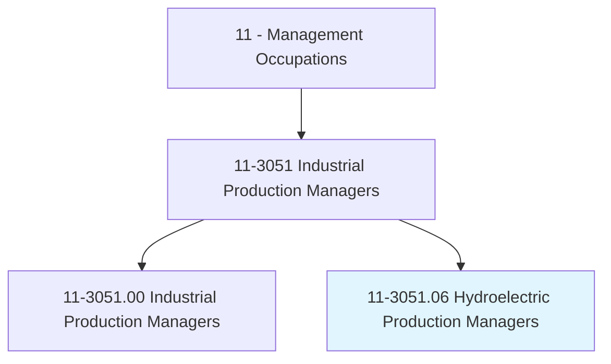
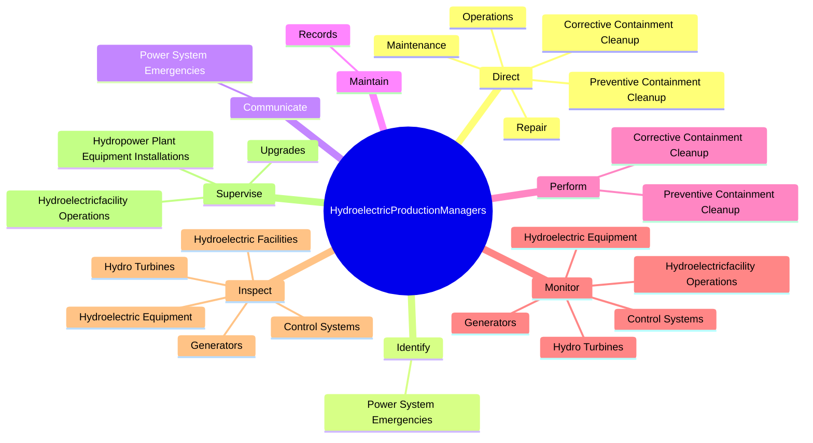
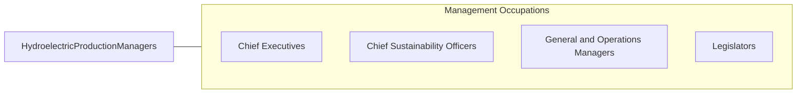

# Hydroelectric Production Managers

> Manage operations at hydroelectric power generation facilities. Maintain and monitor hydroelectric plant equipment for efficient and safe plant operations.

## Overview

Hydroelectric Production Managers is a specialized variant within the Management Occupations category. Manage operations at hydroelectric power generation facilities. 

## Classification Hierarchy

## Key Statistics

| Metric | Value |
|--------|-------|
| SOC Code | 11-3051.06 |
| Category | [Management Occupations](/occupations/Management/index) |
| Task Count | 78 |
| Source | O*NET |

## Core Tasks

### direct.Operations

Hydroelectric Production Managers direct operations as part of their core responsibilities.

**Actions:**
- `direct.Operations.of.HydroelectricPowerFacilities`
- `direct.Maintenance.of.HydroelectricPowerFacilities`
- `direct.Repair.of.HydroelectricPowerFacilities`
- `direct.PreventiveContainmentCleanup.to.protect.Environment`

### identify.PowerSystemEmergencies

Hydroelectric Production Managers identify power system emergencies as part of their core responsibilities.

**Actions:**
- `identify.PowerSystemEmergencies`

### communicate.PowerSystemEmergencies

Hydroelectric Production Managers communicate power system emergencies as part of their core responsibilities.

**Actions:**
- `communicate.PowerSystemEmergencies`

## Skills & Competencies

### Technical Skills
- **Strategic Planning** - Advanced
- **Financial Management** - Advanced
- **Operations Management** - Advanced

### Soft Skills
- **Communication** - Essential
- **Problem Solving** - Essential
- **Critical Thinking** - Important
- **Teamwork** - Important
- **Adaptability** - Important

## Related Occupations

## Industries

This occupation is found across multiple industries. See [Industries](/industries) for sector-specific employment data.

## Career Progression

---

*Source: O*NET 11-3051.06 - ONETOccupation*
