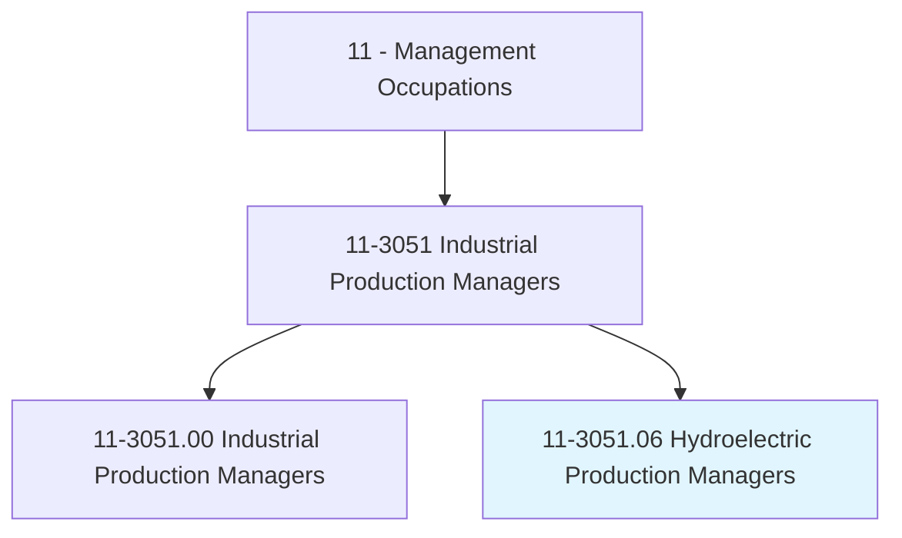
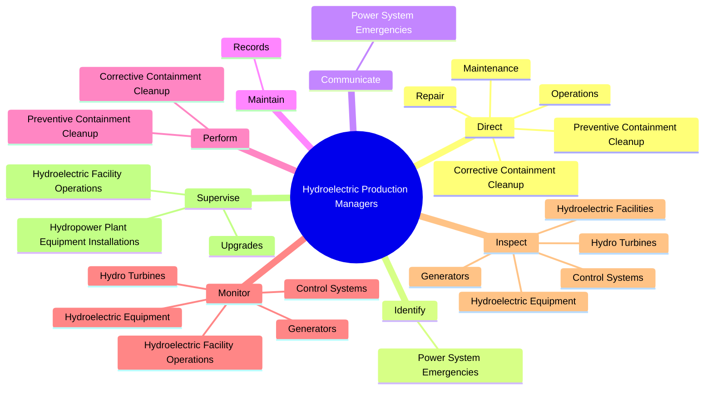
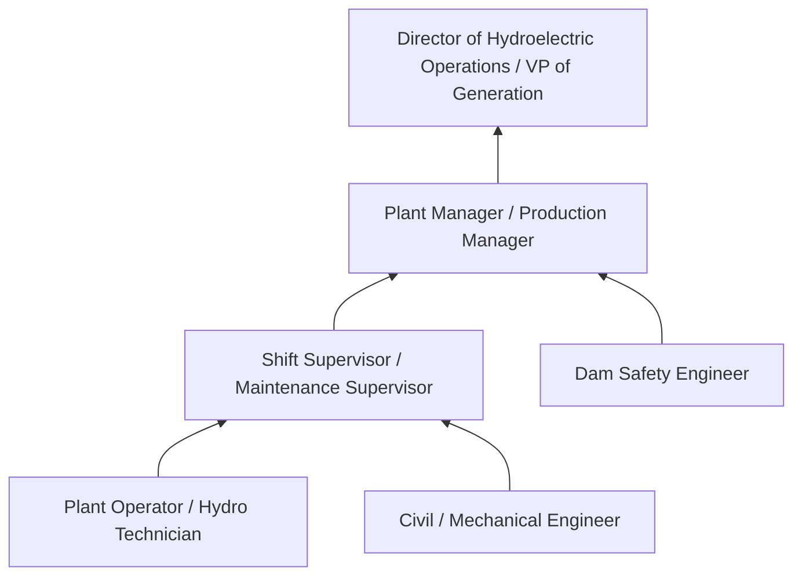
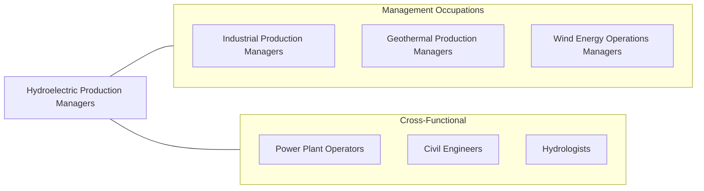

# Hydroelectric Production Managers

> Manage operations at hydroelectric power generation facilities. Maintain and monitor hydroelectric plant equipment for efficient and safe plant operations.

## Overview

Hydroelectric Production Managers oversee the operation of facilities that generate electricity from flowing or falling water. They manage dams, powerhouses, penstocks, turbines, generators, switchyards, and associated infrastructure to produce reliable, dispatchable renewable energy. Hydroelectric facilities range from large multi-unit dams producing hundreds of megawatts to small run-of-river installations, and managers must adapt their approach to the scale, technology, and regulatory context of their specific plant.

These managers direct operations and maintenance crews, coordinate planned outages for equipment overhaul, respond to emergency conditions (floods, equipment failures, grid disturbances), and manage water resources in coordination with dam safety, fisheries, recreation, and flood control requirements. They monitor reservoir levels, water flows, generation schedules, and equipment condition using SCADA systems and on-site inspections. Many hydroelectric facilities are decades old, requiring managers to balance aging infrastructure challenges with modern reliability and environmental expectations.

Hydroelectric power is the largest source of renewable electricity globally and plays a unique role in grid management through its ability to ramp quickly, provide spinning reserves, and support grid frequency regulation. Production managers must coordinate closely with grid operators, comply with FERC licensing requirements, meet NERC reliability standards, and satisfy complex environmental mandates including fish passage, minimum flows, water quality, and endangered species protections. Pumped-storage hydroelectric facilities add another dimension, requiring managers to optimize charge/discharge cycles based on electricity market conditions.

## Classification Hierarchy

## Key Statistics

| Metric | Value |
|--------|-------|
| SOC Code | 11-3051.06 |
| Job Zone | 4 (Considerable Preparation) |
| Category | [Management Occupations](/occupations/Management/index) |
| Task Count | 78 |
| Salary Range | $85,000 - $155,000+ |
| Employment Level | Small |
| Growth Outlook | Average |
| Source | O*NET |

## Core Tasks

### direct.Operations

Hydroelectric Production Managers direct all operations, maintenance, and repair activities at hydroelectric power facilities, including environmental containment and cleanup.

**Actions:**
- `direct.Operations.of.HydroelectricPowerFacilities`
- `direct.Maintenance.of.HydroelectricPowerFacilities`
- `direct.Repair.of.HydroelectricPowerFacilities`
- `direct.PreventiveContainmentCleanup.to.protect.Environment`

### identify.PowerSystemEmergencies

Hydroelectric Production Managers identify and respond to power system emergencies including grid disturbances, equipment failures, and dam safety events.

**Actions:**
- `identify.PowerSystemEmergencies`

### communicate.PowerSystemEmergencies

Hydroelectric Production Managers communicate emergency conditions to plant staff, grid operators, dam safety authorities, and emergency management agencies.

**Actions:**
- `communicate.PowerSystemEmergencies`

## Skills & Competencies

### Technical Skills
- **Hydroelectric Plant Operations** - Expert
- **Hydro Turbine & Generator Systems** - Expert
- **Dam Safety & Water Management** - Advanced
- **Electrical Systems & Grid Operations** - Advanced
- **FERC/NERC Regulatory Compliance** - Advanced
- **Maintenance Management** - Advanced
- **Environmental Compliance (ESA, CWA)** - Advanced

### Soft Skills
- **Leadership** - Critical
- **Decision Making** - Critical
- **Crisis Management** - Essential
- **Communication** - Essential
- **Problem Solving** - Essential
- **Planning & Organization** - Important
- **Stakeholder Management** - Important

## Education & Certifications

| Requirement | Details |
|-------------|---------|
| Typical Education | Bachelor's degree in Mechanical Engineering, Electrical Engineering, Civil Engineering, or related field |
| Work Experience | 7-10 years in hydroelectric or power plant operations with progressive supervisory responsibility |
| Common Certifications | PE (Professional Engineer - NCEES), NERC System Operator Certification, Dam Safety certification (ASDSO), First Class Power Engineer (state-specific), OSHA 30-Hour |

## Career Progression

## Industry Variations

- **Federal Agencies (BPA, TVA, Army Corps, Bureau of Reclamation)** - Multi-purpose projects; flood control; navigation; irrigation coordination; federal dam safety program
- **Investor-Owned Utilities** - Rate-regulated generation; integrated resource planning; relicensing (FERC); capital improvement programs
- **Public Power / Municipal Utilities** - Community-owned generation; low-cost power mandates; local governance; recreation management
- **Pumped-Storage Facilities** - Energy arbitrage; ancillary services (frequency regulation, spinning reserves); upper/lower reservoir management; market optimization

## Technology & Tools

- **Control Systems** - SCADA, DCS, governor controls, excitation systems, automatic generation control (AGC)
- **Monitoring** - Vibration monitoring, oil analysis, dam instrumentation (piezometers, inclinometers, seepage monitors)
- **Hydrology** - River forecasting models, reservoir simulation, inflow prediction, USGS stream gauges
- **Maintenance** - CMMS (Maximo, SAP PM), condition-based monitoring, GIS for asset management
- **Compliance** - FERC eLibrary, NERC compliance tools, dam safety inspection software
- **Grid Operations** - Energy management systems (EMS), real-time dispatch, market bidding platforms

## Related Occupations

## Industries

- [Utilities (Electric Power Generation)](/industries/Utilities/index) - High Employment
- [Government (Federal - BPA, TVA, Army Corps, Bureau of Reclamation)](/industries/Government) - High Employment
- [Construction (Dam and Hydropower)](/industries/Construction/index) - Low Employment

## Departments

This occupation typically works in:
- [Plant Operations](/departments/Operations/index)
- [Power Generation](/departments/PowerGeneration)
- [Dam Safety / Water Management](/departments/DamSafety)

---

*Source: O*NET 11-3051.06 - ONETOccupation*
