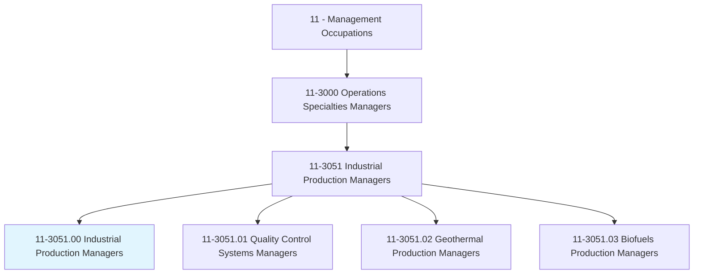
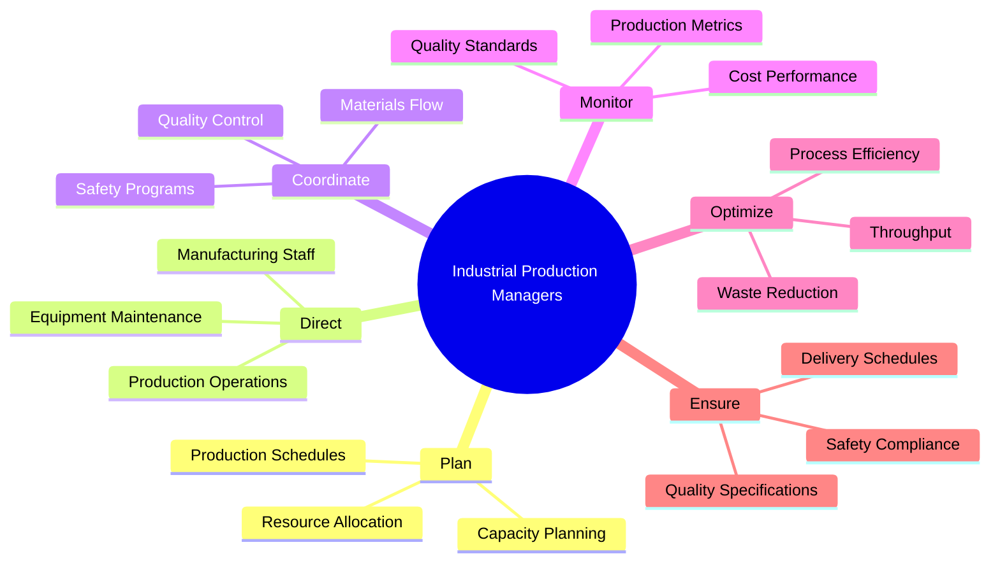
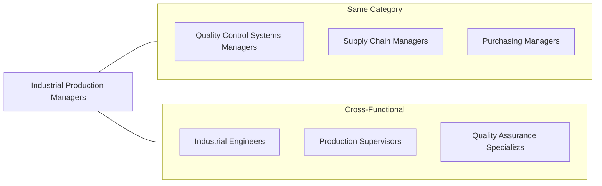
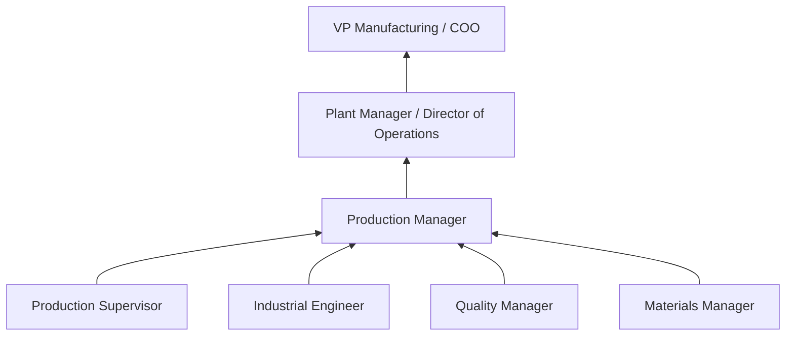

# Industrial Production Managers

> Plan, direct, or coordinate the work activities and resources necessary for manufacturing products in accordance with cost, quality, and quantity specifications.

## Overview

Industrial Production Managers oversee the manufacturing operations that transform raw materials into finished products. They coordinate production schedules, manage manufacturing personnel, ensure quality standards, and optimize processes for efficiency and cost-effectiveness. This role requires balancing production targets with quality requirements, worker safety, and environmental regulations. Production Managers must excel at problem-solving, as they frequently address equipment issues, supply chain disruptions, and staffing challenges.

## Classification Hierarchy

## Key Statistics

| Metric | Value |
|--------|-------|
| SOC Code | 11-3051.00 |
| Job Zone | 4 (Considerable Preparation) |
| Category | [Management](/occupations/Management/index) |
| Core Tasks | 20+ |
| Source | O*NET |

## Core Tasks

### plan.ProductionSchedules

Industrial Production Managers develop production plans to meet demand.

**Actions:**
- `plan.ProductionSchedules.for.DemandFulfillment` - Schedule manufacturing runs
- `plan.ResourceAllocation.for.Efficiency` - Assign equipment and labor
- `plan.CapacityUtilization.for.Optimization` - Maximize throughput
- `plan.MaintenanceSchedules.for.Reliability` - Schedule equipment upkeep

### direct.ManufacturingOperations

Industrial Production Managers lead production floor activities.

**Actions:**
- `direct.ManufacturingStaff.in.Operations` - Supervise production workers
- `direct.ProductionOperations.for.Output` - Guide manufacturing processes
- `direct.ShiftSupervisors.in.Execution` - Coordinate shift operations
- `train.Staff.on.Procedures` - Build team capabilities

### coordinate.ProductionResources

Industrial Production Managers ensure smooth material and resource flow.

**Actions:**
- `coordinate.MaterialsFlow.for.Continuity` - Manage supply to production
- `coordinate.QualityControl.for.Standards` - Integrate quality processes
- `coordinate.Maintenance.for.Uptime` - Minimize equipment downtime
- `coordinate.Logistics.for.Delivery` - Ensure timely shipment

### monitor.ProductionMetrics

Industrial Production Managers track performance against targets.

**Actions:**
- `monitor.ProductionOutput.against.Targets` - Track volume
- `monitor.CostPerformance.against.Budget` - Control expenses
- `monitor.QualityMetrics.for.Defects` - Track quality rates
- `monitor.SafetyIncidents.for.Prevention` - Ensure worker safety

### optimize.ManufacturingProcesses

Industrial Production Managers continuously improve operations.

**Actions:**
- `optimize.ProcessEfficiency.for.Productivity` - Improve throughput
- `implement.LeanManufacturing.for.WasteReduction` - Eliminate waste
- `improve.EquipmentUtilization.for.ROI` - Maximize asset use
- `reduce.CycleTime.for.Speed` - Accelerate production

## Skills & Competencies

### Technical Skills
- **Production Planning** - Expert
- **Manufacturing Processes** - Expert
- **Quality Management** - Advanced
- **Lean Manufacturing** - Advanced
- **Supply Chain** - Advanced
- **Safety Regulations** - Advanced

### Soft Skills
- **Leadership** - Critical
- **Problem Solving** - Critical
- **Decision Making** - Critical
- **Communication** - Essential
- **Time Management** - Essential
- **Stress Management** - Essential

## Related Occupations

## Industries

- [Manufacturing](/industries/Manufacturing/index) - High Employment
- [Food Processing](/industries/FoodProcessing) - High Employment
- [Automotive](/industries/Automotive) - High Employment
- [Aerospace](/industries/Aerospace) - Moderate Employment
- [Pharmaceuticals](/industries/Pharmaceuticals) - Moderate Employment
- [Electronics](/industries/Electronics) - Moderate Employment

## Career Progression

## Education & Training

| Requirement | Details |
|-------------|---------|
| Typical Education | Bachelor's degree in Industrial Engineering, Business, or related field |
| Work Experience | 5+ years in manufacturing with supervisory experience |
| On-the-Job Training | Extensive; industry-specific training |
| Common Certifications | CPIM, Six Sigma, Lean Manufacturing, PMP |

## Departments

This occupation typically works in:
- [Manufacturing](/departments/Manufacturing)
- [Operations](/departments/Operations/index)
- [Production](/departments/Production)
- [Plant Management](/departments/PlantManagement)

---

*Source: O*NET 11-3051.00 - ONETOccupation*
