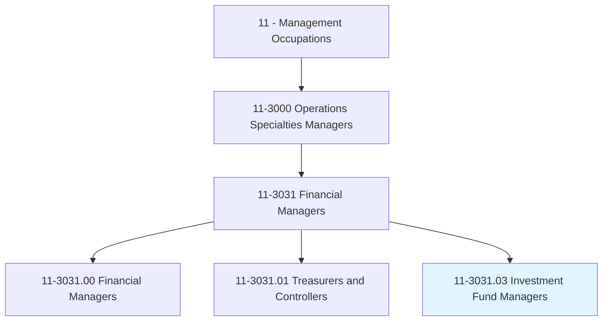
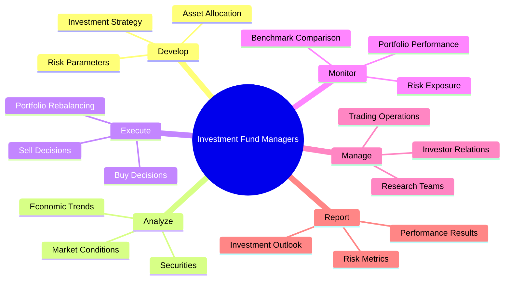
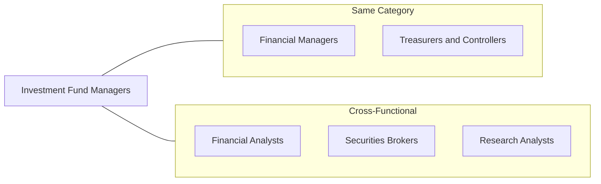
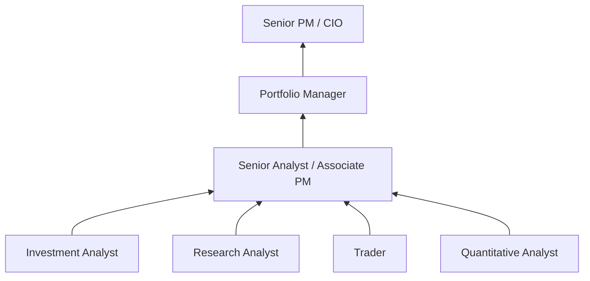

# Investment Fund Managers

> Plan, direct, or coordinate investment strategy or operations for a large pool of liquid assets supplied by institutional investors or individual investors.

## Overview

Investment Fund Managers (also known as Portfolio Managers or Asset Managers) oversee investment portfolios ranging from mutual funds and hedge funds to pension funds and endowments. They make buy, sell, and hold decisions based on research, market analysis, and investment strategies to achieve target returns while managing risk. This role requires deep market knowledge, analytical sophistication, and the ability to make high-stakes decisions under pressure. Fund Managers must balance fiduciary responsibilities to investors with competitive performance expectations.

## Classification Hierarchy

## Key Statistics

| Metric | Value |
|--------|-------|
| SOC Code | 11-3031.03 |
| Job Zone | 5 (Extensive Preparation) |
| Category | [Management](/occupations/Management/index) |
| Core Tasks | 15+ |
| Source | O*NET |

## Core Tasks

### develop.InvestmentStrategy

Investment Fund Managers create and refine investment approaches.

**Actions:**
- `develop.InvestmentStrategy.for.Fund` - Define overall approach
- `develop.AssetAllocation.for.Diversification` - Balance portfolio mix
- `develop.RiskParameters.for.Protection` - Set risk limits
- `develop.BenchmarkTargets.for.Performance` - Establish goals

### analyze.Markets

Investment Fund Managers conduct extensive research and analysis.

**Actions:**
- `analyze.MarketConditions.for.Opportunities` - Assess market environment
- `analyze.Securities.for.Selection` - Evaluate individual investments
- `analyze.EconomicTrends.for.Positioning` - Understand macro factors
- `analyze.CompanyFundamentals.for.Valuation` - Assess business quality

### execute.InvestmentDecisions

Investment Fund Managers make and implement portfolio decisions.

**Actions:**
- `execute.BuyDecisions.for.PortfolioConstruction` - Add positions
- `execute.SellDecisions.for.RiskManagement` - Exit positions
- `execute.PortfolioRebalancing.for.Alignment` - Adjust allocations
- `coordinate.Trading.with.TradingDesk` - Implement efficiently

### monitor.PortfolioPerformance

Investment Fund Managers track results and adjust strategies.

**Actions:**
- `monitor.PortfolioPerformance.against.Benchmarks` - Track relative results
- `monitor.RiskExposure.for.Limits` - Ensure compliance
- `monitor.Positions.for.Concentration` - Manage holdings
- `monitor.Liquidity.for.Redemptions` - Ensure ability to pay

### manage.InvestorRelations

Investment Fund Managers communicate with stakeholders.

**Actions:**
- `manage.InvestorCommunications.for.Transparency` - Update investors
- `present.PerformanceResults.to.Clients` - Report outcomes
- `explain.InvestmentOutlook.to.Stakeholders` - Share views
- `respond.to.InvestorInquiries` - Address questions

## Skills & Competencies

### Technical Skills
- **Investment Analysis** - Expert
- **Portfolio Management** - Expert
- **Risk Management** - Expert
- **Financial Modeling** - Expert
- **Market Analysis** - Expert
- **Quantitative Analysis** - Advanced

### Soft Skills
- **Decision Making** - Critical
- **Analytical Thinking** - Critical
- **Communication** - Critical
- **Stress Tolerance** - Essential
- **Integrity** - Essential
- **Confidence** - Essential

## Related Occupations

## Industries

- [Asset Management](/industries/AssetManagement) - High Employment
- [Hedge Funds](/industries/HedgeFunds) - High Employment
- [Pension Funds](/industries/PensionFunds) - High Employment
- [Investment Banking](/industries/InvestmentBanking) - Moderate Employment
- [Insurance](/industries/Insurance/index) - Moderate Employment
- [Endowments](/industries/Endowments) - Moderate Employment

## Career Progression

## Education & Training

| Requirement | Details |
|-------------|---------|
| Typical Education | Bachelor's or Master's degree in Finance, Economics, or related field |
| Work Experience | 5-10 years in investment research or analysis |
| On-the-Job Training | Extensive; continuous market education |
| Common Certifications | CFA (Chartered Financial Analyst) - strongly preferred, CAIA, MBA |

## Departments

This occupation typically works in:
- [Portfolio Management](/departments/PortfolioManagement)
- [Asset Management](/departments/AssetManagement)
- [Investment Research](/departments/InvestmentResearch)
- [Trading](/departments/Trading)

---

*Source: O*NET 11-3031.03 - ONETOccupation*
