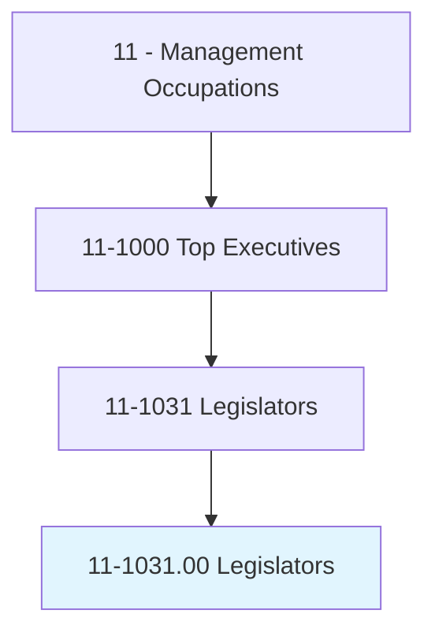
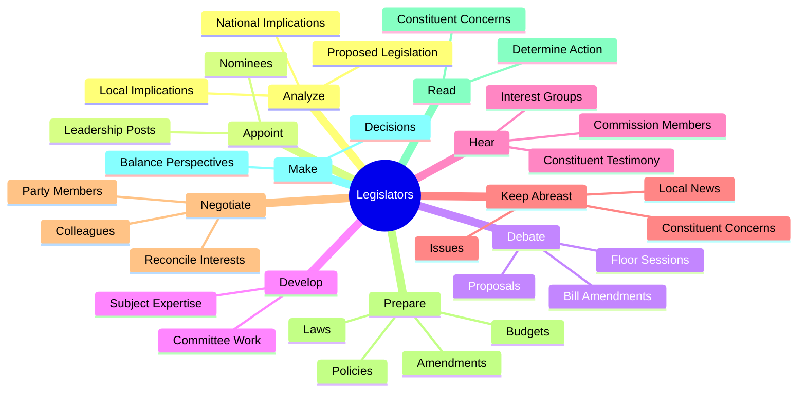
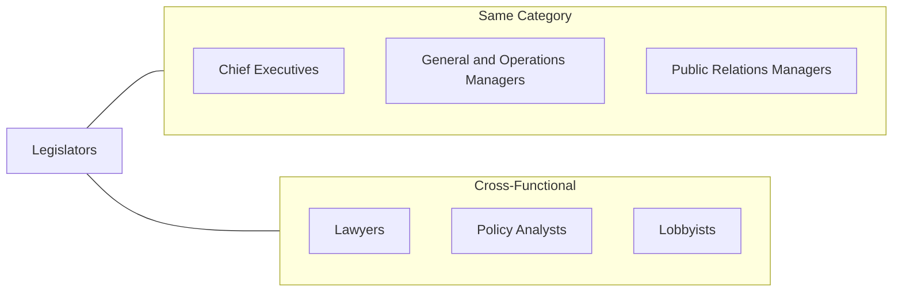
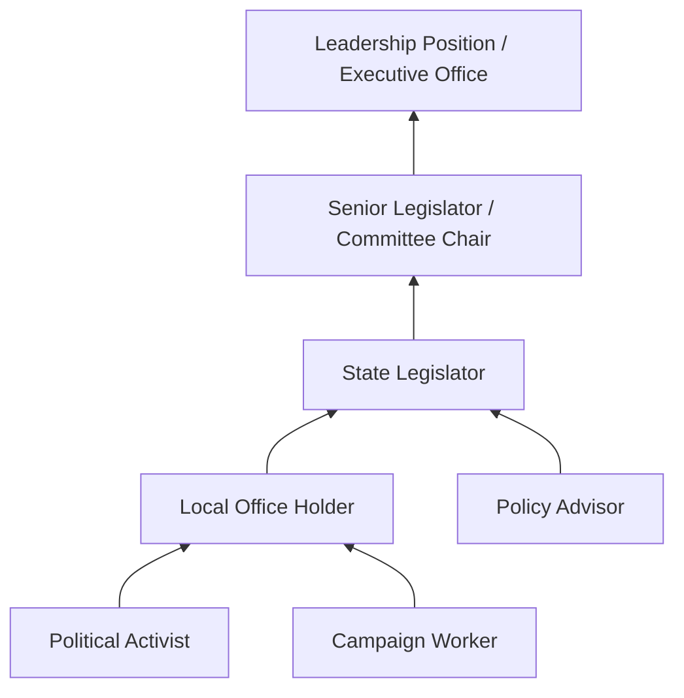

# Legislators

> Develop, introduce, or enact laws and statutes at the local, tribal, state, or federal level. Includes only workers in elected positions.

## Overview

Legislators are elected officials who represent constituents in the democratic process of creating, amending, and enacting laws. They serve at various levels of government including municipal councils, tribal governments, state legislatures, and the federal Congress. Legislators must balance the perspectives of their constituents, party leadership, and public policy experts while navigating complex political processes to advance legislation and serve their communities.

## Classification Hierarchy

## Key Statistics

| Metric | Value |
|--------|-------|
| SOC Code | 11-1031.00 |
| Job Zone | 5 (Extensive Preparation) |
| Category | [Management](/occupations/Management) |
| Core Tasks | 15+ |
| Source | O*NET |

## Core Tasks

### analyze.Implications

Legislators evaluate the impact of proposed legislation at multiple levels.

**Actions:**
- `analyze.LocalImplications.of.ProposedLegislation` - Assess community-level impacts
- `analyze.NationalImplications.of.ProposedLegislation` - Evaluate broader policy effects
- `understand.LocalImplications.of.ProposedLegislation` - Comprehend local consequences
- `understand.NationalImplications.of.ProposedLegislation` - Grasp national significance

### appoint.Nominees

Legislators exercise authority in leadership and appointment decisions.

**Actions:**
- `appoint.Nominees.to.LeadershipPosts` - Select individuals for leadership roles
- `appoint.Nominees.to.approve.SuchAppointments` - Confirm executive appointments

### debate.Merits

Legislators engage in formal deliberation on proposed legislation.

**Actions:**
- `debate.Merits.of.Proposals` - Argue for or against policy proposals
- `debate.Merits.of.BillAmendmentsDuringFloorSessions` - Participate in floor debates
- `debate.Merits.of.FollowingAppropriateRules.of.Procedure` - Adhere to parliamentary procedure

### develop.Expertise

Legislators build specialized knowledge in their committee areas.

**Actions:**
- `develop.Expertise.in.SubjectMattersRelatedToCommitteeAssignments` - Cultivate policy expertise

### hear.Testimony

Legislators gather input from diverse stakeholders.

**Actions:**
- `hear.Testimony.from.Constituents` - Listen to citizen concerns
- `hear.Testimony.from.Representatives.of.InterestGroups` - Consider advocacy perspectives
- `hear.Testimony.from.Board` - Receive board recommendations
- `hear.Testimony.from.CommissionMembers` - Accept commission input
- `hear.Testimony.from.Others.with.InterestInBills` - Consider all stakeholder views

### keep.Abreast

Legislators maintain awareness of issues affecting their constituents.

**Actions:**
- `keep.Abreast.of.IssuesAffectingConstituents.by.MakingPersonalVisitsCalls` - Engage directly with constituents
- `keep.Abreast.of.PhoneCalls` - Respond to constituent communications
- `keep.Abreast.of.ReadingLocalNewspapers` - Monitor local media coverage
- `maintain.Knowledge.of.RelevantNationalCurrentEvents` - Stay informed on national issues
- `maintain.Knowledge.of.InternationalCurrentEvents` - Understand global context

### negotiate.Members

Legislators build coalitions and broker compromises.

**Actions:**
- `negotiate.Members.of.OtherPoliticalPartiesInOrder.to.reconcile.DifferingInterests` - Bridge partisan divides
- `negotiate.Members.of..to.create.Policies` - Collaborate on policy development
- `negotiate.Members.of.Agreements` - Forge legislative agreements

### prepare.Drafts

Legislators craft legislation and policy documents.

**Actions:**
- `prepare.Drafts.of.Amendments` - Write proposed changes to bills
- `prepare.Drafts.of.GovernmentPolicies` - Develop policy frameworks
- `prepare.Drafts.of.Laws` - Author new legislation
- `prepare.Drafts.of.Rules` - Establish procedural rules
- `prepare.Drafts.of.Regulations` - Create regulatory frameworks
- `prepare.Drafts.of.Budgets` - Develop budget proposals
- `prepare.Drafts.of.Programs` - Design government programs
- `prepare.Drafts.of.Procedures` - Establish operational procedures

### make.DecisionsBalancePerspectives

Legislators weigh competing interests in their decision-making.

**Actions:**
- `make.DecisionsBalancePerspectives.of.PrivateCitizens` - Consider citizen viewpoints
- `make.DecisionsBalancePerspectives.of.PublicOfficials` - Weigh official recommendations
- `make.DecisionsBalancePerspectives.of.PartyLeaders` - Consider party positions

## Skills & Competencies

### Technical Skills
- **Legislative Process** - Expert
- **Policy Analysis** - Advanced
- **Budget Management** - Advanced
- **Public Administration** - Advanced
- **Parliamentary Procedure** - Expert
- **Legal Interpretation** - Advanced

### Soft Skills
- **Public Speaking** - Critical
- **Negotiation** - Critical
- **Coalition Building** - Critical
- **Active Listening** - Essential
- **Ethical Judgment** - Critical
- **Constituent Relations** - Essential

## Related Occupations

## Industries

- [Government](/industries/Government) - Primary Employment
- [Political Organizations](/industries/PoliticalOrganizations) - Associated
- [Public Administration](/industries/PublicAdministration) - Primary Employment
- [Tribal Government](/industries/TribalGovernment) - Specialized Employment

## Career Progression

## Education & Training

| Requirement | Details |
|-------------|---------|
| Typical Education | Bachelor's degree common; Law degree frequent at higher levels |
| Work Experience | Political, legal, or community organizing experience typical |
| On-the-Job Training | Legislative orientation and ongoing professional development |
| Common Certifications | None required; elected position |

## Departments

This occupation typically works in:
- [Legislative Branch](/departments/Legislative)
- [Government Affairs](/departments/GovernmentAffairs)
- [Policy Office](/departments/PolicyOffice)
- [Constituent Services](/departments/ConstituentServices)

---

*Source: O*NET 11-1031.00 - ONETOccupation*
