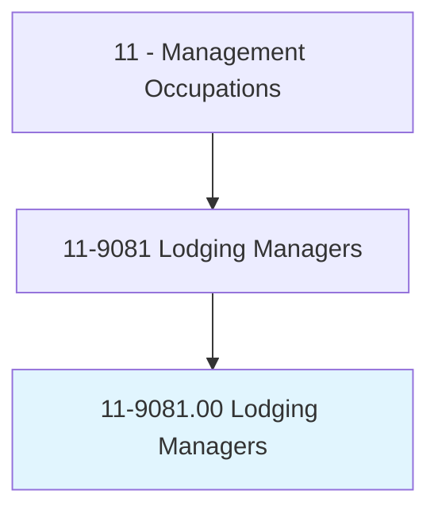
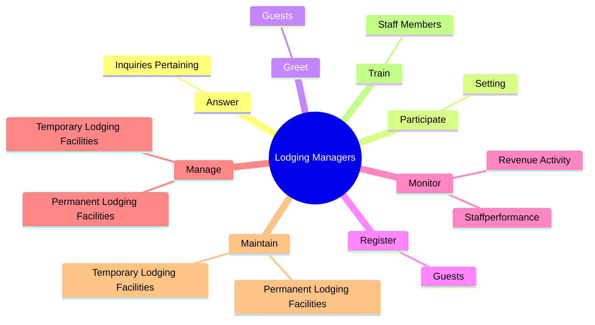
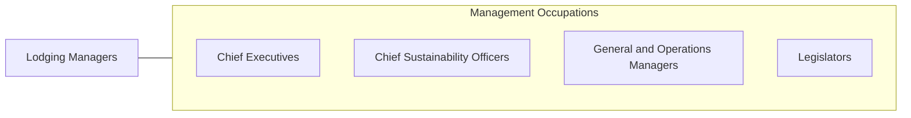

# Lodging Managers

> Plan, direct, or coordinate activities of an organization or department that provides lodging and other accommodations.

## Overview

Lodging Managers is classified under Management Occupations (SOC 11). Plan, direct, or coordinate activities of an organization or department that provides lodging and other accommodations.

## Classification Hierarchy

## Key Statistics

| Metric | Value |
|--------|-------|
| SOC Code | 11-9081.00 |
| Category | [Management Occupations](/occupations/Management) |
| Task Count | 87 |
| Source | O*NET |

## Core Tasks

### answer.InquiriesPertaining

Lodging Managers answer inquiries pertaining as part of their core responsibilities.

**Actions:**
- `answer.InquiriesPertaining.to.HotelPolicies`
- `answer.InquiriesPertaining.to.services`
- `answer.InquiriesPertaining.to.resolve.OccupantsComplaints`

### participate.Setting

Lodging Managers participate setting as part of their core responsibilities.

**Actions:**
- `participate.Setting.of.RoomRates`
- `participate.Setting.of.Establishment.of.Budgets`
- `participate.Setting.of.Allocation.of.FundsToDepartments`

### greet.Guests

Lodging Managers greet guests as part of their core responsibilities.

**Actions:**
- `greet.Guests`

## Skills & Competencies

### Technical Skills
- **Strategic Planning** - Advanced
- **Financial Management** - Advanced
- **Operations Management** - Advanced

### Soft Skills
- **Communication** - Essential
- **Problem Solving** - Essential
- **Critical Thinking** - Important
- **Teamwork** - Important
- **Adaptability** - Important

## Related Occupations

## Industries

This occupation is found across multiple industries. See [Industries](/industries) for sector-specific employment data.

## Career Progression

---

*Source: O*NET 11-9081.00 - ONETOccupation*
