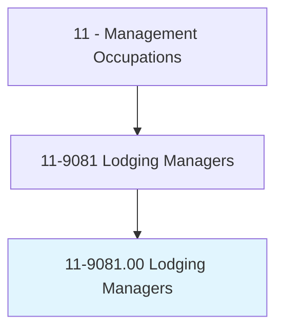
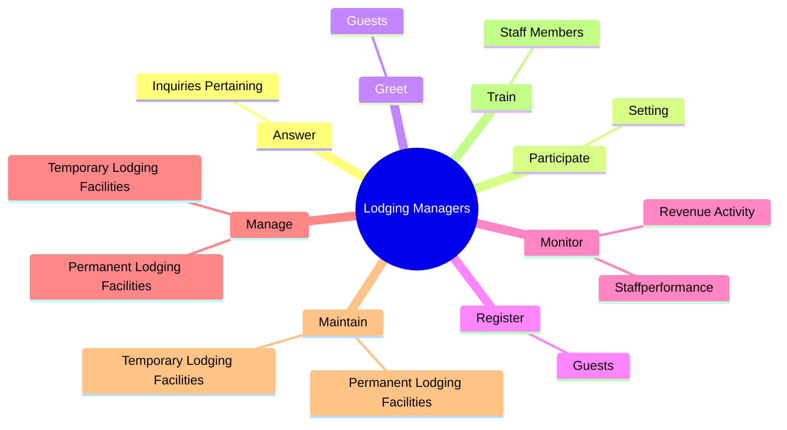
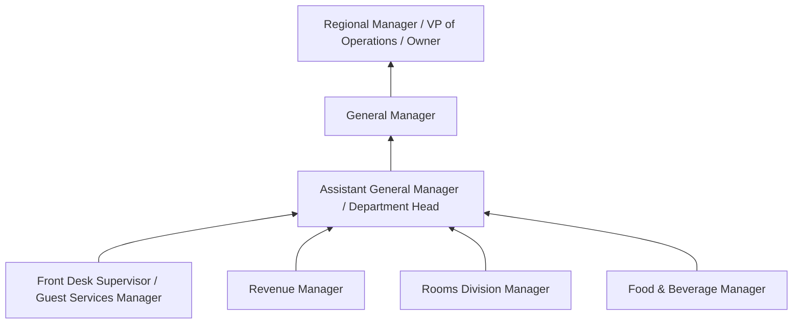
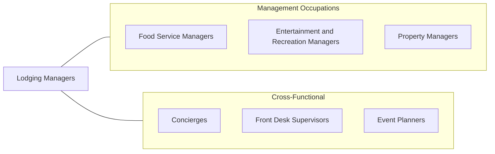

# Lodging Managers

> Plan, direct, or coordinate activities of an organization or department that provides lodging and other accommodations.

## Overview

Lodging Managers oversee the operations of hotels, motels, resorts, bed-and-breakfasts, and other accommodation establishments. They ensure that guests receive quality service, facilities are well-maintained, and the property operates profitably. Their responsibilities encompass front desk operations, housekeeping, maintenance, food and beverage, revenue management, and staff supervision.

The hospitality industry demands that Lodging Managers balance guest satisfaction with financial performance. They set room rates using dynamic pricing strategies, manage occupancy levels, coordinate with online travel agencies, and oversee the guest experience from check-in to departure. They must also manage property upkeep, ensure regulatory compliance, and handle emergency situations ranging from guest complaints to natural disasters.

Modern Lodging Managers increasingly leverage technology for revenue management, guest communication, and operational efficiency. They must also adapt to evolving traveler expectations including contactless check-in, sustainability programs, and personalized experiences. The role requires a combination of hospitality expertise, business acumen, and people management skills.

## Classification Hierarchy

## Key Statistics

| Metric | Value |
|--------|-------|
| SOC Code | 11-9081.00 |
| Job Zone | 3 (Medium Preparation) |
| Category | [Management Occupations](/occupations/Management/index) |
| Task Count | 87 |
| Salary Range | $40,000 - $100,000+ |
| Employment Level | Moderate - approximately 45,000 |
| Growth Outlook | Average |
| Source | O*NET |

## Core Tasks

### answer.InquiriesPertaining

Lodging Managers respond to guest inquiries about hotel policies, services, and amenities, and work to resolve complaints and ensure guest satisfaction.

**Actions:**
- `answer.InquiriesPertaining.to.HotelPolicies`
- `answer.InquiriesPertaining.to.services`
- `answer.InquiriesPertaining.to.resolve.OccupantsComplaints`

### participate.Setting

Lodging Managers participate in setting room rates, establishing budgets, and allocating funds across departments to optimize property performance.

**Actions:**
- `participate.Setting.of.RoomRates`
- `participate.Setting.of.Establishment.of.Budgets`
- `participate.Setting.of.Allocation.of.FundsToDepartments`

### greet.Guests

Lodging Managers personally greet guests to create a welcoming atmosphere and demonstrate the property's commitment to hospitality.

**Actions:**
- `greet.Guests`

## Skills & Competencies

### Technical Skills
- **Revenue Management** - Expert
- **Property Operations** - Expert
- **Guest Service Management** - Advanced
- **Housekeeping & Facilities Management** - Advanced
- **Food & Beverage Oversight** - Advanced
- **Financial Reporting & Budgeting** - Advanced
- **Health & Safety Compliance** - Advanced

### Soft Skills
- **Customer Service** - Critical
- **Leadership** - Critical
- **Communication** - Essential
- **Problem Solving** - Essential
- **Multitasking** - Essential
- **Composure Under Pressure** - Important
- **Cultural Sensitivity** - Important

## Education & Certifications

| Requirement | Details |
|-------------|---------|
| Typical Education | Bachelor's degree in Hospitality Management, Hotel Administration, or Business |
| Work Experience | 3-5 years in hotel operations with supervisory experience |
| On-the-Job Training | Moderate to extensive - brand-specific training programs |
| Common Certifications | CHA (Certified Hotel Administrator - AHLEI), CHIA (Certified Hospitality Industry Analyst - AHLEI/STR), CHO (Certified Hotel Owner - AAHOA), CRME (Certified Revenue Management Executive - HSMAI) |

## Career Progression

## Industry Variations

- **Full-Service Hotels** - Multiple revenue outlets (rooms, F&B, meetings, spa); complex staffing; brand standard compliance; group sales coordination
- **Limited-Service / Select-Service** - Streamlined operations; technology-driven guest service; emphasis on RevPAR optimization; smaller staff management
- **Resorts** - Recreational amenities management; seasonal staffing; activity programming; destination marketing
- **Boutique / Independent** - Brand differentiation; personalized guest experiences; owner relations; local market positioning

## Technology & Tools

- **Property Management Systems (PMS)** - Opera PMS (Oracle), Mews, Cloudbeds, StayNTouch
- **Revenue Management** - IDeaS, Duetto, RateGain, OTA Insight
- **Channel Management** - SiteMinder, RateGain, Cloudbeds
- **Guest Communication** - Whistle, Zingle, ALICE
- **Housekeeping** - Optii Solutions, Flexkeeping
- **Accounting** - M3 Accounting, Sage Intacct

## Related Occupations

## Industries

- Accommodation and Food Services - Very High Employment
- [Arts, Entertainment, and Recreation](/industries/Entertainment) - Moderate Employment
- [Government](/industries/PublicAdministration) - Low Employment

## Departments

This occupation typically works in:
- Hotel Operations
- Rooms Division
- Guest Services
- General Management

---

*Source: O*NET 11-9081.00 - ONETOccupation*
