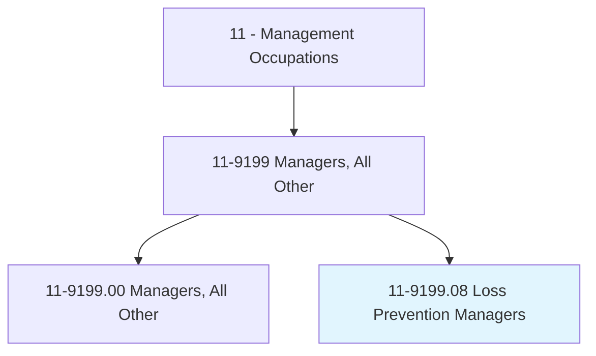
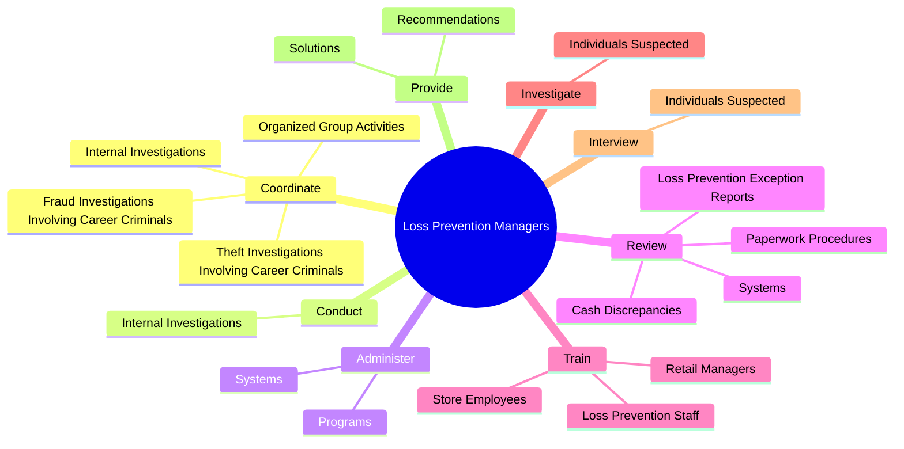
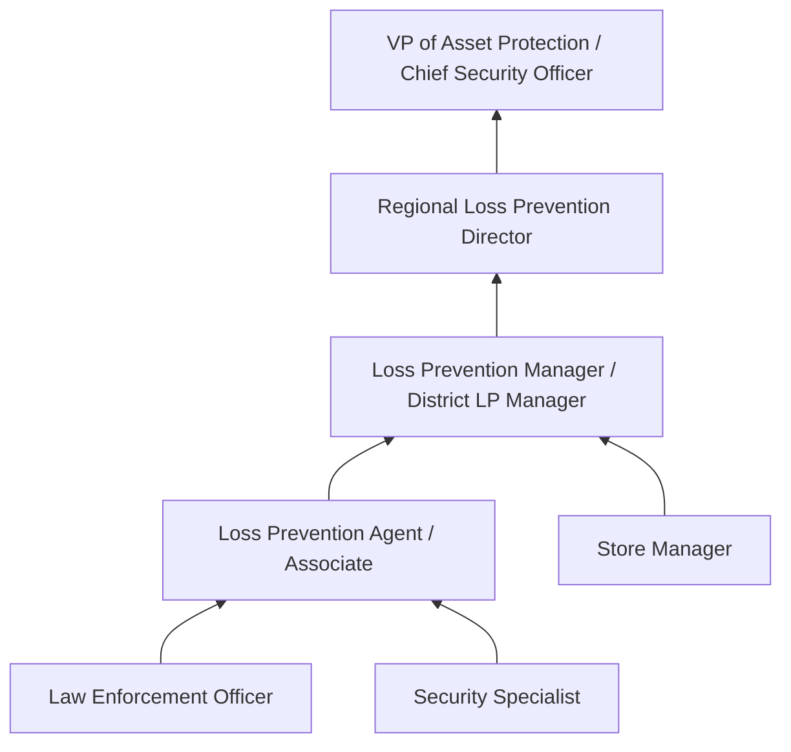
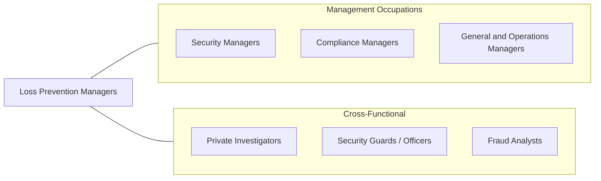

# Loss Prevention Managers

> Plan and direct policies, procedures, or systems to prevent the loss of assets. Determine risk exposure or potential liability, and develop risk control measures.

## Overview

Loss Prevention Managers protect organizations from financial losses caused by theft, fraud, operational errors, and safety incidents. They design and implement comprehensive loss prevention programs that encompass physical security, inventory controls, surveillance systems, investigation procedures, and employee training. Their work directly impacts an organization's bottom line by reducing shrinkage, liability exposure, and operational waste.

These managers conduct investigations into internal and external theft, organized retail crime, vendor fraud, and policy violations. They analyze exception reports, review surveillance footage, interview suspects, and work with law enforcement when criminal activity is identified. Beyond reactive investigations, they proactively assess risks, audit operational procedures, and develop preventive measures including access controls, cash handling protocols, and merchandise protection strategies.

The role has expanded beyond traditional retail settings to encompass supply chain security, cyber-related losses, workplace violence prevention, and enterprise risk management. Loss Prevention Managers increasingly leverage data analytics, artificial intelligence, and advanced surveillance technologies to identify patterns and predict where losses are most likely to occur.

## Classification Hierarchy

## Key Statistics

| Metric | Value |
|--------|-------|
| SOC Code | 11-9199.08 |
| Job Zone | 4 (Considerable Preparation) |
| Category | [Management Occupations](/occupations/Management/index) |
| Task Count | 102 |
| Salary Range | $55,000 - $115,000+ |
| Employment Level | Moderate |
| Growth Outlook | Average |
| Source | O*NET |

## Core Tasks

### coordinate.InternalInvestigations

Loss Prevention Managers coordinate investigations into employee theft, policy violations, organized crime, and fraud, working with internal teams and external law enforcement.

**Actions:**
- `coordinate.InternalInvestigations.of.Problems`
- `coordinate.InternalInvestigations.of.EmployeeTheft`
- `coordinate.InternalInvestigations.of.Violations.of.CorporateLossPreventionPolicies`
- `coordinate.TheftInvestigationsInvolvingCareerCriminals`

### administer.Systems

Loss Prevention Managers implement and manage systems and programs designed to reduce loss, maintain inventory control, and increase safety.

**Actions:**
- `administer.Systems.to.reduce.Loss`
- `administer.Systems.to.maintain.InventoryControl`
- `administer.Systems.to.increase.Safety`
- `administer.Programs.to.reduce.Loss`

### train.LossPreventionStaff

Loss Prevention Managers train LP staff, store management, and employees on loss prevention procedures, detection techniques, and safety protocols.

**Actions:**
- No specific sub-actions listed for this task group.

## Skills & Competencies

### Technical Skills
- **Investigation & Interviewing (WZ/Reid)** - Expert
- **Surveillance Systems & Technology** - Expert
- **Risk Assessment** - Advanced
- **Inventory Control & Auditing** - Advanced
- **Data Analytics & Exception Reporting** - Advanced
- **Physical Security** - Advanced
- **Legal Compliance (Detention Laws, Evidence)** - Advanced

### Soft Skills
- **Analytical Thinking** - Critical
- **Integrity & Ethics** - Critical
- **Communication** - Essential
- **Decision Making** - Essential
- **Observation Skills** - Essential
- **Leadership** - Important
- **Discretion** - Important

## Education & Certifications

| Requirement | Details |
|-------------|---------|
| Typical Education | Bachelor's degree in Criminal Justice, Business Administration, Security Management, or related field |
| Work Experience | 5+ years in loss prevention, security, or law enforcement |
| On-the-Job Training | Moderate - investigation techniques, technology systems |
| Common Certifications | LPC (Loss Prevention Certified - LPF), LPQ (Loss Prevention Qualified - LPF), CFI (Certified Forensic Interviewer - IAI), CPP (Certified Protection Professional - ASIS), CFE (Certified Fraud Examiner - ACFE) |

## Career Progression

## Industry Variations

- **Retail** - Organized retail crime; electronic article surveillance; point-of-sale exception monitoring; shoplifting investigation; self-checkout loss
- **Warehousing / Distribution** - Supply chain theft; cargo security; inventory variance analysis; dock and shipping controls
- **Hospitality** - Guest theft prevention; employee fraud (cash, food); key control; surveillance management
- **Financial Services** - Fraud detection; internal controls; regulatory compliance; transaction monitoring; anti-money laundering

## Technology & Tools

- **Surveillance / CCTV** - Axis, Genetec, Milestone, March Networks, Verkada
- **Exception-Based Reporting** - Appriss Retail, StoreNext, Agilence
- **Case Management** - ThinkLP, i-Sight, LPMS
- **Analytics** - Agilence, Zebra Analytics, Power BI
- **EAS / Product Protection** - Checkpoint Systems, Sensormatic, InVue
- **POS Monitoring** - NCR, Fujitsu, Exception reporting modules

## Related Occupations

## Industries

- [Retail Trade](/industries/Retail/index) - Very High Employment
- Wholesale Trade - Moderate Employment
- Transportation and Warehousing - Moderate Employment
- Accommodation and Food Services - Low Employment

## Departments

This occupation typically works in:
- Asset Protection / Loss Prevention
- [Security](/departments/Security)
- Risk Management
- [Operations](/departments/Operations/index)

---

*Source: O*NET 11-9199.08 - ONETOccupation*
