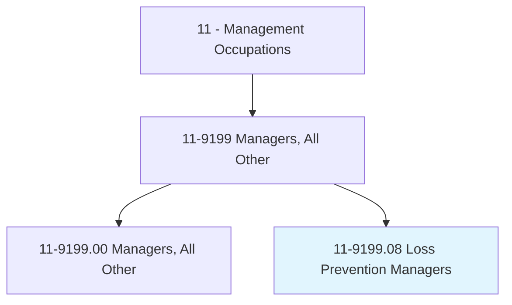
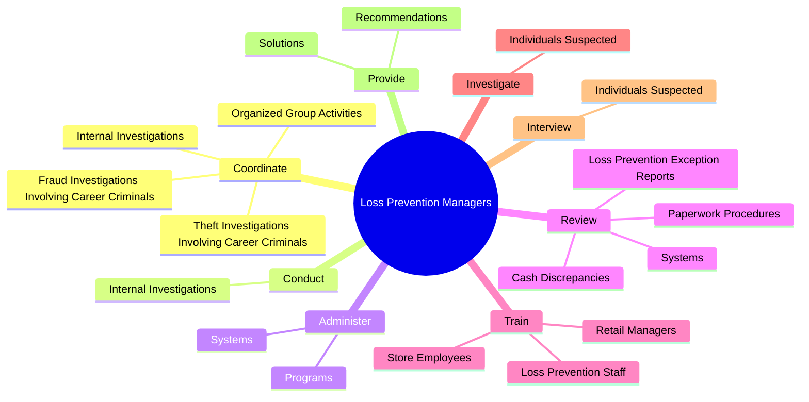
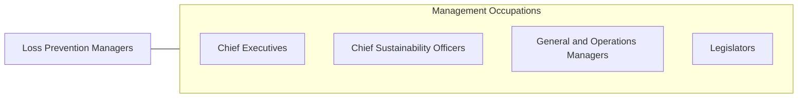

# Loss Prevention Managers

> Plan and direct policies, procedures, or systems to prevent the loss of assets. Determine risk exposure or potential liability, and develop risk control measures.

## Overview

Loss Prevention Managers is a specialized variant within the Management Occupations category. Plan and direct policies, procedures, or systems to prevent the loss of assets. 

## Classification Hierarchy

## Key Statistics

| Metric | Value |
|--------|-------|
| SOC Code | 11-9199.08 |
| Category | [Management Occupations](/occupations/Management) |
| Task Count | 102 |
| Source | O*NET |

## Core Tasks

### coordinate.InternalInvestigations

Loss Prevention Managers coordinate internal investigations as part of their core responsibilities.

**Actions:**
- `coordinate.InternalInvestigations.of.Problems`
- `coordinate.InternalInvestigations.of.EmployeeTheft`
- `coordinate.InternalInvestigations.of.Violations.of.CorporateLossPreventionPolicies`
- `coordinate.TheftInvestigationsInvolvingCareerCriminals`

### conduct.InternalInvestigations

Loss Prevention Managers conduct internal investigations as part of their core responsibilities.

**Actions:**
- `conduct.InternalInvestigations.of.Problems`
- `conduct.InternalInvestigations.of.EmployeeTheft`
- `conduct.InternalInvestigations.of.Violations.of.CorporateLossPreventionPolicies`

### administer.Systems

Loss Prevention Managers administer systems as part of their core responsibilities.

**Actions:**
- `administer.Systems.to.reduce.Loss`
- `administer.Systems.to.maintain.InventoryControl`
- `administer.Systems.to.increase.Safety`
- `administer.Programs.to.reduce.Loss`

## Skills & Competencies

### Technical Skills
- **Strategic Planning** - Advanced
- **Financial Management** - Advanced
- **Operations Management** - Advanced

### Soft Skills
- **Communication** - Essential
- **Problem Solving** - Essential
- **Critical Thinking** - Important
- **Teamwork** - Important
- **Adaptability** - Important

## Related Occupations

## Industries

This occupation is found across multiple industries. See [Industries](/industries) for sector-specific employment data.

## Career Progression

---

*Source: O*NET 11-9199.08 - ONETOccupation*
