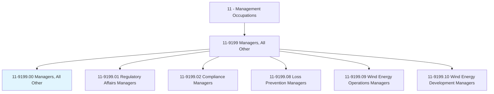
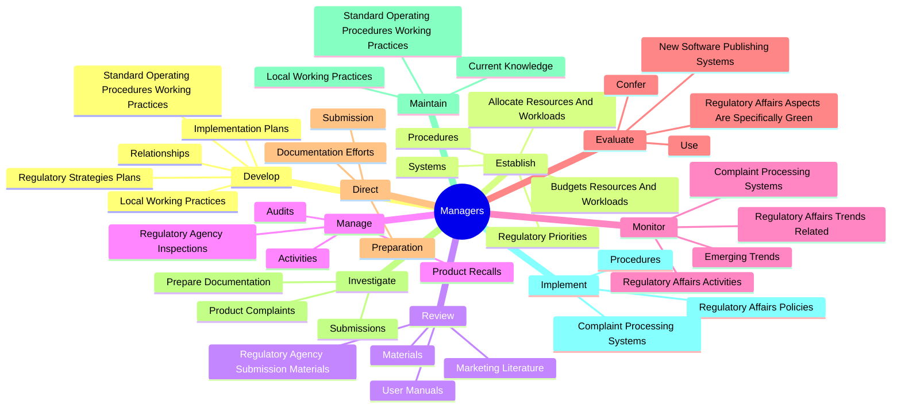
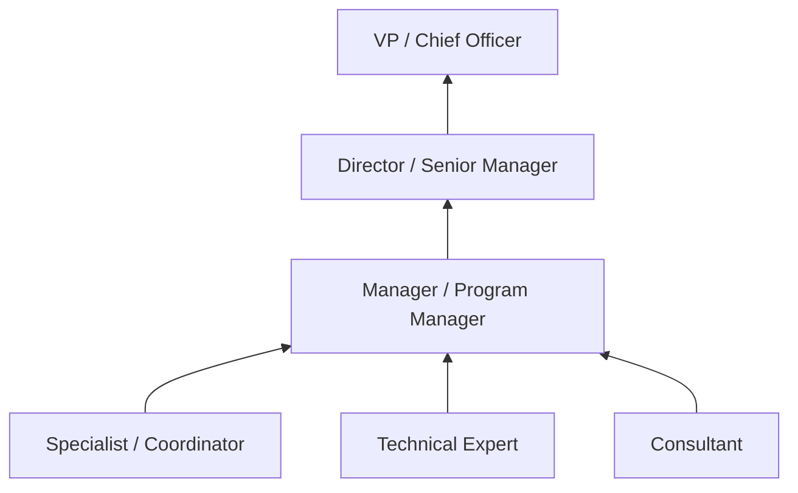
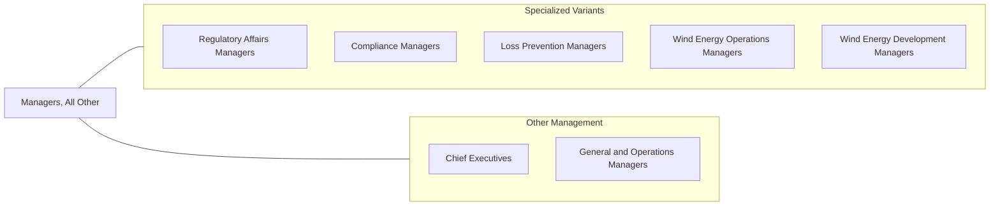

# Managers, All Other

> All managers not listed separately.

## Overview

Managers, All Other is a broad residual category encompassing management professionals whose specific roles are not captured by other Standard Occupational Classification codes. This category includes diverse specialist managers such as regulatory affairs managers, compliance managers, loss prevention managers, wind energy managers, and other emerging management roles that reflect evolving industries and organizational structures.

Professionals in this category typically manage specialized functions, teams, or programs that require both domain expertise and management competency. While their specific responsibilities vary widely, they share common management tasks including strategic planning, team supervision, budget administration, performance evaluation, and cross-functional coordination. The category grows as new industries and business functions emerge that require dedicated management oversight.

This classification is particularly relevant for organizations in rapidly evolving fields where management specializations have not yet been formally defined in occupational taxonomy. As specific roles within this category grow in prevalence, they may be reclassified into dedicated SOC codes, as has occurred with roles like Compliance Managers and Wind Energy Operations Managers.

## Classification Hierarchy

## Key Statistics

| Metric | Value |
|--------|-------|
| SOC Code | 11-9199.00 |
| Job Zone | 4 (Considerable Preparation) |
| Category | [Management Occupations](/occupations/Management/index) |
| Task Count | 91 |
| Salary Range | $70,000 - $150,000+ (varies widely by specialization) |
| Employment Level | Very Large |
| Growth Outlook | Average |
| Source | O*NET |

## Core Tasks

### develop.RegulatoryStrategiesPlans

Managers in this category develop strategic plans for preparation and submission of products and regulatory documentation.

**Actions:**
- `develop.RegulatoryStrategiesPlans.for.Preparation`
- `develop.RegulatoryStrategiesPlans.for.Submission`
- `develop.ImplementationPlans.for.Preparation`
- `develop.ImplementationPlans.for.Submission`

### establish.Procedures

Managers establish procedures and systems for document management, electronic submissions, and operational workflows.

**Actions:**
- `establish.Procedures.for.PublishingDocumentSubmissions`
- `establish.Procedures.for.ElectronicFormats`
- `establish.Systems.for.PublishingDocumentSubmissions`
- `establish.Systems.for.ElectronicFormats`

### review.RegulatoryAgencySubmissionMaterials

Managers review submission materials for quality, accuracy, and regulatory compliance.

**Actions:**
- `review.RegulatoryAgencySubmissionMaterials.to.Timeliness`
- `review.RegulatoryAgencySubmissionMaterials.to.Accuracy`
- `review.RegulatoryAgencySubmissionMaterials.to.Comprehensiveness`
- `review.RegulatoryAgencySubmissionMaterials.to.Compliance`

## Skills & Competencies

### Technical Skills
- **Domain-Specific Expertise** - Expert (varies by specialization)
- **Strategic Planning** - Advanced
- **Project Management** - Advanced
- **Regulatory Knowledge** - Advanced
- **Budget & Financial Management** - Advanced
- **Process Improvement** - Advanced
- **Data Analysis** - Advanced

### Soft Skills
- **Leadership** - Critical
- **Communication** - Essential
- **Problem Solving** - Essential
- **Decision Making** - Essential
- **Adaptability** - Essential
- **Cross-Functional Collaboration** - Important
- **Strategic Thinking** - Important

## Education & Certifications

| Requirement | Details |
|-------------|---------|
| Typical Education | Bachelor's degree in field-specific discipline; Master's degree often preferred |
| Work Experience | 5+ years in relevant domain with progressive responsibility |
| Common Certifications | Varies by specialization: PMP (PMI), domain-specific certifications, industry certifications |

## Career Progression

## Industry Variations

- **Regulated Industries** - Focus on regulatory strategy, compliance monitoring, and agency interactions
- **Energy / Renewables** - Wind, solar, and alternative energy project and operations management
- **Technology** - Product management; developer relations; platform management; data governance
- **Retail / Consumer** - Loss prevention; store operations; merchandising management; brand management

## Technology & Tools

- Varies widely by specialization; see specific variant occupation pages for detailed technology listings.

## Related Occupations

## Industries

This residual category spans all industries. Employment is concentrated in:
- [Manufacturing](/industries/Manufacturing/index) - High Employment
- [Professional, Scientific, and Technical Services](/industries/Scientific) - High Employment
- [Government](/industries/PublicAdministration) - Moderate Employment
- [Healthcare and Social Assistance](/industries/Healthcare/index) - Moderate Employment

## Departments

This occupation works across many departments depending on specialization.

---

*Source: O*NET 11-9199.00 - ONETOccupation*
