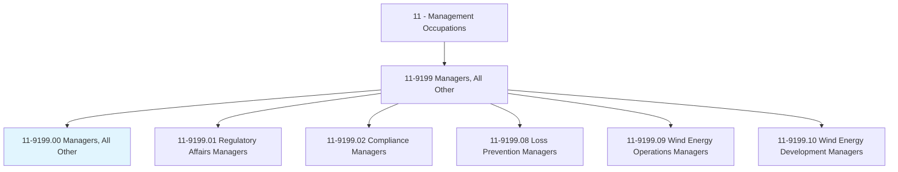
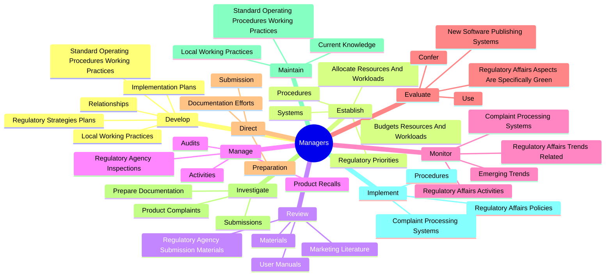
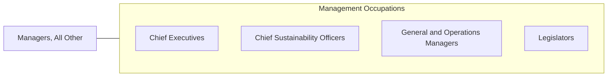

# Managers, All Other

> All managers not listed separately.

## Overview

Managers, All Other is classified under Management Occupations (SOC 11). All managers not listed separately.

## Classification Hierarchy

## Key Statistics

| Metric | Value |
|--------|-------|
| SOC Code | 11-9199.00 |
| Category | [Management Occupations](/occupations/Management) |
| Task Count | 91 |
| Source | O*NET |

## Core Tasks

### develop.RegulatoryStrategiesPlans

Managers, All Other develop regulatory strategies plans as part of their core responsibilities.

**Actions:**
- `develop.RegulatoryStrategiesPlans.for.Preparation`
- `develop.RegulatoryStrategiesPlans.for.Submission`
- `develop.ImplementationPlans.for.Preparation`
- `develop.ImplementationPlans.for.Submission`

### establish.Procedures

Managers, All Other establish procedures as part of their core responsibilities.

**Actions:**
- `establish.Procedures.for.PublishingDocumentSubmissions`
- `establish.Procedures.for.ElectronicFormats`
- `establish.Systems.for.PublishingDocumentSubmissions`
- `establish.Systems.for.ElectronicFormats`

### review.RegulatoryAgencySubmissionMaterials

Managers, All Other review regulatory agency submission materials as part of their core responsibilities.

**Actions:**
- `review.RegulatoryAgencySubmissionMaterials.to.Timeliness`
- `review.RegulatoryAgencySubmissionMaterials.to.Accuracy`
- `review.RegulatoryAgencySubmissionMaterials.to.Comprehensiveness`
- `review.RegulatoryAgencySubmissionMaterials.to.Compliance`

## Skills & Competencies

### Technical Skills
- **Strategic Planning** - Advanced
- **Financial Management** - Advanced
- **Operations Management** - Advanced

### Soft Skills
- **Communication** - Essential
- **Problem Solving** - Essential
- **Critical Thinking** - Important
- **Teamwork** - Important
- **Adaptability** - Important

## Related Occupations

## Industries

This occupation is found across multiple industries. See [Industries](/industries) for sector-specific employment data.

## Career Progression

---

*Source: O*NET 11-9199.00 - ONETOccupation*
