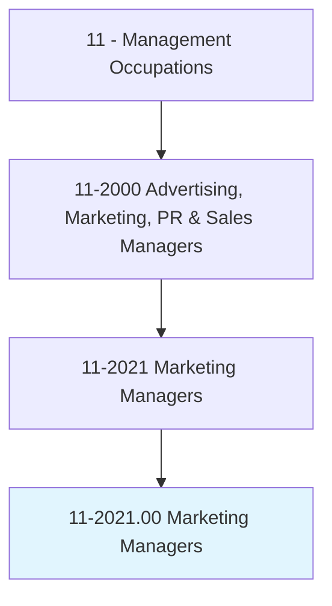
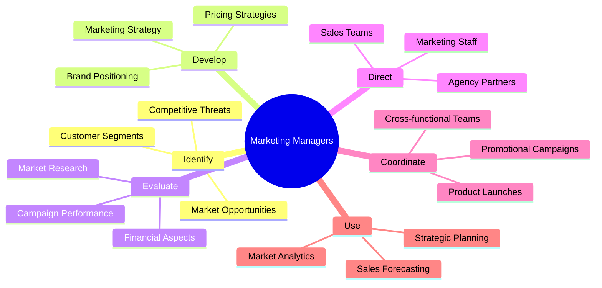
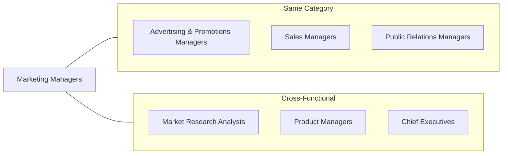
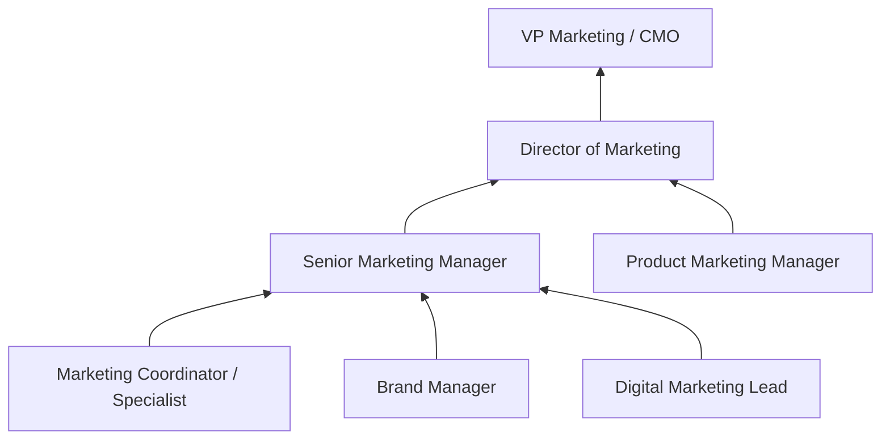

# Marketing Managers

> Plan, direct, or coordinate marketing policies and programs, such as determining the demand for products and services offered by a firm and its competitors, and identify potential customers. Develop pricing strategies with the goal of maximizing the firm's profits or share of the market while ensuring the firm's customers are satisfied. Oversee product development or monitor trends that indicate the need for new products and services.

## Overview

Marketing Managers are strategic leaders responsible for developing and executing marketing initiatives that drive business growth. They analyze market conditions, consumer behavior, and competitive landscapes to create effective marketing strategies. Working at the intersection of creative vision and business objectives, they oversee brand positioning, product launches, digital marketing campaigns, and market research efforts. This role requires a blend of analytical thinking, creative problem-solving, and leadership skills to guide marketing teams and align initiatives with organizational goals.

## Classification Hierarchy

## Key Statistics

| Metric | Value |
|--------|-------|
| SOC Code | 11-2021.00 |
| Job Zone | 4 (Considerable Preparation) |
| Category | [Management](/occupations/Management/index) |
| Core Tasks | 20+ |
| Source | O*NET |

## Core Tasks

### identify.MarketingStrategy

Marketing Managers identify and develop marketing strategies based on deep knowledge of market dynamics and business objectives.

**Actions:**
- `identify.MarketingStrategy.based.on.EstablishmentObjectives` - Align marketing with business goals
- `identify.MarketingStrategy.based.on.MarketCharacteristics` - Adapt to market conditions
- `identify.MarketingStrategy.based.on.CostMarkupFactors` - Consider financial constraints
- `develop.MarketingStrategy.for.ProductLaunch` - Create go-to-market plans

### evaluate.FinancialAspects

Marketing Managers assess the financial viability and return on investment of marketing initiatives.

**Actions:**
- `evaluate.FinancialAspects.of.ProductDevelopment` - Assess product investment needs
- `evaluate.FinancialAspects.of.Budgets` - Review marketing budget allocations
- `evaluate.FinancialAspects.of.Return.on.Investment` - Calculate ROI of campaigns
- `evaluate.FinancialAspects.of.ProfitLossProjections` - Forecast financial outcomes

### develop.PricingStrategies

Marketing Managers create pricing frameworks that balance profitability with market competitiveness.

**Actions:**
- `develop.PricingStrategies.balancing.FirmObjectives` - Optimize for business goals
- `develop.PricingStrategies.balancing.CustomerSatisfaction` - Ensure value perception
- `develop.PricingStrategies.for.NewProducts` - Price new market entries
- `develop.PricingStrategies.for.CompetitivePositioning` - Respond to market dynamics

### direct.MarketingStaff

Marketing Managers lead and develop their marketing teams to execute strategies effectively.

**Actions:**
- `direct.Hiring.of.MarketingStaff` - Recruit marketing talent
- `direct.Training.of.MarketingStaff` - Develop team capabilities
- `direct.PerformanceEvaluations.of.MarketingStaff` - Assess team performance
- `oversee.DailyActivities.of.MarketingTeam` - Manage day-to-day operations

### use.SalesForecasting

Marketing Managers leverage forecasting tools to plan and optimize marketing investments.

**Actions:**
- `use.SalesForecasting.to.ensure.SaleOfProducts` - Project revenue outcomes
- `use.SalesForecasting.to.AnalyzingBusinessDevelopments` - Track market changes
- `use.SalesForecasting.to.MonitoringMarketTrends` - Identify emerging opportunities
- `use.StrategicPlanning.to.ProfitabilityOfProducts` - Optimize product portfolio

## Skills & Competencies

### Technical Skills
- **Marketing Analytics** - Expert
- **Digital Marketing** - Advanced
- **Brand Management** - Advanced
- **Market Research** - Advanced
- **Product Marketing** - Advanced
- **Budget Management** - Proficient

### Soft Skills
- **Strategic Thinking** - Critical
- **Leadership** - Critical
- **Communication** - Critical
- **Creativity** - Essential
- **Collaboration** - Essential
- **Decision Making** - Essential

## Related Occupations

## Industries

- [Professional, Scientific, and Technical Services](/industries/Scientific) - High Employment
- [Manufacturing](/industries/Manufacturing/index) - High Employment
- [Information](/industries/Information/index) - High Employment
- [Finance and Insurance](/industries/Finance) - Moderate Employment
- [Retail Trade](/industries/Retail/index) - Moderate Employment
- [Wholesale Trade](/industries/Wholesale/index) - Moderate Employment

## Career Progression

## Education & Training

| Requirement | Details |
|-------------|---------|
| Typical Education | Bachelor's degree in Marketing, Business, or related field |
| Work Experience | 5+ years in marketing roles with increasing responsibility |
| On-the-Job Training | Moderate; ongoing professional development |
| Common Certifications | MBA, Google Analytics, HubSpot, Digital Marketing certifications |

## Departments

This occupation typically works in:
- [Marketing](/departments/Marketing/index)
- Brand Management
- Digital Marketing
- Product Marketing

---

*Source: O*NET 11-2021.00 - ONETOccupation*
