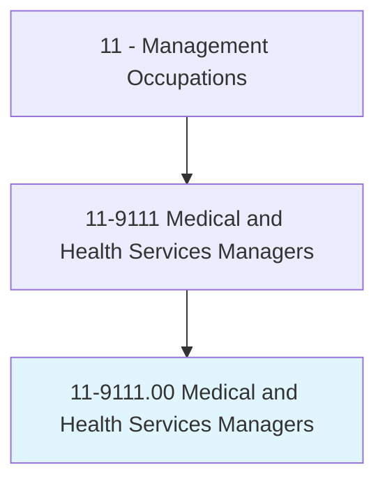
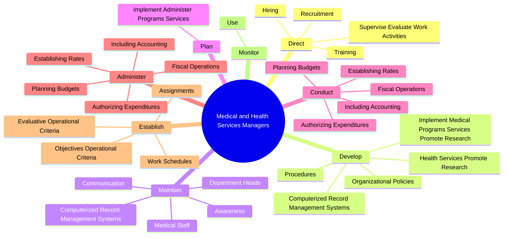
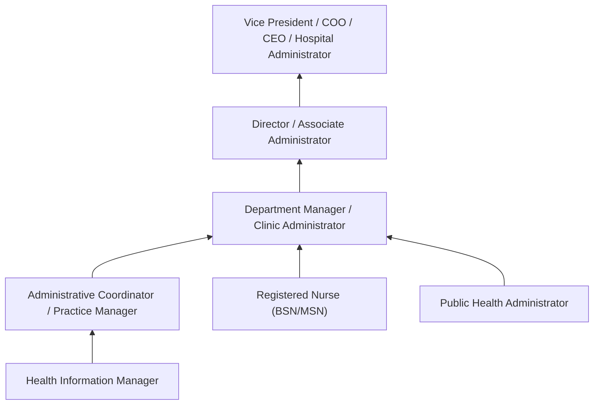
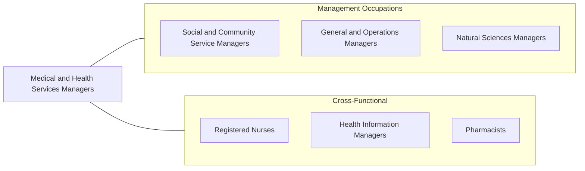

# Medical and Health Services Managers

> Plan, direct, or coordinate medical and health services in hospitals, clinics, managed care organizations, public health agencies, or similar organizations.

## Overview

Medical and Health Services Managers -- also known as healthcare administrators or healthcare executives -- plan, direct, and coordinate the delivery of healthcare services within organizations. They manage clinical departments, entire facilities, or specific medical practices, ensuring that healthcare is delivered efficiently, cost-effectively, and in compliance with complex regulations. Their decisions directly impact patient care quality, staff satisfaction, and organizational financial health.

The role sits at the intersection of healthcare delivery and business management. These managers must understand clinical workflows, medical terminology, and patient care standards while also managing budgets, human resources, technology systems, and strategic planning. They work closely with physicians, nurses, and other clinicians to improve care delivery, reduce costs, and implement evidence-based practices.

Healthcare management has become increasingly complex due to evolving payment models (value-based care, bundled payments), electronic health record mandates, quality reporting requirements, and the growing emphasis on patient experience metrics. Medical and Health Services Managers must navigate a heavily regulated environment that includes HIPAA, the Affordable Care Act, CMS conditions of participation, and state licensing requirements. The COVID-19 pandemic further highlighted the critical importance of healthcare leaders who can respond to rapidly changing circumstances.

## Classification Hierarchy

## Key Statistics

| Metric | Value |
|--------|-------|
| SOC Code | 11-9111.00 |
| Job Zone | 4 (Considerable Preparation) |
| Category | [Management Occupations](/occupations/Management/index) |
| Task Count | 131 |
| Salary Range | $70,000 - $175,000+ |
| Employment Level | Large - over 480,000 |
| Growth Outlook | Much faster than average |
| Source | O*NET |

## Core Tasks

### direct.SuperviseEvaluateWorkActivities

Medical and Health Services Managers direct, supervise, and evaluate the work activities of medical, nursing, technical, clerical, and other personnel across their organizations.

**Actions:**
- `direct.SuperviseEvaluateWorkActivities.of.MedicalNursingTechnicalClericalServiceMaintenanceOtherPersonnel`
- `direct.Recruitment.of.Personnel`
- `direct.Hiring.of.Personnel`
- `direct.Training.of.Personnel`

### develop.ComputerizedRecordManagementSystems

Medical and Health Services Managers develop and maintain electronic health record systems and other IT infrastructure to store, process, and report clinical and administrative data.

**Actions:**
- `develop.ComputerizedRecordManagementSystems.to.store.Data`
- `develop.ComputerizedRecordManagementSystems.to.process.Data`
- `develop.ComputerizedRecordManagementSystems.to.PersonnelActivities`
- `develop.ComputerizedRecordManagementSystems.to.Information`

### conduct.FiscalOperations

Medical and Health Services Managers oversee the financial operations of their organizations including budgeting, expenditure authorization, rate setting, and financial reporting.

**Actions:**
- No specific sub-actions listed for this task group.

## Skills & Competencies

### Technical Skills
- **Healthcare Operations Management** - Expert
- **Healthcare Regulations & Compliance** - Expert
- **Financial Management & Budgeting** - Advanced
- **Quality Improvement (Lean, Six Sigma)** - Advanced
- **Health Information Systems (EHR)** - Advanced
- **Patient Safety & Risk Management** - Advanced
- **Revenue Cycle Management** - Advanced

### Soft Skills
- **Leadership** - Critical
- **Communication** - Critical
- **Decision Making** - Essential
- **Problem Solving** - Essential
- **Ethical Judgment** - Essential
- **Interpersonal Skills** - Essential
- **Change Management** - Important

## Education & Certifications

| Requirement | Details |
|-------------|---------|
| Typical Education | Master's degree in Healthcare Administration (MHA), Health Services Administration, Public Health (MPH), or Business (MBA) |
| Work Experience | 3-7 years in healthcare with progressive administrative responsibility |
| On-the-Job Training | Moderate - facility-specific and regulatory knowledge development |
| Common Certifications | FACHE (Fellow of the American College of Healthcare Executives - ACHE), CMPE (Certified Medical Practice Executive - MGMA), CPHQ (Certified Professional in Healthcare Quality - NAHQ), CHC (Certified in Healthcare Compliance - HCCA) |

## Career Progression

## Industry Variations

- **Hospitals** - Inpatient operations; medical staff governance; emergency preparedness; Joint Commission accreditation; complex payer mix management
- **Physician Practices** - Provider scheduling; patient access; revenue cycle optimization; practice growth; physician relationship management
- **Long-Term Care** - CMS conditions of participation; staffing ratios; resident rights; survey preparation; Medicaid reimbursement
- **Public Health / Government** - Population health programs; epidemiology; grant management; community health assessments; pandemic preparedness

## Technology & Tools

- **Electronic Health Records** - Epic, Cerner (Oracle Health), MEDITECH, athenahealth
- **Revenue Cycle** - Waystar, Availity, Change Healthcare, Optum
- **Analytics** - Tableau, Power BI, Vizient, Premier PINC AI
- **Quality Reporting** - CMS HCAHPS, Leapfrog, The Joint Commission Connect
- **Workforce Management** - Kronos (UKG), ShiftWizard, Qgenda
- **Telehealth** - Teladoc, Amwell, Zoom for Healthcare, Doxy.me

## Related Occupations

## Industries

- [Healthcare and Social Assistance](/industries/Healthcare/index) - Very High Employment
- [Government](/industries/PublicAdministration) - Moderate Employment
- [Professional, Scientific, and Technical Services](/industries/Scientific) - Low Employment

## Departments

This occupation typically works in:
- Hospital Administration
- Clinical Operations
- Practice Management
- Health Information Management

---

*Source: O*NET 11-9111.00 - ONETOccupation*
