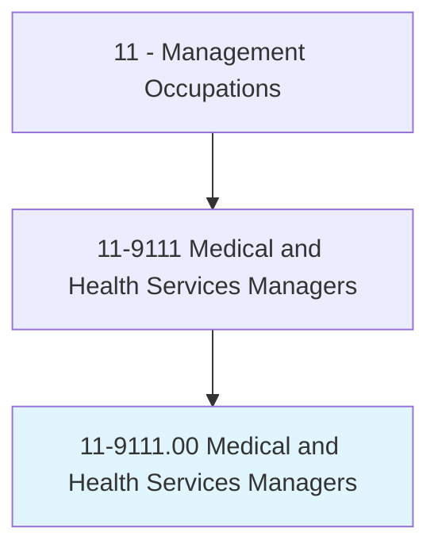
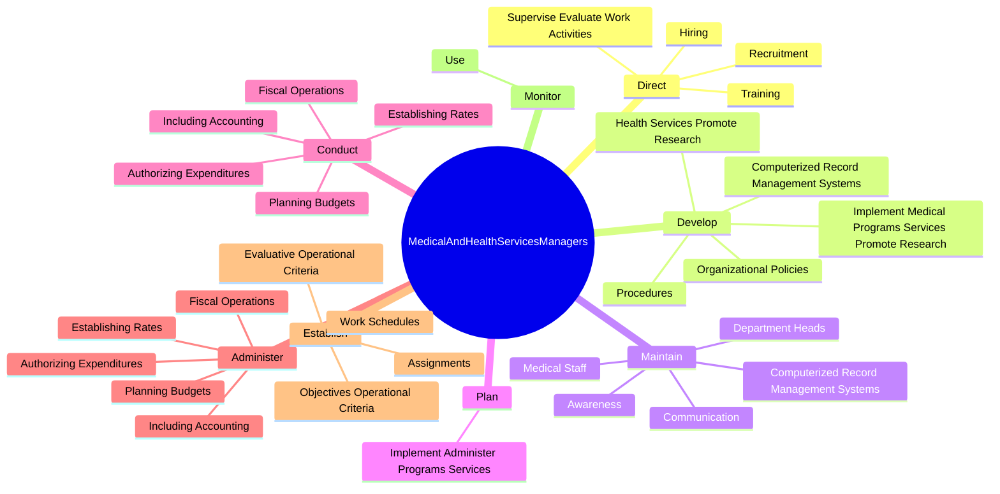

# Medical and Health Services Managers

> Plan, direct, or coordinate medical and health services in hospitals, clinics, managed care organizations, public health agencies, or similar organizations.

## Overview

Medical and Health Services Managers is classified under Management Occupations (SOC 11). Plan, direct, or coordinate medical and health services in hospitals, clinics, managed care organizations, public health agencies, or similar organizations.

## Classification Hierarchy

## Key Statistics

| Metric | Value |
|--------|-------|
| SOC Code | 11-9111.00 |
| Category | [Management Occupations](/occupations/Management/index) |
| Task Count | 131 |
| Source | O*NET |

## Core Tasks

### direct.SuperviseEvaluateWorkActivities

Medical and Health Services Managers direct supervise evaluate work activities as part of their core responsibilities.

**Actions:**
- `direct.SuperviseEvaluateWorkActivities.of.MedicalNursingTechnicalClericalServiceMaintenanceOtherPersonnel`
- `direct.Recruitment.of.Personnel`
- `direct.Hiring.of.Personnel`
- `direct.Training.of.Personnel`

### develop.ComputerizedRecordManagementSystems

Medical and Health Services Managers develop computerized record management systems as part of their core responsibilities.

**Actions:**
- `develop.ComputerizedRecordManagementSystems.to.store.Data`
- `develop.ComputerizedRecordManagementSystems.to.process.Data`
- `develop.ComputerizedRecordManagementSystems.to.PersonnelActivities`
- `develop.ComputerizedRecordManagementSystems.to.Information`

### maintain.ComputerizedRecordManagementSystems

Medical and Health Services Managers maintain computerized record management systems as part of their core responsibilities.

**Actions:**
- `maintain.ComputerizedRecordManagementSystems.to.store.Data`
- `maintain.ComputerizedRecordManagementSystems.to.process.Data`
- `maintain.ComputerizedRecordManagementSystems.to.PersonnelActivities`
- `maintain.ComputerizedRecordManagementSystems.to.Information`

## Skills & Competencies

### Technical Skills
- **Strategic Planning** - Advanced
- **Financial Management** - Advanced
- **Operations Management** - Advanced

### Soft Skills
- **Communication** - Essential
- **Problem Solving** - Essential
- **Critical Thinking** - Important
- **Teamwork** - Important
- **Adaptability** - Important

## Related Occupations

## Industries

This occupation is found across multiple industries. See [Industries](/industries) for sector-specific employment data.

## Career Progression

---

*Source: O*NET 11-9111.00 - ONETOccupation*
