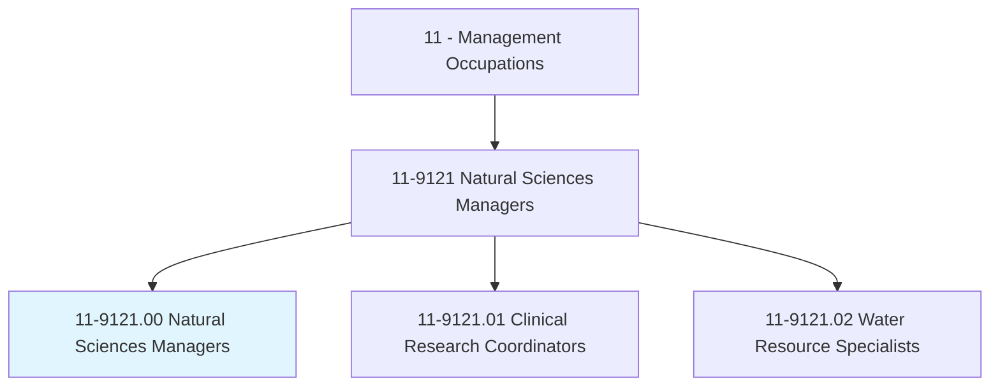
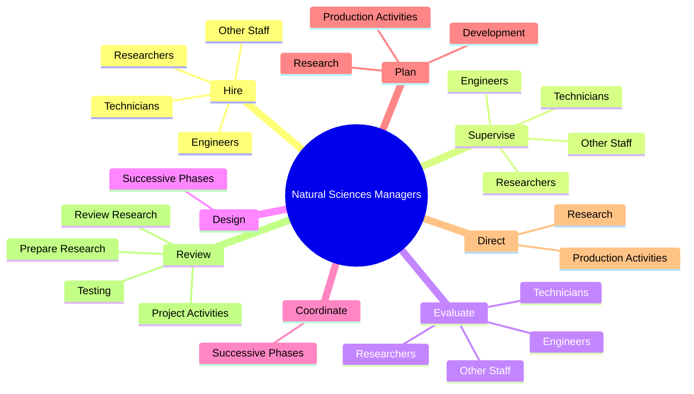

# Natural Sciences Managers

> Plan, direct, or coordinate activities in such fields as life sciences, physical sciences, mathematics, statistics, and research and development in these fields.

## Overview

Natural Sciences Managers is classified under Management Occupations (SOC 11). Plan, direct, or coordinate activities in such fields as life sciences, physical sciences, mathematics, statistics, and research and development in these fields.

## Classification Hierarchy

## Key Statistics

| Metric | Value |
|--------|-------|
| SOC Code | 11-9121.00 |
| Category | [Management Occupations](/occupations/Management) |
| Task Count | 85 |
| Source | O*NET |

## Core Tasks

### hire.Engineers

Natural Sciences Managers hire engineers as part of their core responsibilities.

**Actions:**
- `hire.Engineers`
- `hire.Technicians`
- `hire.Researchers`
- `hire.OtherStaff`

### supervise.Engineers

Natural Sciences Managers supervise engineers as part of their core responsibilities.

**Actions:**
- `supervise.Engineers`
- `supervise.Technicians`
- `supervise.Researchers`
- `supervise.OtherStaff`

### evaluate.Engineers

Natural Sciences Managers evaluate engineers as part of their core responsibilities.

**Actions:**
- `evaluate.Engineers`
- `evaluate.Technicians`
- `evaluate.Researchers`
- `evaluate.OtherStaff`

## Skills & Competencies

### Technical Skills
- **Strategic Planning** - Advanced
- **Financial Management** - Advanced
- **Operations Management** - Advanced

### Soft Skills
- **Communication** - Essential
- **Problem Solving** - Essential
- **Critical Thinking** - Important
- **Teamwork** - Important
- **Adaptability** - Important

## Related Occupations

## Industries

This occupation is found across multiple industries. See [Industries](/industries) for sector-specific employment data.

## Career Progression

---

*Source: O*NET 11-9121.00 - ONETOccupation*
