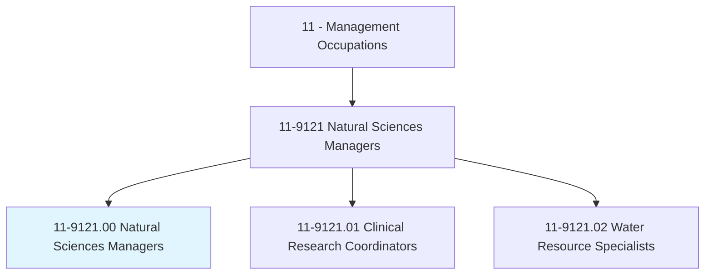
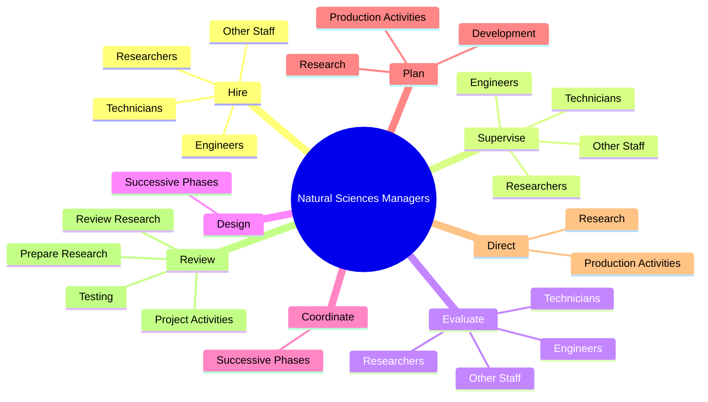
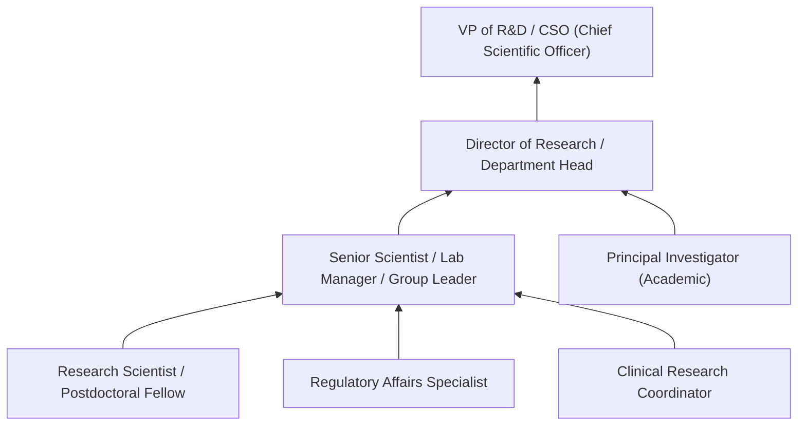
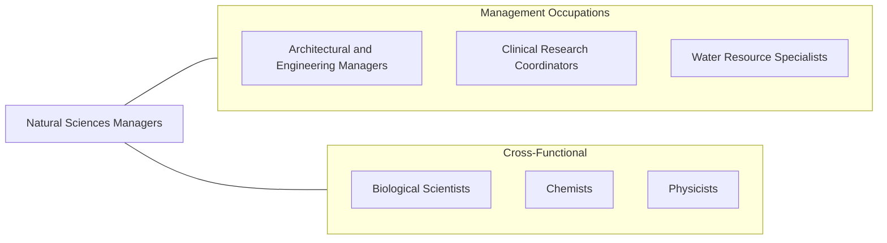

# Natural Sciences Managers

> Plan, direct, or coordinate activities in such fields as life sciences, physical sciences, mathematics, statistics, and research and development in these fields.

## Overview

Natural Sciences Managers lead teams of scientists, researchers, and technical professionals conducting work in biology, chemistry, physics, earth sciences, mathematics, and related fields. They oversee research programs, manage laboratory operations, secure funding, and translate scientific findings into practical applications. Their leadership shapes the direction of scientific inquiry and the development of new products, treatments, and technologies.

These managers bridge the gap between scientific research and organizational objectives. They set research priorities, allocate resources across projects, ensure compliance with regulatory and safety standards, and communicate results to stakeholders including executives, funding agencies, and regulatory bodies. In pharmaceutical and biotechnology companies, they may oversee drug discovery pipelines; in environmental firms, they direct field studies and remediation programs; in government agencies, they manage publicly funded research initiatives.

The role demands deep scientific expertise combined with strong management capabilities. Natural Sciences Managers must evaluate the technical merit and commercial potential of research proposals, mentor junior scientists, manage complex budgets, and navigate the intellectual property landscape. As scientific research becomes increasingly interdisciplinary and data-driven, these managers must also foster collaboration across specialties and integrate computational methods into traditional research workflows.

## Classification Hierarchy

## Key Statistics

| Metric | Value |
|--------|-------|
| SOC Code | 11-9121.00 |
| Job Zone | 5 (Extensive Preparation) |
| Category | [Management Occupations](/occupations/Management/index) |
| Task Count | 85 |
| Salary Range | $100,000 - $195,000+ |
| Employment Level | Moderate - approximately 75,000 |
| Growth Outlook | Average |
| Source | O*NET |

## Core Tasks

### hire.Engineers

Natural Sciences Managers recruit and hire scientists, engineers, technicians, and support staff with the specialized expertise needed for their research programs.

**Actions:**
- `hire.Engineers`
- `hire.Technicians`
- `hire.Researchers`
- `hire.OtherStaff`

### supervise.Engineers

Natural Sciences Managers provide technical direction and professional development oversight to their scientific and engineering teams.

**Actions:**
- `supervise.Engineers`
- `supervise.Technicians`
- `supervise.Researchers`
- `supervise.OtherStaff`

### plan.Research

Natural Sciences Managers plan and direct research, development, and production activities, setting priorities and timelines for scientific programs.

**Actions:**
- No specific sub-actions listed for this task group.

## Skills & Competencies

### Technical Skills
- **Scientific Research Methods** - Expert
- **R&D Program Management** - Expert
- **Laboratory Management** - Advanced
- **Grant Writing & Funding Acquisition** - Advanced
- **Regulatory Compliance (FDA, EPA, etc.)** - Advanced
- **Data Analysis & Statistical Methods** - Advanced
- **Intellectual Property Management** - Advanced

### Soft Skills
- **Leadership** - Critical
- **Communication (Technical & Non-Technical)** - Critical
- **Strategic Thinking** - Essential
- **Mentoring & Team Development** - Essential
- **Decision Making** - Essential
- **Collaboration** - Essential
- **Presentation Skills** - Important

## Education & Certifications

| Requirement | Details |
|-------------|---------|
| Typical Education | Master's or Doctoral degree (PhD) in a natural science discipline |
| Work Experience | 5-10 years of research experience, including published work |
| On-the-Job Training | Moderate - management skills development, regulatory knowledge |
| Common Certifications | PMP (Project Management Professional - PMI), RAC (Regulatory Affairs Certification - RAPS), discipline-specific board certifications |

## Career Progression

## Industry Variations

- **Pharmaceutical / Biotech** - Drug discovery pipelines; clinical trial oversight; FDA regulatory submissions; patent strategy; GLP compliance
- **Environmental Sciences** - Field research management; environmental impact assessments; remediation oversight; EPA compliance
- **Government / National Labs** - Federally funded research; national security applications; large-scale collaborative programs; peer review processes
- **Agriculture / Food Science** - Crop research; food safety testing; USDA compliance; product development; quality assurance

## Technology & Tools

- **Laboratory Information Management** - LabWare LIMS, STARLIMS, Benchling
- **Research Tools** - MATLAB, R, Python, SAS for statistical analysis
- **Project Management** - Microsoft Project, Smartsheet, JIRA
- **Scientific Software** - GraphPad Prism, Schrödinger (drug discovery), ChemDraw
- **Compliance** - Veeva Vault (life sciences), MasterControl
- **Collaboration** - Electronic Lab Notebooks (Benchling, LabArchives), SharePoint

## Related Occupations

## Industries

- [Professional, Scientific, and Technical Services](/industries/Scientific) - High Employment
- [Manufacturing (Pharmaceutical, Chemical)](/industries/Manufacturing/index) - High Employment
- [Government (Federal Research)](/industries/PublicAdministration) - Moderate Employment
- [Educational Services (University Research)](/industries/Education) - Moderate Employment

## Departments

This occupation typically works in:
- [Research & Development](/departments/RnD/index)
- Laboratory Operations
- [Quality Assurance](/departments/Quality)
- Regulatory Affairs

---

*Source: O*NET 11-9121.00 - ONETOccupation*
