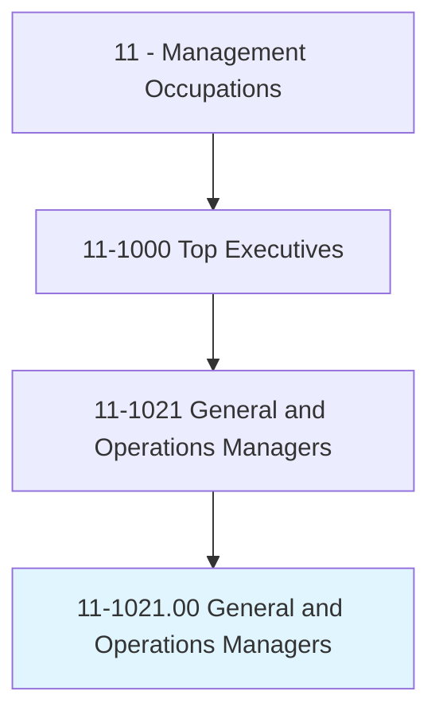
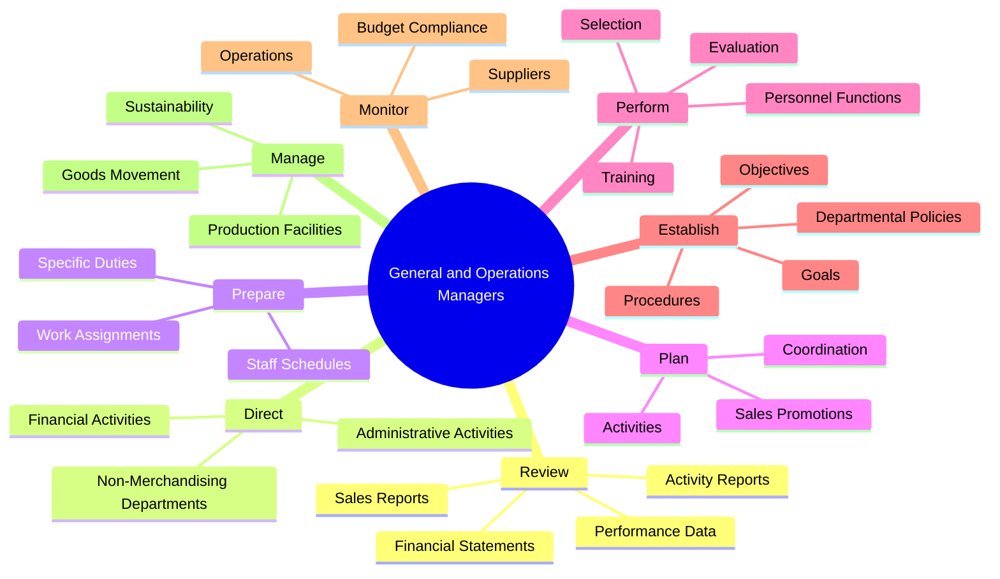
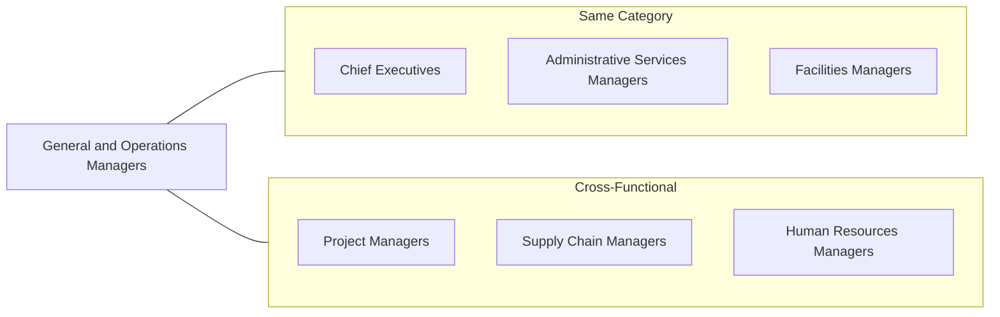
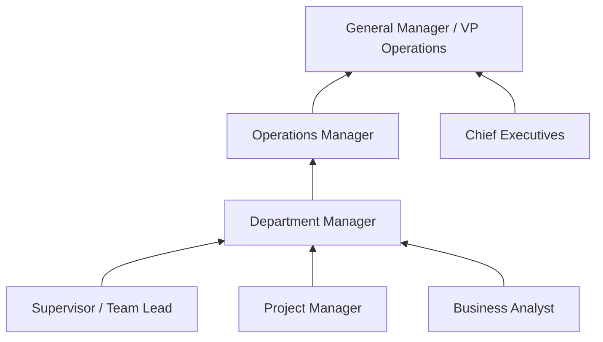

# General and Operations Managers

> Plan, direct, or coordinate the operations of public or private sector organizations, overseeing multiple departments or locations. Duties and responsibilities include formulating policies, managing daily operations, and planning the use of materials and human resources, but are too diverse and general in nature to be classified in any one functional area of management or administration, such as personnel, purchasing, or administrative services.

## Overview

General and Operations Managers serve as versatile organizational leaders who oversee the day-to-day functioning of businesses across all industries. They bridge strategic planning with operational execution, managing multiple departments, coordinating cross-functional activities, and ensuring efficient resource allocation. This role requires balancing financial performance, personnel management, customer satisfaction, and operational efficiency while adapting to diverse organizational contexts and industry requirements.

## Classification Hierarchy

## Key Statistics

| Metric | Value |
|--------|-------|
| SOC Code | 11-1021.00 |
| Job Zone | 4 (Considerable Preparation) |
| Category | [Management](/occupations/Management/index) |
| Core Tasks | 15+ |
| Source | O*NET |

## Core Tasks

### review.FinancialStatements

General and Operations Managers analyze performance data to drive continuous improvement.

**Actions:**
- `review.FinancialStatements.to.measure.ProductivityAchievement` - Assess productivity metrics
- `review.FinancialStatements.to.GoalAchievement` - Track progress toward objectives
- `review.Sales.to.measure.ProductivityAchievement` - Evaluate sales performance
- `review.ActivityReports.to.measure.ProductivityAchievement` - Monitor operational activities
- `review.OtherPerformanceData.to.GoalAchievement` - Identify areas for cost reduction

### direct.AdministrativeActivities

General and Operations Managers lead activities essential to product and service delivery.

**Actions:**
- `direct.AdministrativeActivitiesDirectlyRelated.to.MakingProducts` - Oversee production-related administration
- `direct.AdministrativeActivitiesDirectlyRelated.to.ProvidingServices` - Manage service delivery operations

### prepare.StaffWorkSchedules

General and Operations Managers organize workforce allocation and assignments.

**Actions:**
- `prepare.StaffWorkSchedules` - Create employee scheduling
- `prepare.AssignSpecificDuties` - Allocate task responsibilities

### direct.Financial

General and Operations Managers oversee financial operations for organizational efficiency.

**Actions:**
- `direct.Financial.to.fund.Operations` - Allocate resources for operational needs
- `direct.Financial.to.maximize.Investments` - Optimize investment returns
- `direct.Financial.to.increase.Efficiency` - Drive cost efficiency
- `coordinate.Financial.to.fund.Operations` - Synchronize financial activities

### plan.Activities

General and Operations Managers coordinate cross-departmental initiatives.

**Actions:**
- `plan.Activities.with.OtherDepartmentManagers` - Align departmental efforts
- `plan.SalesPromotions.with.OtherDepartmentManagers` - Coordinate marketing initiatives
- `direct.Activities.with.OtherDepartmentManagers` - Lead collaborative projects

### perform.PersonnelFunctions

General and Operations Managers handle human resources responsibilities.

**Actions:**
- `perform.PersonnelFunctions` - Execute HR-related tasks
- `perform.Selection` - Recruit and hire staff
- `perform.Training` - Develop employee capabilities
- `perform.Evaluation` - Assess employee performance

### establish.DepartmentalPolicies

General and Operations Managers create and implement organizational guidelines.

**Actions:**
- `establish.DepartmentalPolicies.in.Conjunction.with.BoardMembers` - Develop policies with leadership
- `establish.Goals.in.Conjunction.with.BoardMembers` - Set organizational targets
- `establish.Objectives.in.OrganizationOfficials` - Define measurable objectives
- `establish.Procedures.in.StaffMembers` - Create operational procedures
- `implement.DepartmentalPolicies.in.Conjunction.with.BoardMembers` - Execute policy changes

### monitor.Suppliers

General and Operations Managers ensure supply chain performance.

**Actions:**
- `monitor.Suppliers.to.ensure.TheyEfficientlyProvideNeededGoodsServicesWithinBudgetaryLimits` - Track supplier performance
- `monitor.Suppliers.to.EffectivelyProvideNeededGoodsServicesWithinBudgetaryLimits` - Ensure quality delivery

## Skills & Competencies

### Technical Skills
- **Operations Management** - Expert
- **Financial Analysis** - Advanced
- **Project Management** - Advanced
- **Supply Chain Management** - Advanced
- **Human Resources Management** - Advanced
- **Business Analytics** - Advanced

### Soft Skills
- **Leadership** - Critical
- **Decision Making** - Critical
- **Communication** - Critical
- **Problem Solving** - Essential
- **Adaptability** - Essential
- **Team Building** - Essential

## Related Occupations

## Industries

- [Retail Trade](/industries/Retail/index) - High Employment
- [Manufacturing](/industries/Manufacturing/index) - High Employment
- [Professional, Scientific, and Technical Services](/industries/Scientific) - High Employment
- [Healthcare and Social Assistance](/industries/Healthcare/index) - High Employment
- Accommodation and Food Services - High Employment
- [Construction](/industries/Construction/index) - Moderate Employment

## Career Progression

## Education & Training

| Requirement | Details |
|-------------|---------|
| Typical Education | Bachelor's degree in Business Administration, Management, or related field |
| Work Experience | 5+ years in progressively responsible management roles |
| On-the-Job Training | Moderate to extensive, depending on industry specialization |
| Common Certifications | PMP, Six Sigma, MBA, Industry-specific certifications |

## Departments

This occupation typically works in:
- [Operations](/departments/Operations/index)
- General Management
- Administration
- Regional/District Management

---

*Source: O*NET 11-1021.00 - ONETOccupation*
