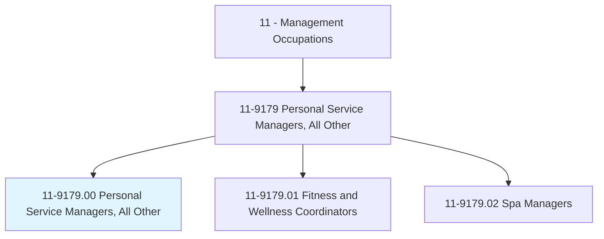
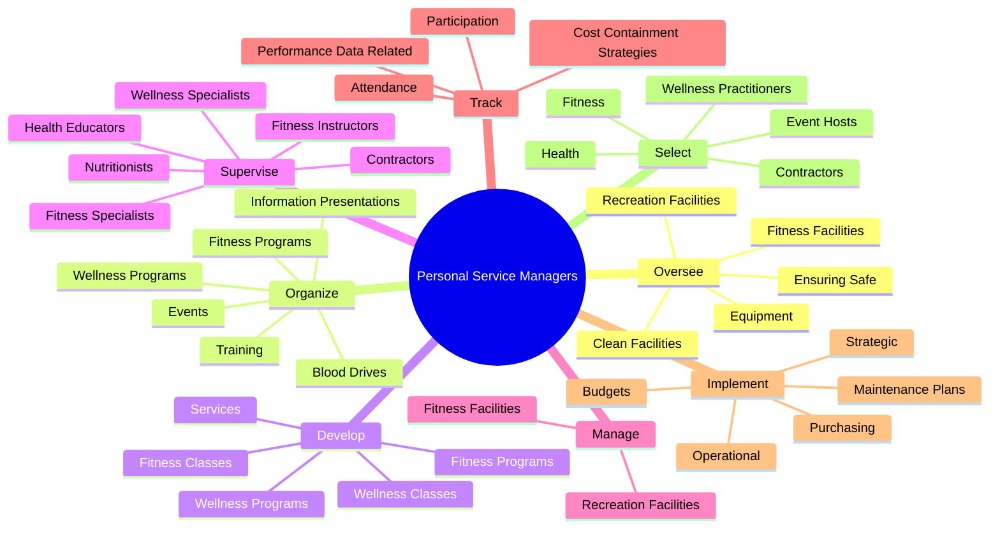
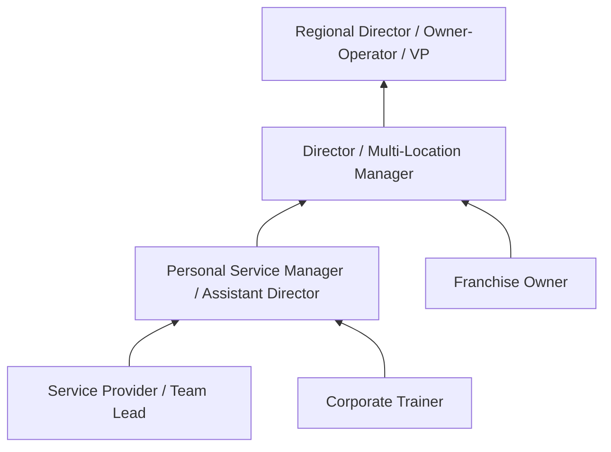
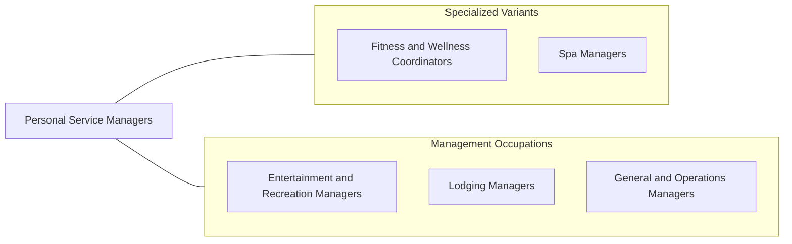

# Personal Service Managers, All Other

> All personal service managers not listed separately.

## Overview

Personal Service Managers in this residual category oversee operations in personal service establishments and programs that do not fall under more specific management classifications. This includes managers of fitness centers, wellness programs, beauty salons, pet care facilities, dry cleaners, and other personal service businesses. They combine service industry management with knowledge of their specific domain to deliver quality customer experiences.

These managers are responsible for staff hiring and training, scheduling, facility operations, financial management, marketing, and customer satisfaction. The personal services sector is characterized by direct customer interaction, appointment-based scheduling, and the need to maintain high service standards consistently. Many establishments are small businesses, so managers often wear multiple hats, handling everything from front-desk reception to inventory management.

The personal services industry continues to evolve with growing consumer spending on wellness, self-care, and convenience services. Managers must adapt to online booking expectations, social media marketing, subscription-based business models, and the integration of technology into service delivery. The COVID-19 pandemic also reshaped the industry, introducing new hygiene standards and contactless service options.

## Classification Hierarchy

## Key Statistics

| Metric | Value |
|--------|-------|
| SOC Code | 11-9179.00 |
| Job Zone | 3 (Medium Preparation) |
| Category | [Management Occupations](/occupations/Management/index) |
| Task Count | 159 |
| Salary Range | $35,000 - $80,000+ |
| Employment Level | Moderate |
| Growth Outlook | Faster than average |
| Source | O*NET |

## Core Tasks

### oversee.FitnessFacilities

Personal Service Managers ensure facilities and equipment are safe, clean, and properly maintained for service delivery.

**Actions:**
- `oversee.FitnessFacilities`
- `oversee.RecreationFacilities`
- `oversee.EnsuringSafe`
- `oversee.CleanFacilities`

### develop.FitnessPrograms

Personal Service Managers develop programming and service offerings that meet customer needs and generate revenue.

**Actions:**
- `develop.FitnessPrograms`
- `develop.Services`
- `develop.WellnessPrograms`
- `develop.FitnessClasses.of.ClassOfferings`

### supervise.FitnessSpecialists

Personal Service Managers supervise a diverse team of service professionals, contractors, and support staff.

**Actions:**
- No specific sub-actions listed for this task group.

## Skills & Competencies

### Technical Skills
- **Service Operations Management** - Expert
- **Staff Scheduling & Management** - Advanced
- **Financial Management & Budgeting** - Advanced
- **Facility Operations** - Advanced
- **Customer Service Standards** - Advanced
- **Marketing & Business Development** - Advanced
- **Health & Safety Compliance** - Advanced

### Soft Skills
- **Customer Service** - Critical
- **Leadership** - Critical
- **Communication** - Essential
- **Organizational Skills** - Essential
- **Multitasking** - Essential
- **People Management** - Important
- **Creativity** - Important

## Education & Certifications

| Requirement | Details |
|-------------|---------|
| Typical Education | Associate's or Bachelor's degree in Business, Hospitality, or domain-specific field |
| Work Experience | 3-5 years in personal services with supervisory experience |
| Common Certifications | Domain-specific: ACSM, ACE, NASM (fitness); state cosmetology license (beauty); business management certificates |

## Career Progression

## Industry Variations

- **Fitness / Health Clubs** - Membership management; group fitness scheduling; personal training oversight; retention programs
- **Beauty / Hair Salons** - Stylist recruitment and retention; booth rental vs. commission models; product sales; style trends
- **Pet Care Services** - Grooming, boarding, daycare management; animal safety; client relationship management
- **Wellness / Holistic Services** - Practitioner coordination; treatment menu design; community wellness events

## Technology & Tools

- **Scheduling / POS** - Mindbody, Vagaro, Booker, Square Appointments
- **Marketing** - Instagram, Facebook, Google Business, Mailchimp
- **Client Management** - Mindbody CRM, Fresha, Zenoti
- **Financial** - QuickBooks, Wave, Square Dashboard
- **Staff Management** - When I Work, Deputy, Homebase
- **Online Booking** - Calendly, Acuity Scheduling, platform-specific tools

## Related Occupations

## Industries

- [Personal and Laundry Services](/industries/PersonalServices) - High Employment
- [Arts, Entertainment, and Recreation](/industries/Entertainment) - Moderate Employment
- [Healthcare and Social Assistance](/industries/Healthcare/index) - Moderate Employment

## Departments

This occupation typically works in:
- [Operations](/departments/Operations/index)
- Guest / Client Services
- Wellness / Recreation

---

*Source: O*NET 11-9179.00 - ONETOccupation*
