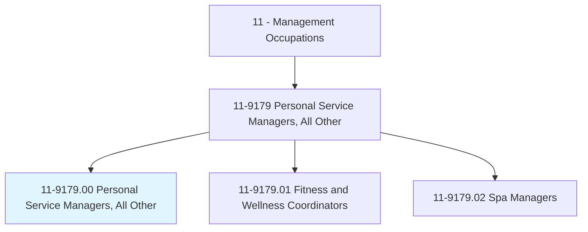
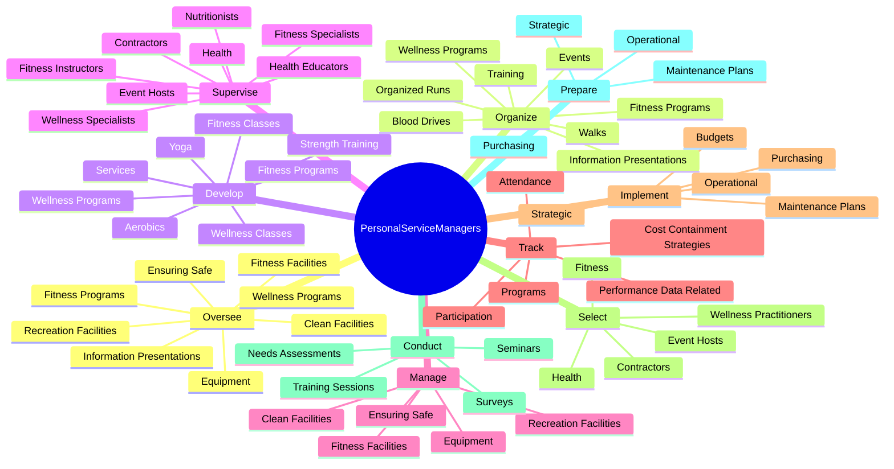
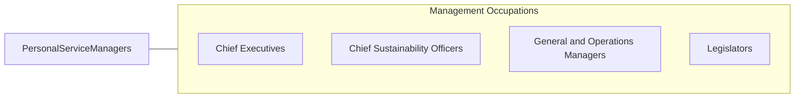

# Personal Service Managers, All Other

> All personal service managers not listed separately.

## Overview

Personal Service Managers, All Other is classified under Management Occupations (SOC 11). All personal service managers not listed separately.

## Classification Hierarchy

## Key Statistics

| Metric | Value |
|--------|-------|
| SOC Code | 11-9179.00 |
| Category | [Management Occupations](/occupations/Management) |
| Task Count | 159 |
| Source | O*NET |

## Core Tasks

### oversee.FitnessFacilities

Personal Service Managers, All Other oversee fitness facilities as part of their core responsibilities.

**Actions:**
- `oversee.FitnessFacilities`
- `oversee.RecreationFacilities`
- `oversee.EnsuringSafe`
- `oversee.CleanFacilities`

### organize.FitnessPrograms

Personal Service Managers, All Other organize fitness programs as part of their core responsibilities.

**Actions:**
- `organize.FitnessPrograms.in.FirstAidResuscitationCpr`
- `organize.FitnessPrograms.in.CardiopulmonaryResuscitationCpr`
- `organize.WellnessPrograms.in.FirstAidResuscitationCpr`
- `organize.WellnessPrograms.in.CardiopulmonaryResuscitationCpr`

### develop.FitnessPrograms

Personal Service Managers, All Other develop fitness programs as part of their core responsibilities.

**Actions:**
- `develop.FitnessPrograms`
- `develop.Services`
- `develop.WellnessPrograms`
- `develop.FitnessClasses.of.ClassOfferings`

## Skills & Competencies

### Technical Skills
- **Strategic Planning** - Advanced
- **Financial Management** - Advanced
- **Operations Management** - Advanced

### Soft Skills
- **Communication** - Essential
- **Problem Solving** - Essential
- **Critical Thinking** - Important
- **Teamwork** - Important
- **Adaptability** - Important

## Related Occupations

## Industries

This occupation is found across multiple industries. See [Industries](/industries) for sector-specific employment data.

## Career Progression

---

*Source: O*NET 11-9179.00 - ONETOccupation*
