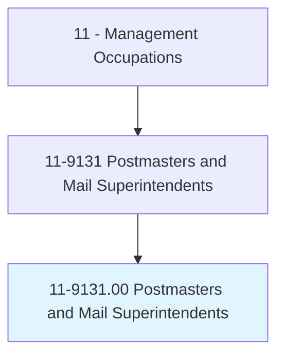
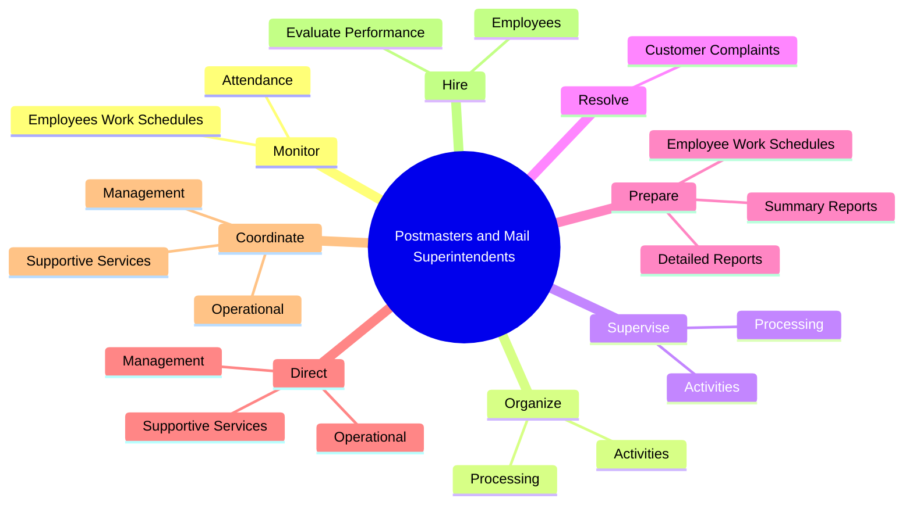
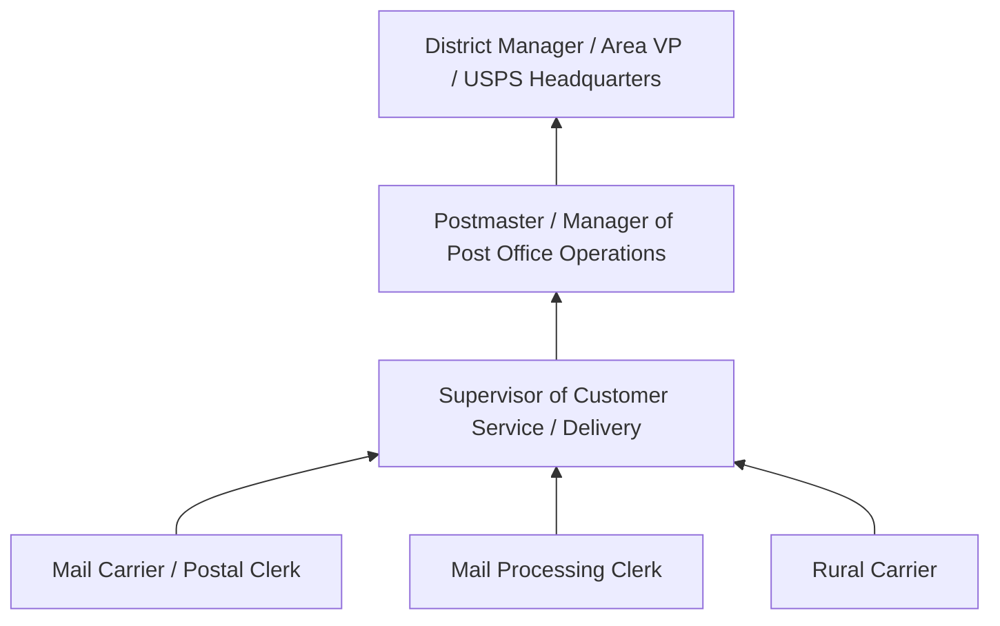
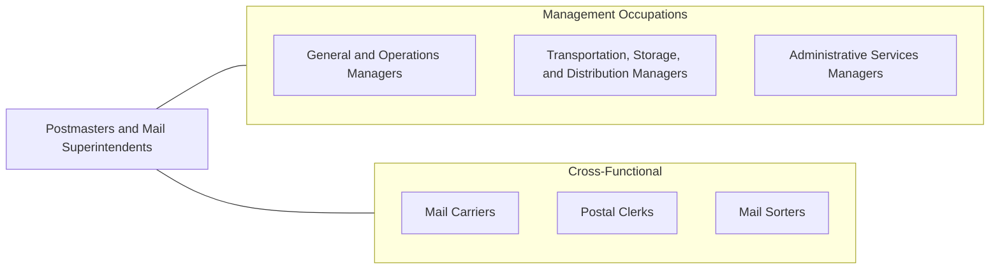

# Postmasters and Mail Superintendents

> Plan, direct, or coordinate operational, administrative, management, and support services of a U.S. post office; or coordinate activities of workers engaged in postal and related work in assigned post office.

## Overview

Postmasters and Mail Superintendents manage the operations of U.S. Postal Service facilities, from small rural post offices to large urban processing centers. They oversee mail collection, sorting, processing, and delivery operations while managing staff, budgets, customer service, and regulatory compliance. As the public face of the Postal Service in their communities, they ensure reliable mail delivery while adapting to evolving customer expectations and declining first-class mail volumes.

These managers are responsible for the full spectrum of postal operations: scheduling carriers and clerks, monitoring delivery performance, resolving customer complaints, maintaining facilities, managing vehicle fleets, and ensuring compliance with USPS policies and federal regulations. They balance operational efficiency with customer service, community engagement, and employee welfare. In smaller offices, Postmasters may personally handle all functions; in larger facilities, they manage through subordinate supervisors.

The postal industry is undergoing significant transformation as package delivery grows, digital communication reduces letter volume, and new services emerge. Postmasters must adapt operations to handle increased parcel volumes, implement new technology, manage last-mile delivery challenges, and find ways to maintain financial viability while fulfilling the Postal Service's universal service obligation.

## Classification Hierarchy

## Key Statistics

| Metric | Value |
|--------|-------|
| SOC Code | 11-9131.00 |
| Job Zone | 3 (Medium Preparation) |
| Category | [Management Occupations](/occupations/Management/index) |
| Task Count | 42 |
| Salary Range | $45,000 - $95,000+ |
| Employment Level | Moderate - approximately 20,000 |
| Growth Outlook | Declining |
| Source | O*NET |

## Core Tasks

### monitor.EmployeesWorkSchedules

Postmasters monitor employee work schedules and attendance records for payroll accuracy and operational coverage.

**Actions:**
- `monitor.EmployeesWorkSchedules.for.PayrollPurposes`
- `monitor.Attendance.for.PayrollPurposes`

### organize.Activities

Postmasters organize and supervise the processing of incoming and outgoing mail to ensure timely and accurate delivery.

**Actions:**
- `organize.Activities.of.IncomingMail`
- `organize.Activities.of.OutgoingMail`
- `organize.Processing.of.IncomingMail`
- `organize.Processing.of.OutgoingMail`

### resolve.CustomerComplaints

Postmasters address customer complaints about mail delivery, service quality, and postal products, serving as the primary community liaison.

**Actions:**
- No specific sub-actions listed for this task group.

## Skills & Competencies

### Technical Skills
- **Postal Operations Management** - Expert
- **Mail Processing & Distribution** - Expert
- **Staff Scheduling & Labor Management** - Advanced
- **Budget Administration** - Advanced
- **USPS Regulations & Procedures** - Advanced
- **Customer Service Management** - Advanced
- **Fleet & Facility Management** - Advanced

### Soft Skills
- **Leadership** - Critical
- **Customer Service** - Critical
- **Communication** - Essential
- **Organizational Skills** - Essential
- **Problem Solving** - Essential
- **Community Relations** - Important
- **Adaptability** - Important

## Education & Certifications

| Requirement | Details |
|-------------|---------|
| Typical Education | High school diploma; some college or Bachelor's degree preferred for larger offices |
| Work Experience | Extensive USPS career experience, typically 5-15 years progressing through postal positions |
| On-the-Job Training | Extensive - USPS-specific management training programs |
| Common Certifications | USPS internal management development programs, EAS (Executive and Administrative Schedule) qualifications |

## Career Progression

## Industry Variations

- **Rural Post Offices** - Single-person operations; community hub function; limited hours; retail window focus
- **Urban Post Offices** - Large staff management; high-volume processing; multiple service windows; security concerns
- **Processing & Distribution Centers** - Mail sorting operations; automation management; shift scheduling; throughput optimization
- **Last-Mile Operations** - Carrier route management; package delivery coordination; Amazon/UPS/FedEx partnerships

## Technology & Tools

- **USPS Systems** - Point of Sale (POS) retail systems, Delivery Management System, CSDRS
- **Scanning / Tracking** - Intelligent Mail Barcode, Package Tracking, Informed Delivery
- **Workforce Management** - TACS (Time and Attendance Collection System), eReassign
- **Customer Tools** - USPS.com services, Click-N-Ship, Business Mail Entry
- **Automation** - Automated Flat Sorting Machine, Delivery Barcode Sorter, AFCS
- **Reporting** - USPS Business Intelligence, Financial reporting tools

## Related Occupations

## Industries

- [Federal Government (USPS)](/industries/PublicAdministration) - Exclusive Employment

## Departments

This occupation typically works in:
- Post Office Operations
- Customer Service
- Mail Processing

---

*Source: O*NET 11-9131.00 - ONETOccupation*
