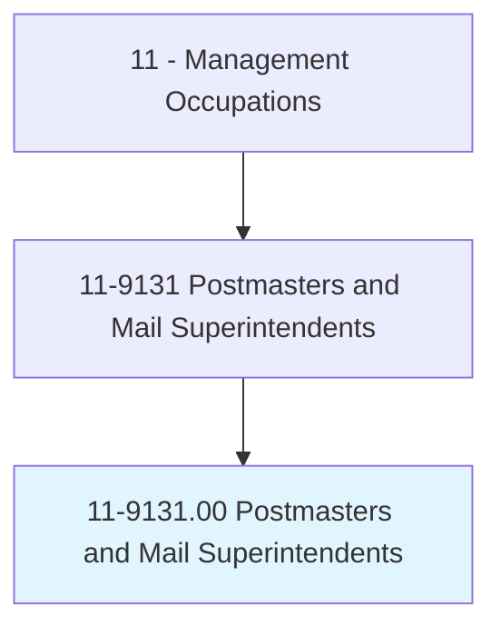
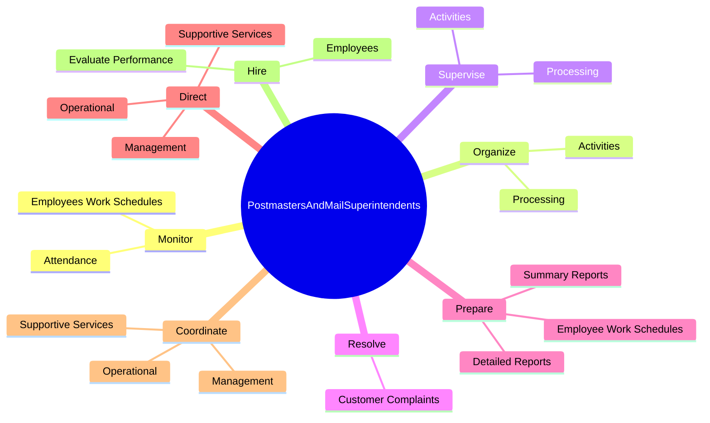
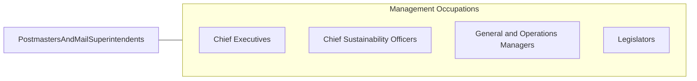

# Postmasters and Mail Superintendents

> Plan, direct, or coordinate operational, administrative, management, and support services of a U.S. post office; or coordinate activities of workers engaged in postal and related work in assigned post office.

## Overview

Postmasters and Mail Superintendents is an occupation within the Management Occupations category. Plan, direct, or coordinate operational, administrative, management, and support services of a U.S. 

## Classification Hierarchy

## Key Statistics

| Metric | Value |
|--------|-------|
| SOC Code | 11-9131.00 |
| Category | [Management Occupations](/occupations/Management) |
| Task Count | 42 |
| Source | O*NET |

## Core Tasks

### monitor.EmployeesWorkSchedules

Postmasters and Mail Superintendents monitor employees work schedules as part of their core responsibilities.

**Actions:**
- `monitor.EmployeesWorkSchedules.for.PayrollPurposes`
- `monitor.Attendance.for.PayrollPurposes`

### organize.Activities

Postmasters and Mail Superintendents organize activities as part of their core responsibilities.

**Actions:**
- `organize.Activities.of.IncomingMail`
- `organize.Activities.of.OutgoingMail`
- `organize.Processing.of.IncomingMail`
- `organize.Processing.of.OutgoingMail`

### supervise.Activities

Postmasters and Mail Superintendents supervise activities as part of their core responsibilities.

**Actions:**
- `supervise.Activities.of.IncomingMail`
- `supervise.Activities.of.OutgoingMail`
- `supervise.Processing.of.IncomingMail`
- `supervise.Processing.of.OutgoingMail`

## Skills & Competencies

### Technical Skills
- **Strategic Planning** - Advanced
- **Financial Management** - Advanced
- **Operations Management** - Advanced

### Soft Skills
- **Communication** - Essential
- **Problem Solving** - Essential
- **Critical Thinking** - Important
- **Teamwork** - Important
- **Adaptability** - Important

## Related Occupations

## Industries

This occupation is found across multiple industries. See [Industries](/industries) for sector-specific employment data.

## Career Progression

---

*Source: O*NET 11-9131.00 - ONETOccupation*
