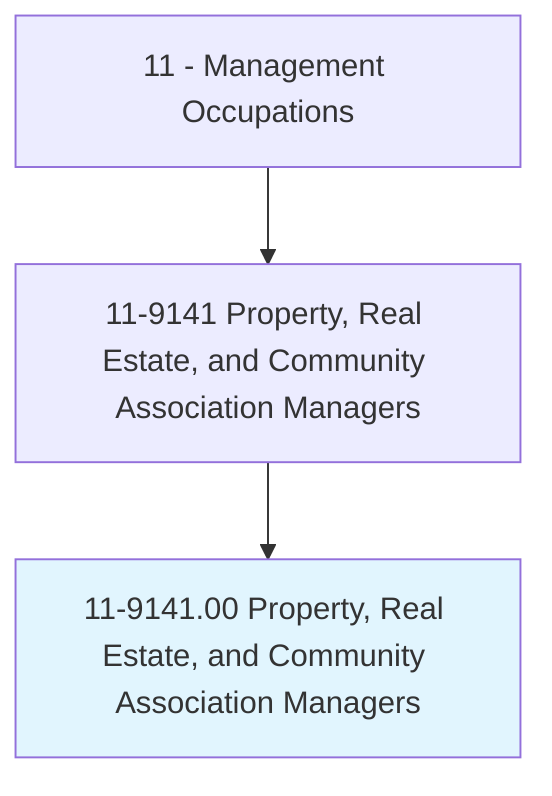
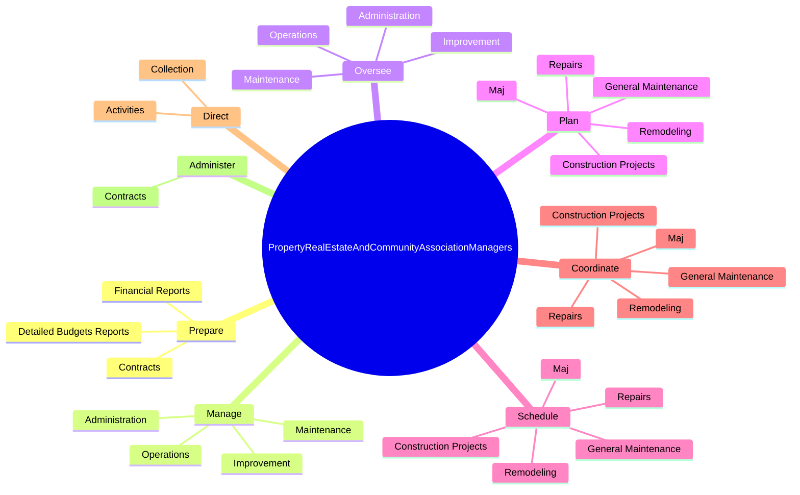
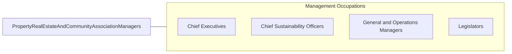

# Property, Real Estate, and Community Association Managers

> Plan, direct, or coordinate the selling, buying, leasing, or governance activities of commercial, industrial, or residential real estate properties. Includes managers of homeowner and condominium associations, rented or leased housing units, buildings, or land (including rights-of-way).

## Overview

Property, Real Estate, and Community Association Managers is an occupation within the Management Occupations category. Plan, direct, or coordinate the selling, buying, leasing, or governance activities of commercial, industrial, or residential real estate properties. 

## Classification Hierarchy

## Key Statistics

| Metric | Value |
|--------|-------|
| SOC Code | 11-9141.00 |
| Category | [Management Occupations](/occupations/Management/index) |
| Task Count | 150 |
| Source | O*NET |

## Core Tasks

### prepare.DetailedBudgetsReports

Property, Real Estate, and Community Association Managers prepare detailed budgets reports as part of their core responsibilities.

**Actions:**
- `prepare.DetailedBudgetsReports.for.Properties`
- `prepare.FinancialReports.for.Properties`
- `prepare.Contracts.for.Provision.of.PropertyServices`
- `prepare.Contracts.for.Cleaning`

### manage.Operations

Property, Real Estate, and Community Association Managers manage operations as part of their core responsibilities.

**Actions:**
- `manage.Operations.of.Commercial`
- `manage.Operations.of.Industrial`
- `manage.Operations.of.ResidentialProperties`
- `manage.Maintenance.of.Commercial`

### oversee.Operations

Property, Real Estate, and Community Association Managers oversee operations as part of their core responsibilities.

**Actions:**
- `oversee.Operations.of.Commercial`
- `oversee.Operations.of.Industrial`
- `oversee.Operations.of.ResidentialProperties`
- `oversee.Maintenance.of.Commercial`

## Skills & Competencies

### Technical Skills
- **Strategic Planning** - Advanced
- **Financial Management** - Advanced
- **Operations Management** - Advanced

### Soft Skills
- **Communication** - Essential
- **Problem Solving** - Essential
- **Critical Thinking** - Important
- **Teamwork** - Important
- **Adaptability** - Important

## Related Occupations

## Industries

This occupation is found across multiple industries. See [Industries](/industries) for sector-specific employment data.

## Career Progression

---

*Source: O*NET 11-9141.00 - ONETOccupation*
