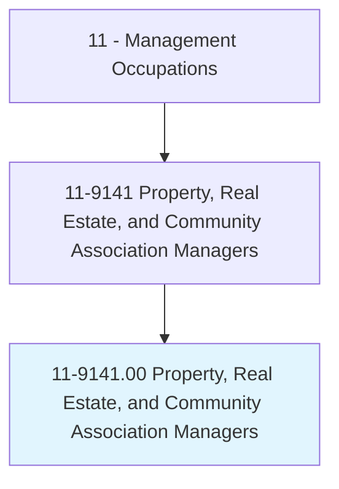
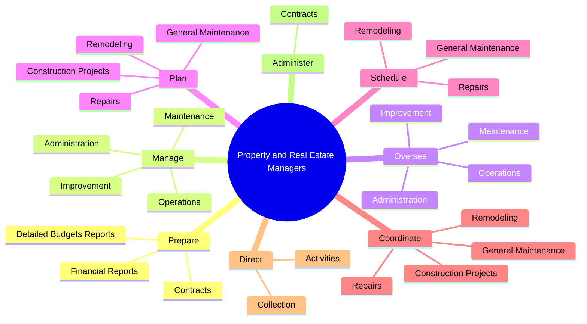
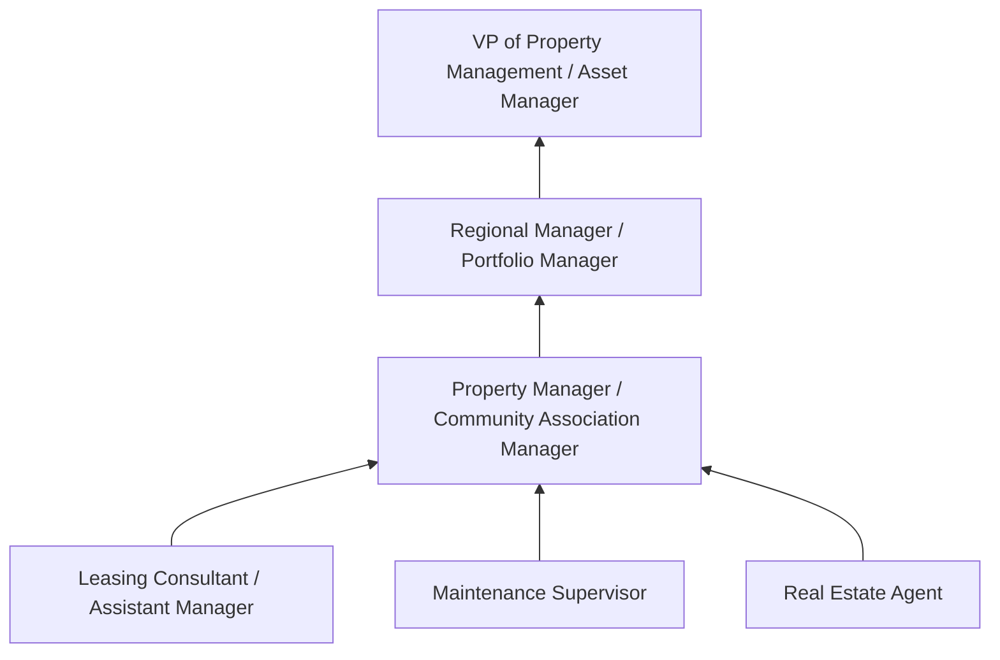
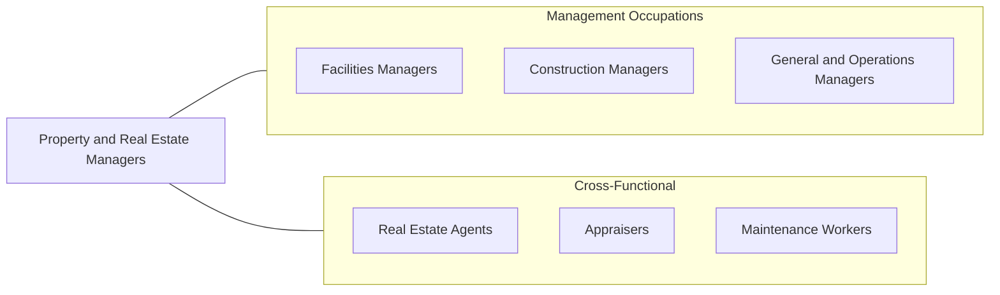

# Property, Real Estate, and Community Association Managers

> Plan, direct, or coordinate the selling, buying, leasing, or governance activities of commercial, industrial, or residential real estate properties. Includes managers of homeowner and condominium associations, rented or leased housing units, buildings, or land (including rights-of-way).

## Overview

Property, Real Estate, and Community Association Managers oversee the operation, maintenance, and financial performance of real estate assets. They manage residential apartments, commercial office buildings, retail centers, industrial properties, and homeowner or condominium associations. Their responsibilities include tenant relations, lease administration, maintenance coordination, budget management, and ensuring properties comply with applicable laws and regulations.

These managers serve as the intermediary between property owners and tenants or association members. They handle lease negotiations, rent collection, maintenance requests, vendor management, and capital improvement planning. For community associations, they manage common areas, enforce governing documents (CC&Rs), coordinate board meetings, and oversee reserve fund planning. Their decisions directly impact property values, tenant satisfaction, and owner returns.

The property management landscape is evolving with technology-driven tenant expectations, sustainability requirements, and changing work patterns that affect commercial real estate demand. Managers must adapt to smart building technologies, contactless services, flexible lease structures, and ESG (environmental, social, governance) reporting requirements while maintaining the physical and financial health of their properties.

## Classification Hierarchy

## Key Statistics

| Metric | Value |
|--------|-------|
| SOC Code | 11-9141.00 |
| Job Zone | 3 (Medium Preparation) |
| Category | [Management Occupations](/occupations/Management/index) |
| Task Count | 150 |
| Salary Range | $40,000 - $110,000+ |
| Employment Level | Large - over 370,000 |
| Growth Outlook | Average |
| Source | O*NET |

## Core Tasks

### prepare.DetailedBudgetsReports

Property Managers prepare budgets, financial reports, and contracts that support property operations and service delivery.

**Actions:**
- `prepare.DetailedBudgetsReports.for.Properties`
- `prepare.FinancialReports.for.Properties`
- `prepare.Contracts.for.Provision.of.PropertyServices`
- `prepare.Contracts.for.Cleaning`

### manage.Operations

Property Managers oversee the daily operations, maintenance, and administration of commercial, industrial, and residential properties.

**Actions:**
- `manage.Operations.of.Commercial`
- `manage.Operations.of.Industrial`
- `manage.Operations.of.ResidentialProperties`
- `manage.Maintenance.of.Commercial`

### plan.GeneralMaintenance

Property Managers plan and coordinate maintenance programs, capital improvements, and construction projects to preserve and enhance property value.

**Actions:**
- No specific sub-actions listed for this task group.

## Skills & Competencies

### Technical Skills
- **Property Operations Management** - Expert
- **Lease Administration** - Expert
- **Financial Reporting & Budgeting** - Advanced
- **Maintenance & Facilities Management** - Advanced
- **Real Estate Law & Fair Housing** - Advanced
- **Vendor & Contract Management** - Advanced
- **Reserve Study & Capital Planning** - Advanced

### Soft Skills
- **Communication** - Critical
- **Customer Service** - Critical
- **Problem Solving** - Essential
- **Negotiation** - Essential
- **Organizational Skills** - Essential
- **Conflict Resolution** - Important
- **Multitasking** - Important

## Education & Certifications

| Requirement | Details |
|-------------|---------|
| Typical Education | Bachelor's degree in Business, Real Estate, or related field; some positions require only high school diploma with experience |
| Work Experience | 2-5 years in property management or real estate |
| Licensure | Real Estate License (required in most states for leasing/selling); Community Association Manager License (required in some states) |
| Common Certifications | CPM (Certified Property Manager - IREM), CAM (Certified Apartment Manager - NAA), CMCA (Certified Manager of Community Associations - CAMICB), ACoM (Accredited Commercial Manager - IREM), RPA (Real Property Administrator - BOMI) |

## Career Progression

## Industry Variations

- **Residential (Multifamily)** - Leasing and turnover management; resident retention; amenity management; fair housing compliance
- **Commercial Office** - Tenant improvements; long-term lease negotiations; building systems management; class A/B/C positioning
- **Retail / Shopping Centers** - Tenant mix optimization; percentage rent; common area maintenance (CAM) charges; foot traffic management
- **HOA / Community Associations** - Board governance; CC&R enforcement; reserve fund management; homeowner relations; meeting facilitation

## Technology & Tools

- **Property Management Software** - Yardi Voyager, RealPage, AppFolio, Buildium, MRI Software
- **Accounting** - Yardi, MRI, QuickBooks, TOPS (for HOA)
- **Leasing** - RentCafe, Zillow Rental Manager, Apartments.com
- **Maintenance** - Building Engines, Angus Systems, HappyCo
- **Communication** - AppFolio Tenant Portal, Buildium, HOA Express
- **Smart Building** - Honeywell Building Management, Siemens, Johnson Controls

## Related Occupations

## Industries

- [Real Estate and Rental and Leasing](/industries/RealEstate) - Very High Employment
- [Government](/industries/Government) - Moderate Employment

## Departments

This occupation typically works in:
- [Property Management](/departments/PropertyManagement)
- [Facilities](/departments/Facilities)
- [Asset Management](/departments/AssetManagement)
- [Community Management](/departments/CommunityManagement)

---

*Source: O*NET 11-9141.00 - ONETOccupation*
