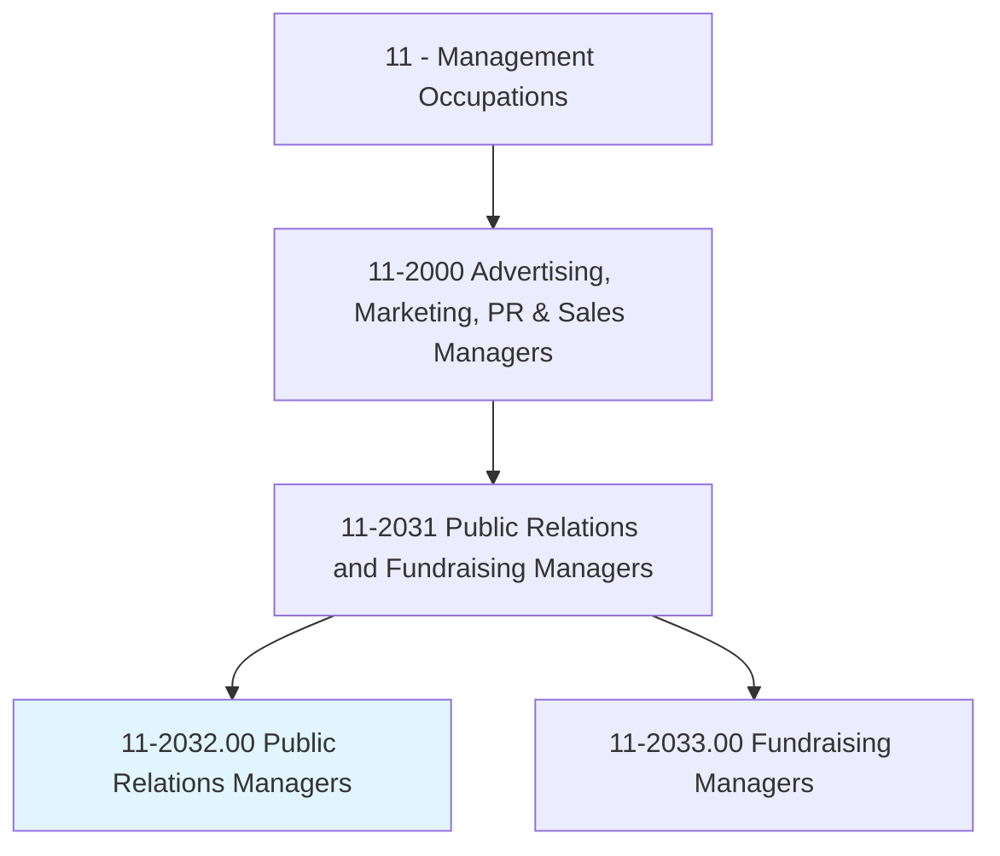
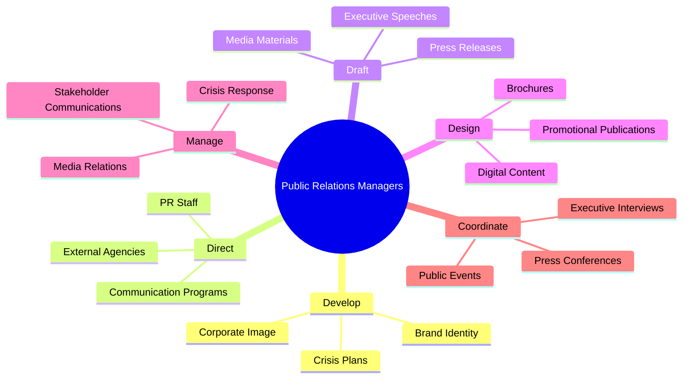
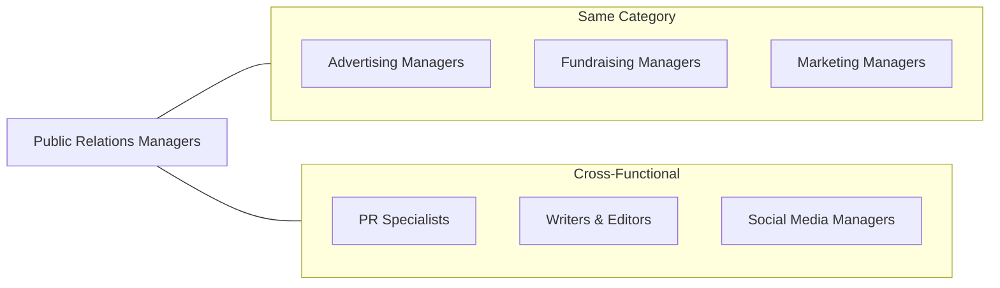
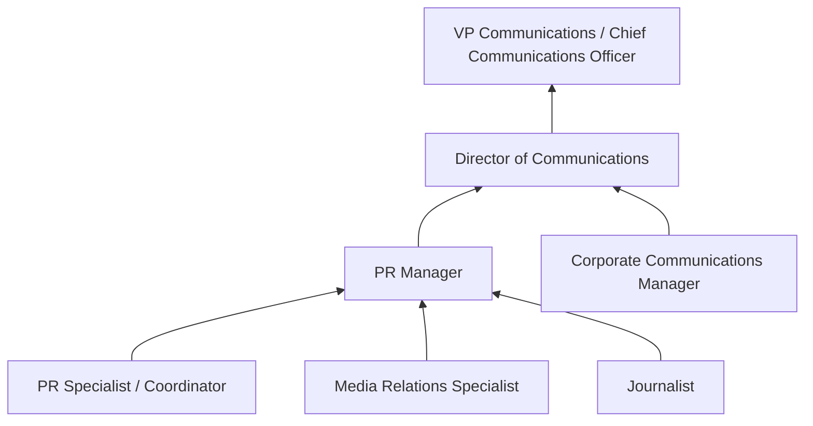

# Public Relations Managers

> Plan, direct, or coordinate activities designed to create or maintain a favorable public image or raise issue awareness for their organization or client.

## Overview

Public Relations Managers are strategic communicators who shape and protect organizational reputation. They develop comprehensive PR strategies, manage media relationships, craft messaging for various stakeholders, and guide organizations through crisis situations. Working across earned, owned, and shared media channels, they ensure consistent brand voice while building positive relationships with the press, community, and public. This role demands exceptional communication skills, strategic thinking, and the ability to navigate complex stakeholder landscapes.

## Classification Hierarchy

## Key Statistics

| Metric | Value |
|--------|-------|
| SOC Code | 11-2032.00 |
| Job Zone | 4 (Considerable Preparation) |
| Category | [Management](/occupations/Management/index) |
| Core Tasks | 20+ |
| Source | O*NET |

## Core Tasks

### develop.CorporateImage

Public Relations Managers develop and maintain the organization's public image and identity.

**Actions:**
- `develop.CorporateImage.using.Logos` - Create visual brand elements
- `develop.CorporateImage.using.Signage` - Establish physical brand presence
- `maintain.CorporateIdentity.across.Channels` - Ensure brand consistency
- `protect.Reputation.through.ProactiveMessaging` - Build positive perception

### direct.PRActivities

Public Relations Managers lead internal teams and external partners in executing PR strategies.

**Actions:**
- `assign.Activities.of.PublicRelationsStaff` - Delegate team responsibilities
- `supervise.Activities.of.PublicRelationsStaff` - Oversee daily operations
- `review.Activities.of.PublicRelationsStaff` - Evaluate work quality
- `direct.Activities.of.ExternalAgencies` - Manage agency relationships

### develop.CrisisCommunicationPlans

Public Relations Managers prepare organizations for potential crisis situations.

**Actions:**
- `develop.CrisisCommunicationPlans` - Create contingency protocols
- `implement.CrisisCommunicationPlans` - Execute during emergencies
- `maintain.CrisisCommunicationPlans` - Update regularly
- `train.Executives.on.CrisisResponse` - Prepare leadership for media

### draft.ExecutiveSpeeches

Public Relations Managers create compelling communications for senior leadership.

**Actions:**
- `draft.Speeches.for.CompanyExecutives` - Write executive presentations
- `arrange.Interviews.for.Executives` - Coordinate media appearances
- `prepare.TalkingPoints.for.MediaInteractions` - Brief leaders on messaging
- `coach.Spokespersons.on.MediaTechniques` - Improve presentation skills

### design.PromotionalPublications

Public Relations Managers create materials that communicate organizational messages.

**Actions:**
- `design.PromotionalPublications` - Create collateral materials
- `design.Brochures` - Develop print materials
- `edit.PromotionalPublications` - Refine content and messaging
- `coordinate.DigitalContent.with.BrandGuidelines` - Ensure consistency

## Skills & Competencies

### Technical Skills
- **Media Relations** - Expert
- **Crisis Communications** - Expert
- **Content Strategy** - Advanced
- **Social Media Management** - Advanced
- **Brand Management** - Advanced
- **Analytics & Measurement** - Proficient

### Soft Skills
- **Communication** - Critical
- **Strategic Thinking** - Critical
- **Relationship Building** - Critical
- **Creativity** - Essential
- **Composure Under Pressure** - Essential
- **Diplomacy** - Essential

## Related Occupations

## Industries

- [Professional Services](/industries/Scientific) - High Employment
- [Information](/industries/Information/index) - High Employment
- [Healthcare](/industries/Healthcare/index) - Moderate Employment
- [Government](/industries/PublicAdministration) - Moderate Employment
- [Finance and Insurance](/industries/Finance) - Moderate Employment
- Nonprofit Organizations - Moderate Employment

## Career Progression

## Education & Training

| Requirement | Details |
|-------------|---------|
| Typical Education | Bachelor's degree in Communications, PR, Journalism, or related field |
| Work Experience | 5+ years in public relations or communications roles |
| On-the-Job Training | Moderate; continuous professional development |
| Common Certifications | APR (Accredited in Public Relations), CPRC |

## Departments

This occupation typically works in:
- Corporate Communications
- Public Affairs
- Media Relations
- Marketing Communications

---

*Source: O*NET 11-2032.00 - ONETOccupation*
