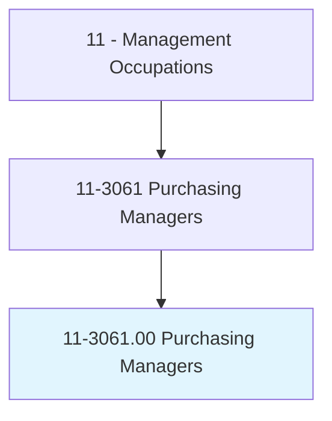
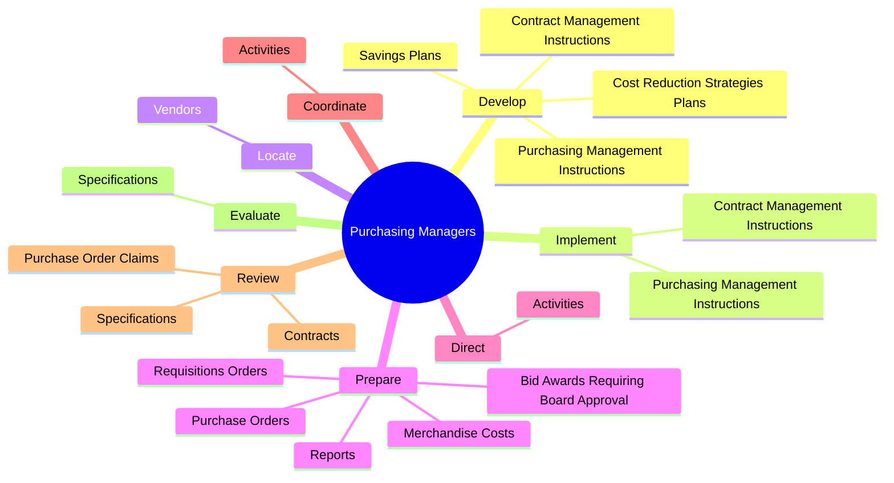

# Purchasing Managers

> Plan, direct, or coordinate the activities of buyers, purchasing officers, and related workers involved in purchasing materials, products, and services. Includes wholesale or retail trade merchandising managers and procurement managers.

## Overview

Purchasing Managers is an occupation within the Management Occupations category. Plan, direct, or coordinate the activities of buyers, purchasing officers, and related workers involved in purchasing materials, products, and services. 

## Classification Hierarchy

## Key Statistics

| Metric | Value |
|--------|-------|
| SOC Code | 11-3061.00 |
| Category | [Management Occupations](/occupations/Management/index) |
| Task Count | 58 |
| Source | O*NET |

## Core Tasks

### develop.PurchasingManagementInstructions

Purchasing Managers develop purchasing management instructions as part of their core responsibilities.

**Actions:**
- `develop.PurchasingManagementInstructions`
- `develop.ContractManagementInstructions`
- `develop.CostReductionStrategiesPlans`
- `develop.SavingsPlans`

### implement.PurchasingManagementInstructions

Purchasing Managers implement purchasing management instructions as part of their core responsibilities.

**Actions:**
- `implement.PurchasingManagementInstructions`
- `implement.ContractManagementInstructions`

### locate.Vendors

Purchasing Managers locate vendors as part of their core responsibilities.

**Actions:**
- `locate.Vendors.of.Materials`
- `locate.Vendors.of.Equipment`
- `locate.Vendors.of.Supplies`
- `locate.Vendors.of.InterviewThem.to.determine.ProductAvailability`

## Skills & Competencies

### Technical Skills
- **Strategic Planning** - Advanced
- **Financial Management** - Advanced
- **Operations Management** - Advanced

### Soft Skills
- **Communication** - Essential
- **Problem Solving** - Essential
- **Critical Thinking** - Important
- **Teamwork** - Important
- **Adaptability** - Important

## Related Occupations

## Industries

This occupation is found across multiple industries. See [Industries](/industries) for sector-specific employment data.

## Career Progression

---

*Source: O*NET 11-3061.00 - ONETOccupation*
