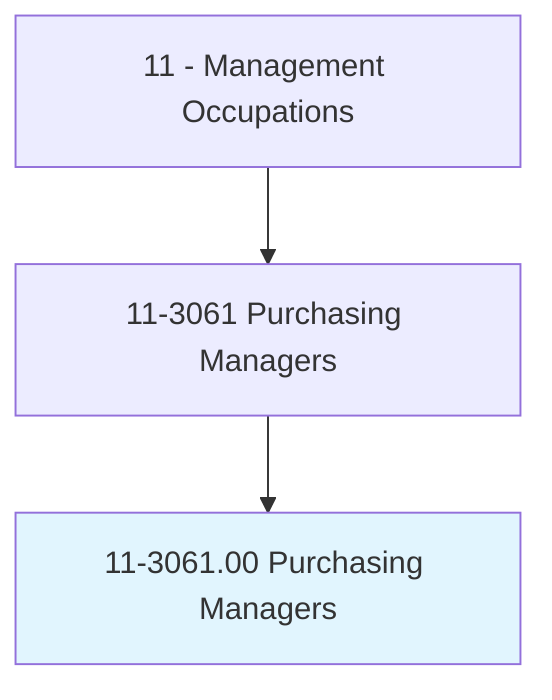
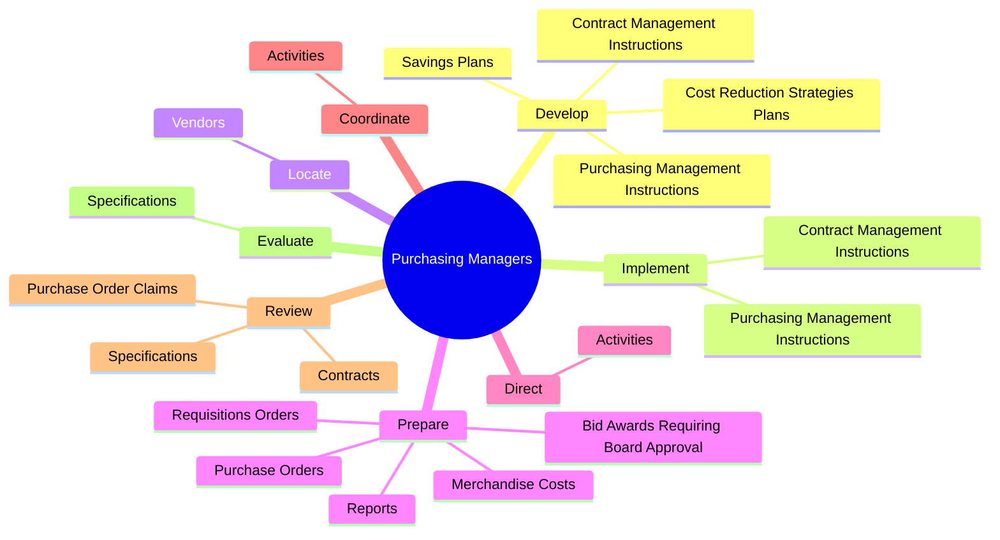
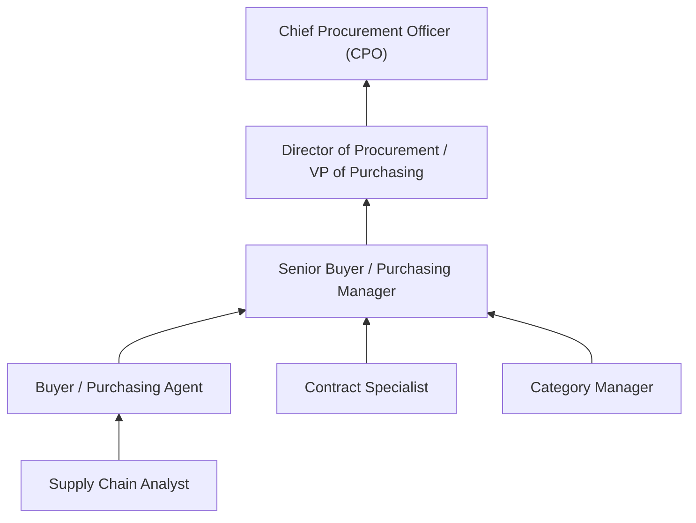
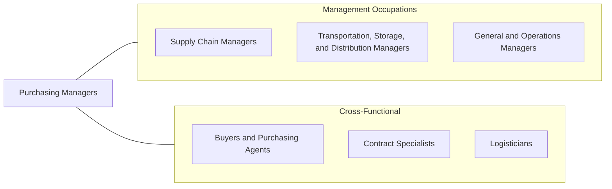

# Purchasing Managers

> Plan, direct, or coordinate the activities of buyers, purchasing officers, and related workers involved in purchasing materials, products, and services. Includes wholesale or retail trade merchandising managers and procurement managers.

## Overview

Purchasing Managers oversee an organization's procurement function, directing teams of buyers and purchasing agents who acquire the materials, products, and services needed for operations. They develop purchasing strategies, negotiate contracts with suppliers, manage vendor relationships, and ensure that procurement activities deliver optimal value in terms of cost, quality, delivery, and compliance.

The strategic importance of purchasing has grown substantially as organizations recognize the impact of procurement on profitability, supply chain resilience, and competitive advantage. Purchasing Managers analyze spending patterns, identify cost reduction opportunities, evaluate supplier capabilities, and implement procurement policies that balance cost efficiency with risk management. They work closely with operations, engineering, finance, and legal teams to align purchasing decisions with organizational objectives.

Modern procurement increasingly involves global sourcing, sustainability considerations, and digital transformation. Purchasing Managers must navigate international trade regulations, currency fluctuations, geopolitical risks, and ethical sourcing requirements. They leverage e-procurement platforms, spend analytics tools, and supplier management systems to drive efficiency and transparency across the purchasing process.

## Classification Hierarchy

## Key Statistics

| Metric | Value |
|--------|-------|
| SOC Code | 11-3061.00 |
| Job Zone | 4 (Considerable Preparation) |
| Category | [Management Occupations](/occupations/Management/index) |
| Task Count | 58 |
| Salary Range | $75,000 - $145,000+ |
| Employment Level | Moderate - approximately 75,000 |
| Growth Outlook | Average |
| Source | O*NET |

## Core Tasks

### develop.PurchasingManagementInstructions

Purchasing Managers develop procurement policies, contract management procedures, and cost reduction strategies that guide organizational purchasing activities.

**Actions:**
- `develop.PurchasingManagementInstructions`
- `develop.ContractManagementInstructions`
- `develop.CostReductionStrategiesPlans`
- `develop.SavingsPlans`

### locate.Vendors

Purchasing Managers identify, qualify, and evaluate potential suppliers to ensure the organization has access to quality materials, equipment, and supplies at competitive prices.

**Actions:**
- `locate.Vendors.of.Materials`
- `locate.Vendors.of.Equipment`
- `locate.Vendors.of.Supplies`
- `locate.Vendors.of.InterviewThem.to.determine.ProductAvailability`

### review.PurchaseOrderClaims

Purchasing Managers review contracts, purchase orders, and specifications to ensure accuracy, compliance, and favorable terms for the organization.

**Actions:**
- No specific sub-actions listed for this task group.

## Skills & Competencies

### Technical Skills
- **Strategic Sourcing** - Expert
- **Contract Negotiation & Management** - Expert
- **Supplier Relationship Management** - Advanced
- **Spend Analysis** - Advanced
- **Category Management** - Advanced
- **Supply Chain Risk Management** - Advanced
- **Regulatory Compliance (FAR, UCC)** - Advanced

### Soft Skills
- **Negotiation** - Critical
- **Analytical Thinking** - Critical
- **Communication** - Essential
- **Decision Making** - Essential
- **Relationship Building** - Essential
- **Leadership** - Important
- **Ethical Judgment** - Important

## Education & Certifications

| Requirement | Details |
|-------------|---------|
| Typical Education | Bachelor's degree in Supply Chain Management, Business Administration, Finance, or related field |
| Advanced Education | MBA or Master's in Supply Chain for senior roles |
| Work Experience | 5-8 years in purchasing, procurement, or supply chain |
| Common Certifications | CPSM (Certified Professional in Supply Management - ISM), CPM (Certified Purchasing Manager - ISM), CSCP (Certified Supply Chain Professional - APICS/ASCM), CPPO (Certified Public Procurement Officer - UPPCC) |

## Career Progression

## Industry Variations

- **Manufacturing** - Direct materials procurement; just-in-time delivery; supplier quality management; make-vs-buy analysis
- **Government** - Federal Acquisition Regulation (FAR) compliance; competitive bidding requirements; socioeconomic sourcing goals; public accountability
- **Healthcare** - GPO (Group Purchasing Organization) management; medical device procurement; formulary management; sterile supply chain
- **Retail** - Merchandise buying; seasonal planning; private label development; vendor managed inventory; import logistics

## Technology & Tools

- **E-Procurement** - SAP Ariba, Coupa, Jaggaer, Oracle Procurement Cloud
- **Spend Analytics** - Sievo, SpendHQ, Ivalua
- **Contract Management** - Icertis, Conga (Apttus), DocuSign CLM
- **Supplier Management** - SAP Ariba SLP, Avetta, Tealbook
- **ERP Integration** - SAP MM, Oracle Purchasing, Microsoft Dynamics
- **Market Intelligence** - Beroe, Spend Matters, Thomas Register

## Related Occupations

## Industries

- [Manufacturing](/industries/Manufacturing/index) - High Employment
- [Government](/industries/Government) - High Employment
- [Wholesale Trade](/industries/WholesaleTrade) - Moderate Employment
- [Healthcare and Social Assistance](/industries/Healthcare/index) - Moderate Employment
- [Retail Trade](/industries/Retail/index) - Moderate Employment

## Departments

This occupation typically works in:
- [Procurement / Purchasing](/departments/Procurement)
- [Supply Chain](/departments/SupplyChain)
- [Strategic Sourcing](/departments/StrategicSourcing)
- [Vendor Management](/departments/VendorManagement)

---

*Source: O*NET 11-3061.00 - ONETOccupation*
