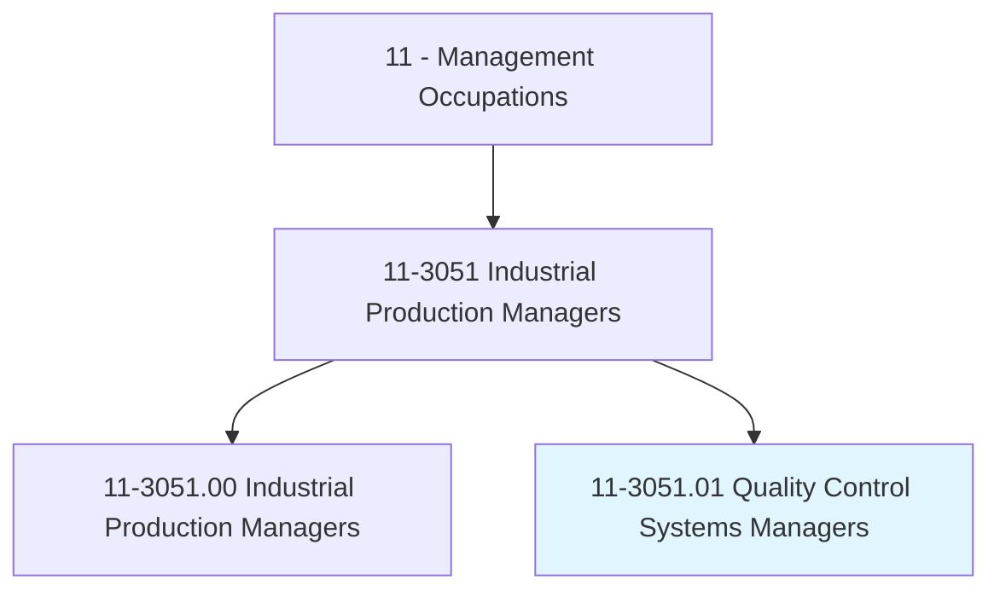
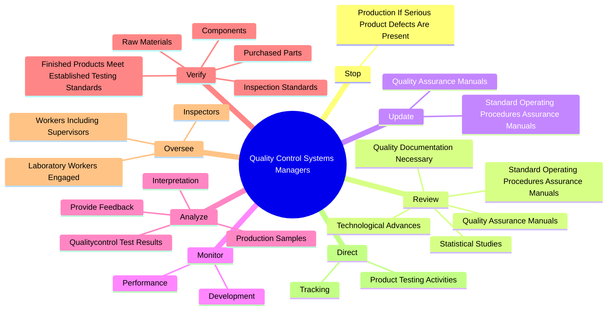
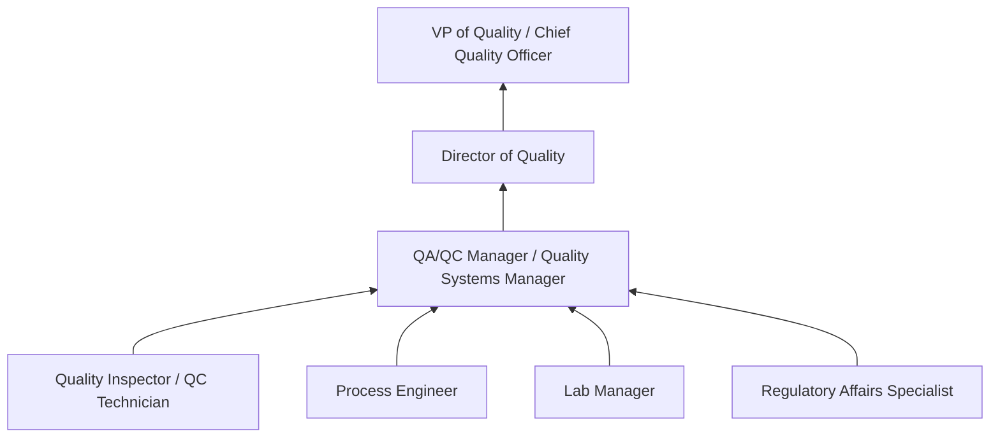
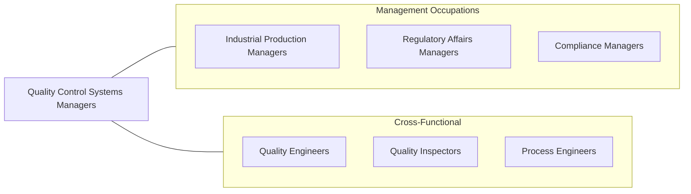

# Quality Control Systems Managers

> Plan, direct, or coordinate quality assurance programs. Formulate quality control policies and control quality of laboratory and production efforts.

## Overview

Quality Control Systems Managers oversee the quality assurance and quality control functions within manufacturing and production environments. They design quality management systems, formulate inspection and testing policies, and ensure that products and processes meet established standards, specifications, and regulatory requirements. Their work prevents defective products from reaching customers, protects brand reputation, and ensures regulatory compliance.

These managers lead teams of quality inspectors, laboratory technicians, and quality engineers who conduct testing, perform audits, analyze defects, and implement corrective actions. They develop standard operating procedures, manage documentation systems, oversee calibration programs, and drive continuous improvement initiatives using methodologies such as Six Sigma, lean manufacturing, and statistical process control.

The role requires both technical depth in quality methodologies and the management skill to build a culture of quality throughout the organization. Quality Control Systems Managers interact with production, engineering, procurement, and regulatory teams to ensure that quality is embedded across the entire product lifecycle from incoming materials through final shipment.

## Classification Hierarchy

## Key Statistics

| Metric | Value |
|--------|-------|
| SOC Code | 11-3051.01 |
| Job Zone | 4 (Considerable Preparation) |
| Category | [Management Occupations](/occupations/Management/index) |
| Task Count | 78 |
| Salary Range | $75,000 - $140,000+ |
| Employment Level | Moderate |
| Growth Outlook | Average |
| Source | O*NET |

## Core Tasks

### stop.ProductionIfSeriousProductDefectsArePresent

Quality Control Systems Managers have the authority and responsibility to halt production when serious product defects are identified, preventing defective products from advancing through the supply chain.

**Actions:**
- `stop.ProductionIfSeriousProductDefectsArePresent`

### review.StandardOperatingProceduresAssuranceManuals

Quality Control Systems Managers review and update quality documentation to ensure compliance with regulatory submissions and inspection readiness.

**Actions:**
- `review.StandardOperatingProceduresAssuranceManuals`
- `review.QualityAssuranceManuals`
- `review.QualityDocumentationNecessary.for.RegulatorySubmissions`
- `review.QualityDocumentationNecessary.for.Inspections`

### verify.RawMaterials

Quality Control Systems Managers verify that incoming materials, components, and finished products meet established testing and inspection standards.

**Actions:**
- No specific sub-actions listed for this task group.

## Skills & Competencies

### Technical Skills
- **Quality Management Systems (ISO 9001, GMP)** - Expert
- **Statistical Process Control (SPC)** - Expert
- **Audit Management (Internal & External)** - Advanced
- **Root Cause Analysis** - Advanced
- **Regulatory Compliance (FDA, ISO, IATF)** - Advanced
- **Laboratory Management** - Advanced
- **Six Sigma / Lean Methodologies** - Advanced

### Soft Skills
- **Attention to Detail** - Critical
- **Analytical Thinking** - Critical
- **Communication** - Essential
- **Leadership** - Essential
- **Decision Making** - Essential
- **Integrity** - Essential
- **Problem Solving** - Important

## Education & Certifications

| Requirement | Details |
|-------------|---------|
| Typical Education | Bachelor's degree in Engineering, Chemistry, Biology, or Quality Management |
| Work Experience | 5-8 years in quality assurance/control with progressive responsibility |
| Common Certifications | CQM (Certified Quality Manager - ASQ), CQE (Certified Quality Engineer - ASQ), Six Sigma Black Belt (ASQ/IASSC), CQA (Certified Quality Auditor - ASQ), ISO 9001 Lead Auditor (IRCA/Exemplar Global) |

## Career Progression

## Industry Variations

- **Pharmaceutical / Medical Devices** - FDA cGMP compliance; 21 CFR Part 820; validation protocols; CAPA systems; design controls
- **Automotive** - IATF 16949; PPAP; APQP; customer-specific requirements; recall management
- **Food & Beverage** - HACCP; SQF/BRC certifications; food safety modernization; allergen management
- **Aerospace & Defense** - AS9100; NADCAP; special processes; first article inspection; DFARS compliance

## Technology & Tools

- **QMS Software** - MasterControl, ETQ Reliance, Veeva Vault Quality, TrackWise
- **Statistical Software** - Minitab, JMP, SPC XL
- **Document Control** - MasterControl, Documentum, SharePoint
- **Inspection / Measurement** - CMM (coordinate measuring machines), optical inspection, metrology tools
- **ERP Integration** - SAP QM, Oracle Quality Management
- **Audit Management** - iAuditor (SafetyCulture), Gensuite, ComplianceQuest

## Related Occupations

## Industries

- [Manufacturing](/industries/Manufacturing/index) - Very High Employment
- [Professional, Scientific, and Technical Services](/industries/Scientific) - Moderate Employment
- Wholesale Trade - Low Employment

## Departments

This occupation typically works in:
- [Quality Assurance / Quality Control](/departments/Quality)
- [Manufacturing / Production](/departments/Operations)
- Regulatory Compliance
- Laboratory

---

*Source: O*NET 11-3051.01 - ONETOccupation*
