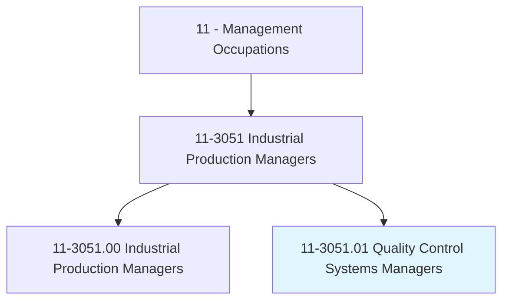
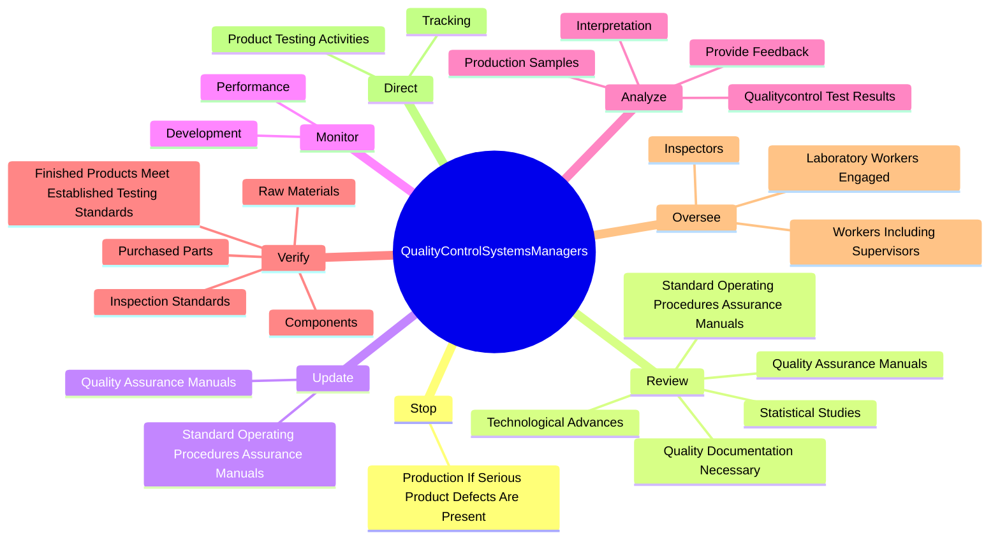
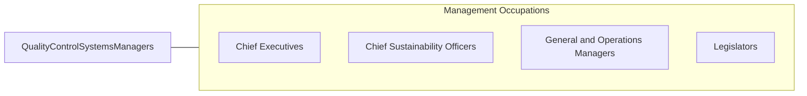

# Quality Control Systems Managers

> Plan, direct, or coordinate quality assurance programs. Formulate quality control policies and control quality of laboratory and production efforts.

## Overview

Quality Control Systems Managers is a specialized variant within the Management Occupations category. Plan, direct, or coordinate quality assurance programs. 

## Classification Hierarchy

## Key Statistics

| Metric | Value |
|--------|-------|
| SOC Code | 11-3051.01 |
| Category | [Management Occupations](/occupations/Management) |
| Task Count | 78 |
| Source | O*NET |

## Core Tasks

### stop.ProductionIfSeriousProductDefectsArePresent

Quality Control Systems Managers stop production if serious product defects are present as part of their core responsibilities.

**Actions:**
- `stop.ProductionIfSeriousProductDefectsArePresent`

### review.StandardOperatingProceduresAssuranceManuals

Quality Control Systems Managers review standard operating procedures assurance manuals as part of their core responsibilities.

**Actions:**
- `review.StandardOperatingProceduresAssuranceManuals`
- `review.QualityAssuranceManuals`
- `review.QualityDocumentationNecessary.for.RegulatorySubmissions`
- `review.QualityDocumentationNecessary.for.Inspections`

### update.StandardOperatingProceduresAssuranceManuals

Quality Control Systems Managers update standard operating procedures assurance manuals as part of their core responsibilities.

**Actions:**
- `update.StandardOperatingProceduresAssuranceManuals`
- `update.QualityAssuranceManuals`

## Skills & Competencies

### Technical Skills
- **Strategic Planning** - Advanced
- **Financial Management** - Advanced
- **Operations Management** - Advanced

### Soft Skills
- **Communication** - Essential
- **Problem Solving** - Essential
- **Critical Thinking** - Important
- **Teamwork** - Important
- **Adaptability** - Important

## Related Occupations

## Industries

This occupation is found across multiple industries. See [Industries](/industries) for sector-specific employment data.

## Career Progression

---

*Source: O*NET 11-3051.01 - ONETOccupation*
