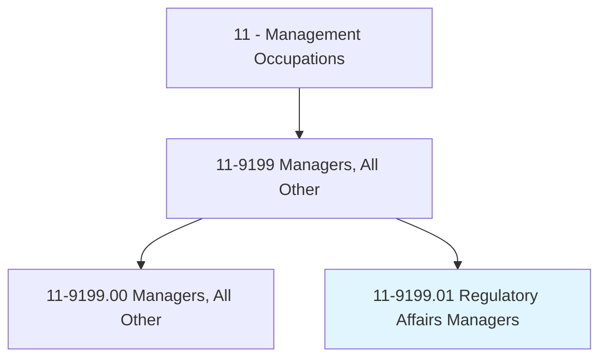
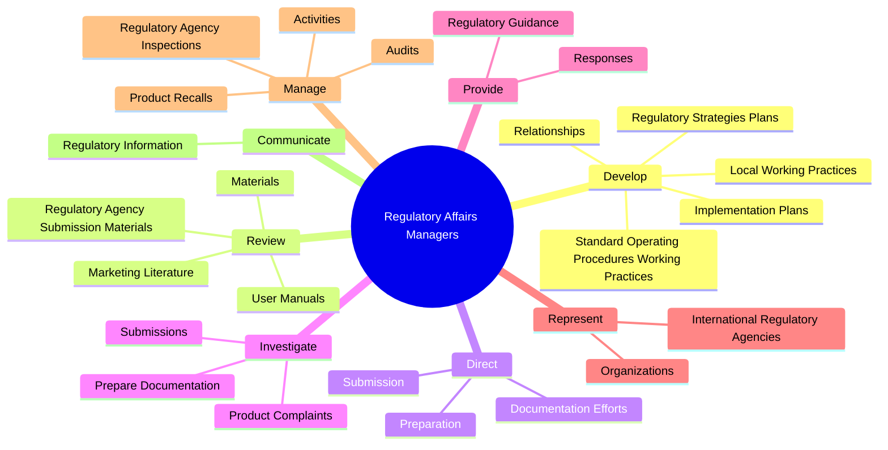
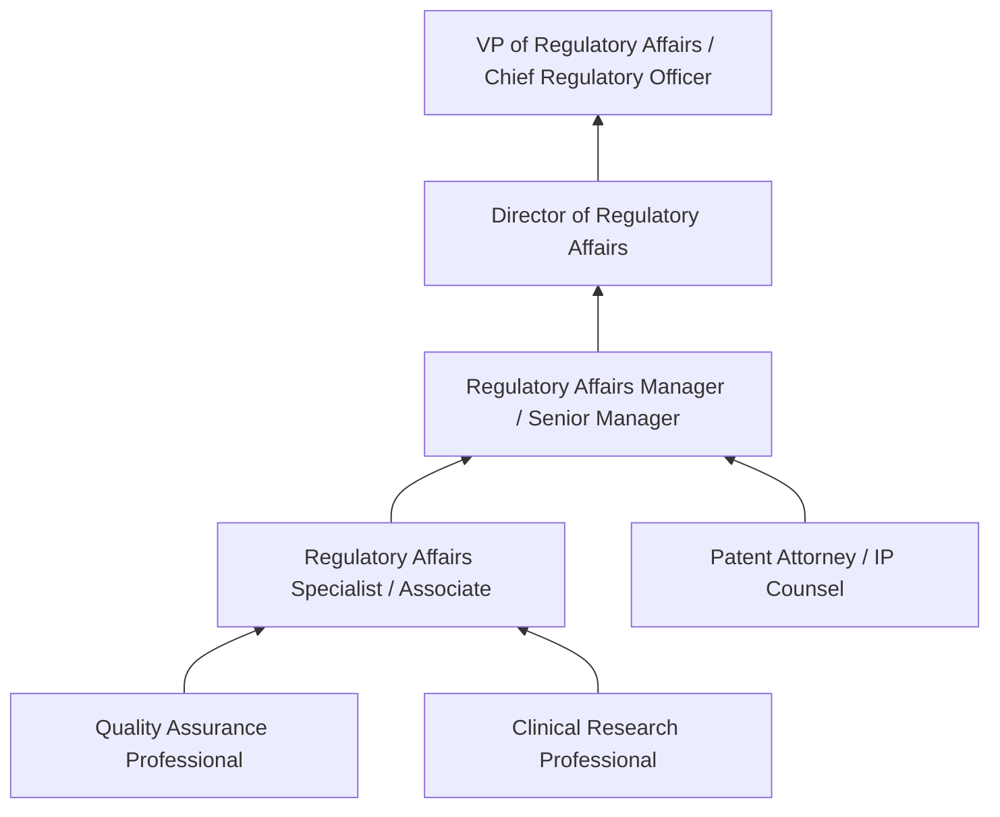
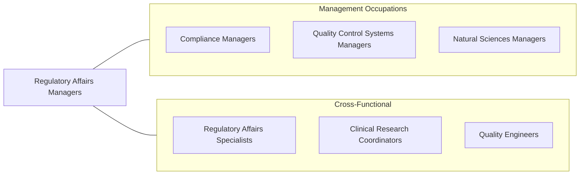

# Regulatory Affairs Managers

> Plan, direct, or coordinate production activities of an organization to ensure compliance with regulations and standard operating procedures.

## Overview

Regulatory Affairs Managers lead the interface between organizations and government regulatory agencies. They develop and execute regulatory strategies for product approvals, manage submission processes, ensure ongoing compliance with evolving regulations, and serve as the organization's regulatory expert. Their work is essential in industries where products require government authorization before reaching the market, particularly pharmaceuticals, medical devices, food, chemicals, and consumer products.

These managers direct the preparation and submission of regulatory applications (NDAs, 510(k)s, PMAs, CE markings), coordinate with regulatory agencies during review processes, and manage post-market compliance obligations. They interpret complex regulations, assess their impact on business operations, and advise product development teams on regulatory requirements that must be addressed during design and manufacturing.

The regulatory landscape is increasingly global and complex. Regulatory Affairs Managers must navigate multi-jurisdictional requirements, harmonization initiatives (ICH, IMDRF), and accelerated approval pathways while managing the risks and timelines associated with bringing products to market. Their strategic decisions directly impact time-to-market, market access, and the organization's competitive position.

## Classification Hierarchy

## Key Statistics

| Metric | Value |
|--------|-------|
| SOC Code | 11-9199.01 |
| Job Zone | 4 (Considerable Preparation) |
| Category | [Management Occupations](/occupations/Management/index) |
| Task Count | 91 |
| Salary Range | $90,000 - $170,000+ |
| Employment Level | Moderate |
| Growth Outlook | Faster than average |
| Source | O*NET |

## Core Tasks

### develop.RegulatoryStrategiesPlans

Regulatory Affairs Managers develop strategies and implementation plans for regulatory submissions of new products across multiple jurisdictions.

**Actions:**
- `develop.RegulatoryStrategiesPlans.for.Preparation.of.NewProducts`
- `develop.RegulatoryStrategiesPlans.for.Submission.of.NewProducts`
- `develop.ImplementationPlans.for.Preparation.of.NewProducts`
- `develop.ImplementationPlans.for.Submission.of.NewProducts`

### review.RegulatoryAgencySubmissionMaterials

Regulatory Affairs Managers review all submission materials to ensure timeliness, accuracy, comprehensiveness, and compliance with regulatory standards.

**Actions:**
- `review.RegulatoryAgencySubmissionMaterials.to.ensure.Timeliness`
- `review.RegulatoryAgencySubmissionMaterials.to.Accuracy`
- `review.RegulatoryAgencySubmissionMaterials.to.Comprehensiveness`
- `review.RegulatoryAgencySubmissionMaterials.to.ComplianceWithRegulatorystandards`

### direct.Preparation

Regulatory Affairs Managers direct the preparation and submission of regulatory agency applications, reports, and correspondence.

**Actions:**
- `direct.Preparation.of.RegulatoryAgencyApplications`
- `direct.Preparation.of.Reports`
- `direct.Preparation.of.Correspondence`
- `direct.Submission.of.RegulatoryAgencyApplications`

## Skills & Competencies

### Technical Skills
- **Regulatory Strategy Development** - Expert
- **FDA / EMA / Global Regulatory Frameworks** - Expert
- **Submission Management (eCTD, 510(k), PMA)** - Advanced
- **Product Labeling & Advertising Review** - Advanced
- **Post-Market Surveillance** - Advanced
- **GxP Compliance** - Advanced
- **Clinical & Nonclinical Data Interpretation** - Advanced

### Soft Skills
- **Strategic Thinking** - Critical
- **Communication** - Critical
- **Attention to Detail** - Essential
- **Project Management** - Essential
- **Influence & Negotiation** - Essential
- **Analytical Thinking** - Essential
- **Leadership** - Important

## Education & Certifications

| Requirement | Details |
|-------------|---------|
| Typical Education | Bachelor's or Master's degree in Life Sciences, Pharmacy, Chemistry, Engineering, or Law |
| Work Experience | 5-10 years in regulatory affairs with progressive responsibility |
| Common Certifications | RAC (Regulatory Affairs Certification - RAPS), CQA (Certified Quality Auditor - ASQ), FRAPS (Fellow of RAPS) |

## Career Progression

## Industry Variations

- **Pharmaceutical** - IND/NDA/ANDA submissions; FDA advisory committee interactions; drug labeling; REMS programs; biosimilar pathways
- **Medical Devices** - 510(k), De Novo, PMA pathways; UDI compliance; EU MDR/IVDR; notified body management
- **Food & Supplements** - GRAS determinations; nutrition labeling; health claims substantiation; FSMA compliance
- **Chemicals / Cosmetics** - REACH, TSCA compliance; safety data sheets; product registration across jurisdictions

## Technology & Tools

- **Regulatory Information Management** - Veeva Vault RIM, IQVIA RIM Smart, Liquent InSight
- **Submission Publishing** - GlobalSubmit, Lorenz docuBridge, Extedo
- **Document Management** - Veeva Vault, Documentum, MasterControl
- **Regulatory Intelligence** - Cortellis Regulatory Intelligence, IQVIA, Citeline
- **Labeling** - Kallik, PRISYM ID, SAP Label Management
- **Compliance Tracking** - TrackWise, ComplianceWire

## Related Occupations

## Industries

- [Manufacturing (Pharmaceutical, Medical Device)](/industries/Manufacturing/index) - Very High Employment
- [Professional, Scientific, and Technical Services](/industries/Scientific) - High Employment
- Wholesale Trade (Medical/Pharmaceutical Distribution) - Low Employment

## Departments

This occupation typically works in:
- Regulatory Affairs
- Quality & Compliance
- [Research & Development](/departments/RnD/index)
- Medical Affairs

---

*Source: O*NET 11-9199.01 - ONETOccupation*
