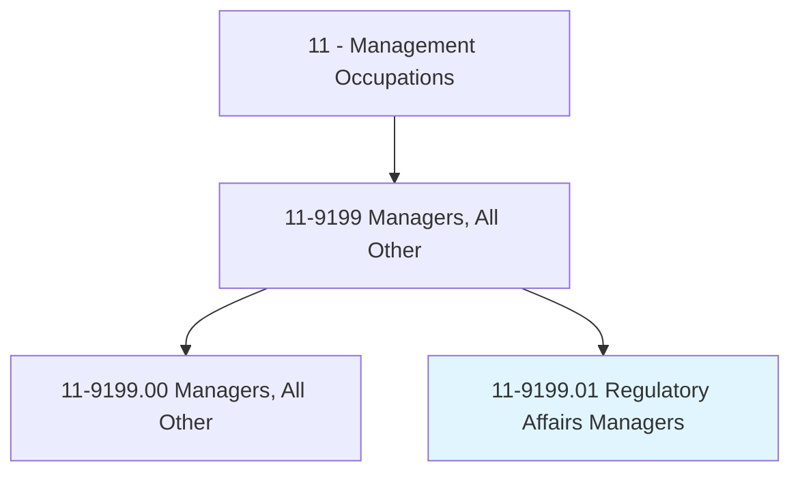
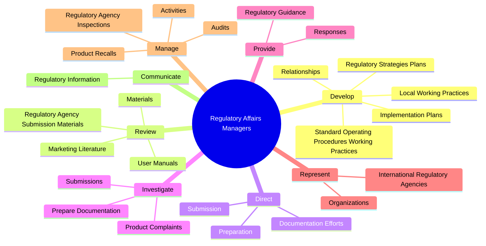
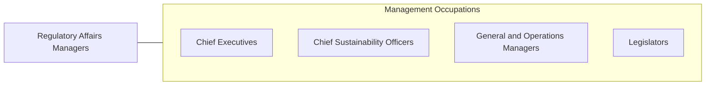

# Regulatory Affairs Managers

> Plan, direct, or coordinate production activities of an organization to ensure compliance with regulations and standard operating procedures.

## Overview

Regulatory Affairs Managers is classified under Management Occupations (SOC 11). Plan, direct, or coordinate production activities of an organization to ensure compliance with regulations and standard operating procedures.

## Classification Hierarchy

## Key Statistics

| Metric | Value |
|--------|-------|
| SOC Code | 11-9199.01 |
| Category | [Management Occupations](/occupations/Management) |
| Task Count | 91 |
| Source | O*NET |

## Core Tasks

### develop.RegulatoryStrategiesPlans

Regulatory Affairs Managers develop regulatory strategies plans as part of their core responsibilities.

**Actions:**
- `develop.RegulatoryStrategiesPlans.for.Preparation.of.NewProducts`
- `develop.RegulatoryStrategiesPlans.for.Submission.of.NewProducts`
- `develop.ImplementationPlans.for.Preparation.of.NewProducts`
- `develop.ImplementationPlans.for.Submission.of.NewProducts`

### review.RegulatoryAgencySubmissionMaterials

Regulatory Affairs Managers review regulatory agency submission materials as part of their core responsibilities.

**Actions:**
- `review.RegulatoryAgencySubmissionMaterials.to.ensure.Timeliness`
- `review.RegulatoryAgencySubmissionMaterials.to.Accuracy`
- `review.RegulatoryAgencySubmissionMaterials.to.Comprehensiveness`
- `review.RegulatoryAgencySubmissionMaterials.to.ComplianceWithRegulatorystandards`

### direct.Preparation

Regulatory Affairs Managers direct preparation as part of their core responsibilities.

**Actions:**
- `direct.Preparation.of.RegulatoryAgencyApplications`
- `direct.Preparation.of.Reports`
- `direct.Preparation.of.Correspondence`
- `direct.Submission.of.RegulatoryAgencyApplications`

## Skills & Competencies

### Technical Skills
- **Strategic Planning** - Advanced
- **Financial Management** - Advanced
- **Operations Management** - Advanced

### Soft Skills
- **Communication** - Essential
- **Problem Solving** - Essential
- **Critical Thinking** - Important
- **Teamwork** - Important
- **Adaptability** - Important

## Related Occupations

## Industries

This occupation is found across multiple industries. See [Industries](/industries) for sector-specific employment data.

## Career Progression

---

*Source: O*NET 11-9199.01 - ONETOccupation*
