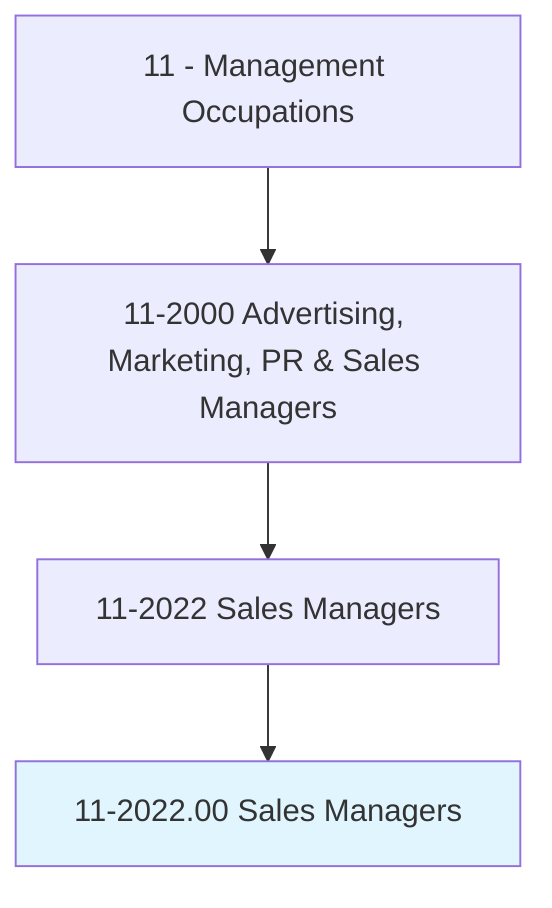
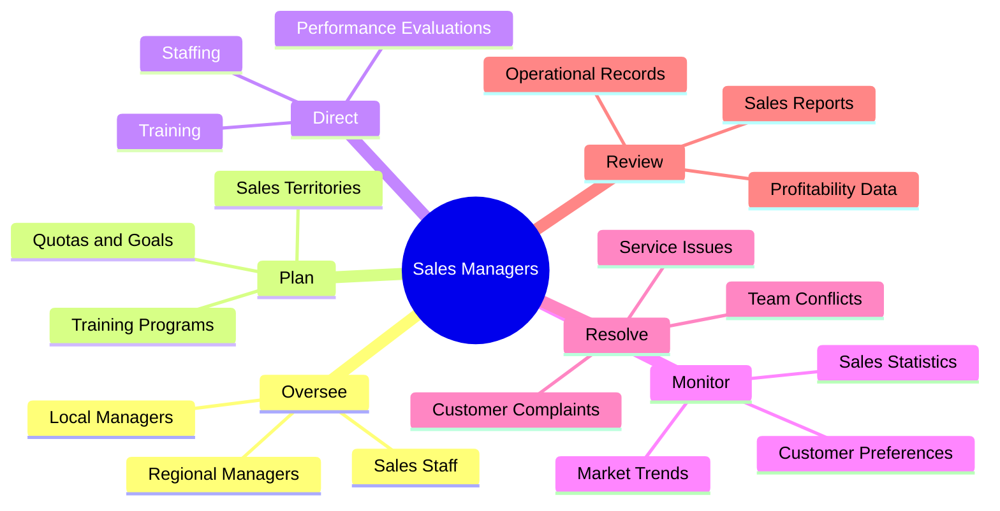
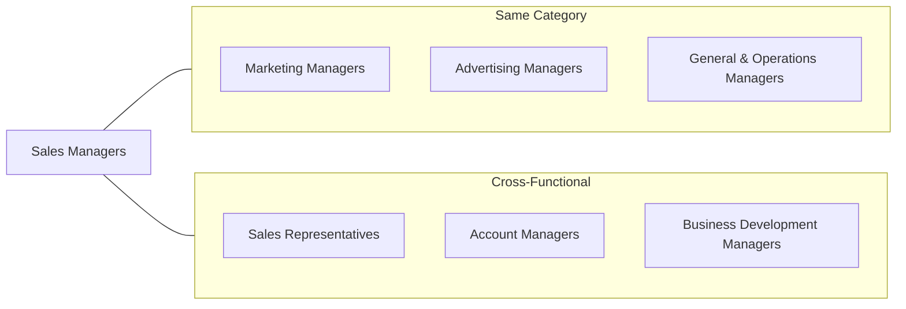
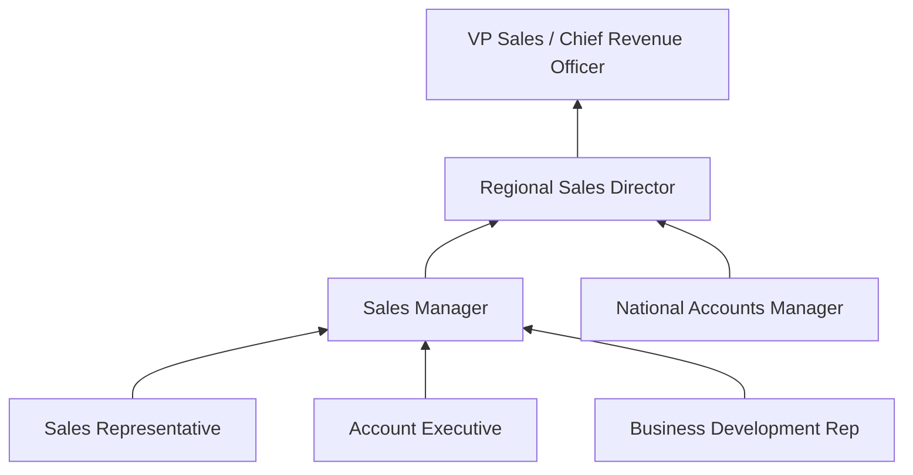

# Sales Managers

> Plan, direct, or coordinate the actual distribution or movement of a product or service to the customer. Coordinate sales distribution by establishing sales territories, quotas, and goals and establish training programs for sales representatives. Analyze sales statistics gathered by staff to determine sales potential and inventory requirements and monitor the preferences of customers.

## Overview

Sales Managers are revenue-driving leaders who orchestrate the sales function of an organization. They develop sales strategies, set targets, manage territories, and lead sales teams to achieve business objectives. This role involves analyzing market data, coaching sales representatives, building client relationships, and ensuring the organization meets or exceeds revenue goals. Sales Managers bridge the gap between company products/services and customer needs, requiring strong interpersonal skills, business acumen, and the ability to motivate teams under pressure.

## Classification Hierarchy

## Key Statistics

| Metric | Value |
|--------|-------|
| SOC Code | 11-2022.00 |
| Job Zone | 4 (Considerable Preparation) |
| Category | [Management](/occupations/Management/index) |
| Core Tasks | 25+ |
| Source | O*NET |

## Core Tasks

### oversee.SalesManagers

Sales Managers oversee the hierarchy of regional and local sales leadership to ensure consistent execution.

**Actions:**
- `oversee.RegionalSalesManagersStaffs` - Supervise regional sales leadership
- `oversee.LocalSalesManagersStaffs` - Manage local sales teams
- `oversee.Staffs` - Direct frontline sales representatives
- `coordinate.SalesActivities.across.Territories` - Align regional efforts

### plan.SalesPrograms

Sales Managers plan comprehensive sales programs including territories, quotas, and training.

**Actions:**
- `plan.Staffing.to.develop.SalesServicePrograms` - Build effective sales teams
- `plan.Training.to.develop.SalesServicePrograms` - Create training curricula
- `plan.PerformanceEvaluations.to.control.SalesServicePrograms` - Establish metrics
- `establish.SalesTerritories.for.Coverage` - Define geographic responsibilities

### direct.SalesActivities

Sales Managers direct the day-to-day activities of sales teams and coordinate with other departments.

**Actions:**
- `direct.Staffing.to.develop.SalesServicePrograms` - Recruit and allocate staff
- `direct.Training.to.develop.SalesServicePrograms` - Implement training initiatives
- `direct.PerformanceEvaluations.to.control.SalesServicePrograms` - Conduct performance reviews
- `direct.ActivitiesInvolvingSales.of.ManufacturedProducts` - Manage product sales

### monitor.CustomerPreferences

Sales Managers track customer behavior and preferences to optimize sales approaches.

**Actions:**
- `monitor.CustomerPreferences.to.determine.FocusOfSalesEfforts` - Identify customer needs
- `analyze.SalesStatistics.to.determine.Potential` - Assess market opportunities
- `track.InventoryRequirements.based.on.Demand` - Align supply with demand
- `identify.MarketTrends.for.StrategicPlanning` - Spot emerging opportunities

### resolve.CustomerComplaints

Sales Managers address customer issues to maintain satisfaction and protect revenue.

**Actions:**
- `resolve.CustomerComplaints.regarding.Sales` - Address sales-related issues
- `resolve.CustomerComplaints.regarding.Service` - Handle service problems
- `mediate.Disputes.between.CustomersAndStaff` - Facilitate resolutions
- `escalate.Issues.to.SeniorManagement` - Handle complex situations

### review.OperationalRecords

Sales Managers analyze data to project sales performance and determine profitability.

**Actions:**
- `review.OperationalRecords.to.project.Sales` - Forecast revenue
- `review.OperationalRecords.to.determine.Profitability` - Assess margins
- `review.Reports.to.project.Sales` - Analyze performance data
- `review.Reports.to.determine.Profitability` - Evaluate cost-effectiveness

## Skills & Competencies

### Technical Skills
- **Sales Strategy** - Expert
- **CRM Systems** - Advanced
- **Sales Analytics** - Advanced
- **Territory Management** - Advanced
- **Forecasting** - Proficient
- **Contract Negotiation** - Advanced

### Soft Skills
- **Leadership** - Critical
- **Persuasion** - Critical
- **Communication** - Critical
- **Relationship Building** - Essential
- **Coaching** - Essential
- **Resilience** - Essential

## Related Occupations

## Industries

- [Wholesale Trade](/industries/Wholesale/index) - High Employment
- [Manufacturing](/industries/Manufacturing/index) - High Employment
- [Retail Trade](/industries/Retail/index) - High Employment
- [Professional Services](/industries/ProfessionalServices) - Moderate Employment
- [Finance and Insurance](/industries/FinanceInsurance) - Moderate Employment
- [Information Technology](/industries/InformationTechnology) - Growing Sector

## Career Progression

## Education & Training

| Requirement | Details |
|-------------|---------|
| Typical Education | Bachelor's degree in Business, Marketing, or related field |
| Work Experience | 5-7 years in sales with progressive leadership experience |
| On-the-Job Training | Extensive coaching and mentorship |
| Common Certifications | Certified Sales Leadership Professional (CSLP), Miller Heiman |

## Departments

This occupation typically works in:
- [Sales](/departments/Sales/index)
- [Business Development](/departments/BusinessDevelopment)
- [Account Management](/departments/AccountManagement)
- [Revenue Operations](/departments/RevenueOperations)

---

*Source: O*NET 11-2022.00 - ONETOccupation*
