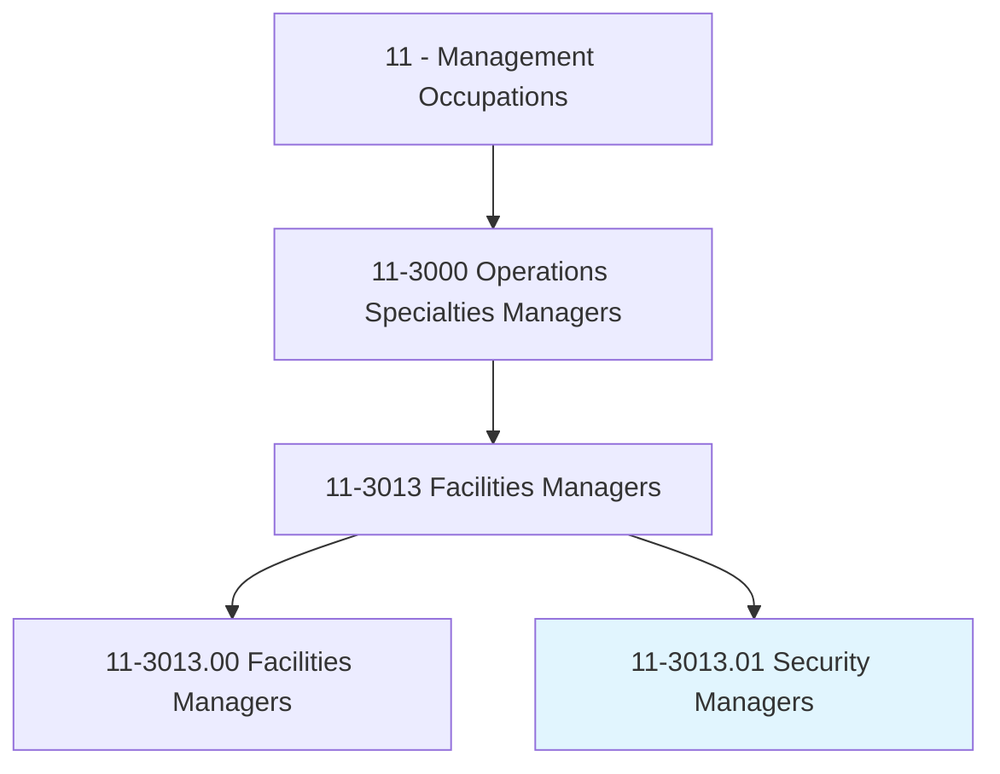
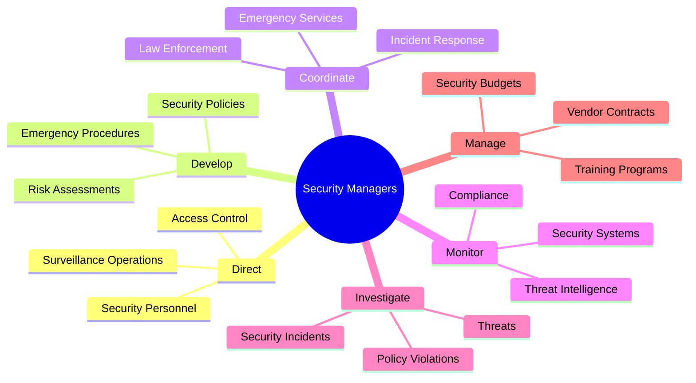
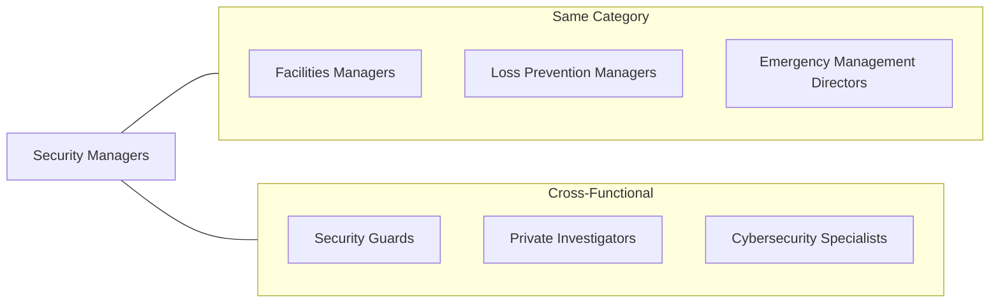
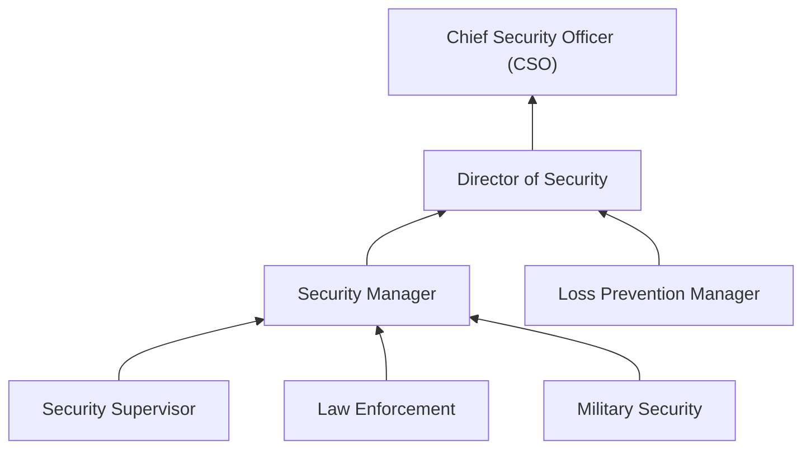

# Security Managers

> Direct an organization's security functions, including physical security and safety of employees and facilities.

## Overview

Security Managers are responsible for protecting an organization's people, assets, and information. They develop and implement comprehensive security programs, manage security personnel, oversee access control systems, and respond to security incidents. This role requires balancing protection with operational accessibility, staying current on emerging threats, and building a security-aware culture. Security Managers must coordinate with law enforcement, emergency services, and internal stakeholders to maintain a safe environment.

## Classification Hierarchy

## Key Statistics

| Metric | Value |
|--------|-------|
| SOC Code | 11-3013.01 |
| Job Zone | 4 (Considerable Preparation) |
| Category | [Management](/occupations/Management/index) |
| Core Tasks | 15+ |
| Source | O*NET |

## Core Tasks

### direct.SecurityOperations

Security Managers lead all aspects of organizational security operations.

**Actions:**
- `direct.SecurityPersonnel.in.DailyOperations` - Supervise security staff
- `direct.AccessControl.for.FacilityProtection` - Manage entry points
- `direct.SurveillanceOperations.for.ThreatDetection` - Oversee monitoring systems
- `direct.GuardServices.for.PhysicalSecurity` - Coordinate security patrols

### develop.SecurityPolicies

Security Managers create policies and procedures that protect the organization.

**Actions:**
- `develop.SecurityPolicies.for.AssetProtection` - Establish security standards
- `develop.EmergencyProcedures.for.CrisisResponse` - Create response protocols
- `develop.RiskAssessments.for.ThreatMitigation` - Identify vulnerabilities
- `develop.TrainingPrograms.for.SecurityAwareness` - Educate employees

### coordinate.IncidentResponse

Security Managers lead responses to security events and emergencies.

**Actions:**
- `coordinate.IncidentResponse.with.EmergencyServices` - Work with first responders
- `coordinate.Investigations.with.LawEnforcement` - Support criminal inquiries
- `coordinate.EvacuationProcedures.for.Safety` - Manage emergency exits
- `coordinate.CrisisManagement.with.Leadership` - Brief executives

### monitor.SecuritySystems

Security Managers ensure security technology operates effectively.

**Actions:**
- `monitor.SecuritySystems.for.ThreatDetection` - Track security alerts
- `monitor.AccessLogs.for.AnomalyDetection` - Review entry records
- `monitor.SurveillanceFootage.for.Incidents` - Analyze camera feeds
- `monitor.AlarmSystems.for.IntrusionPrevention` - Respond to alerts

### investigate.SecurityIncidents

Security Managers conduct inquiries into security breaches and violations.

**Actions:**
- `investigate.SecurityIncidents.for.RootCause` - Determine causes
- `investigate.PolicyViolations.for.Accountability` - Address misconduct
- `investigate.Threats.for.Prevention` - Assess potential dangers
- `document.Investigations.for.LegalPurposes` - Maintain records

## Skills & Competencies

### Technical Skills
- **Physical Security** - Expert
- **Security Technology** - Advanced
- **Risk Assessment** - Advanced
- **Emergency Management** - Advanced
- **Investigations** - Advanced
- **Regulatory Compliance** - Proficient

### Soft Skills
- **Leadership** - Critical
- **Decision Making** - Critical
- **Communication** - Critical
- **Crisis Management** - Essential
- **Attention to Detail** - Essential
- **Integrity** - Essential

## Related Occupations

## Industries

- [Healthcare](/industries/Healthcare/index) - High Employment
- [Government](/industries/PublicAdministration) - High Employment
- [Finance and Insurance](/industries/Finance) - High Employment
- [Educational Services](/industries/Education/index) - Moderate Employment
- [Manufacturing](/industries/Manufacturing/index) - Moderate Employment
- [Retail Trade](/industries/Retail/index) - Moderate Employment

## Career Progression

## Education & Training

| Requirement | Details |
|-------------|---------|
| Typical Education | Bachelor's degree in Criminal Justice, Security Management, or related field |
| Work Experience | 5-7 years in security or law enforcement |
| On-the-Job Training | Extensive; ongoing professional development |
| Common Certifications | CPP (Certified Protection Professional), PSP (Physical Security Professional) |

## Departments

This occupation typically works in:
- [Security](/departments/Security)
- Corporate Security
- Risk Management
- [Facilities](/departments/Operations)

---

*Source: O*NET 11-3013.01 - ONETOccupation*
