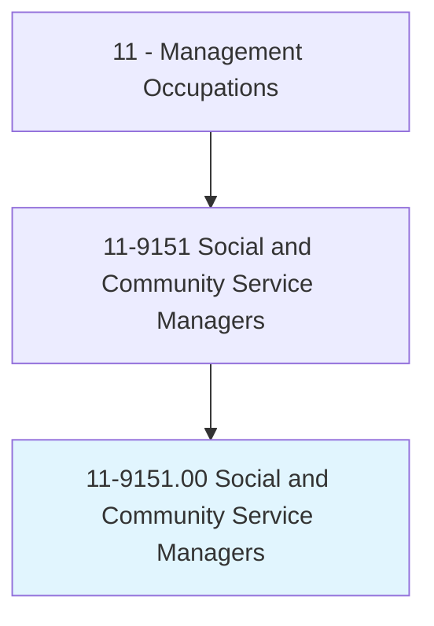
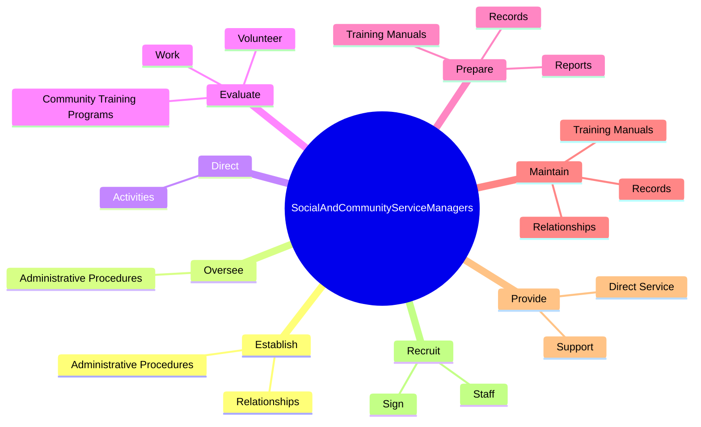

# Social and Community Service Managers

> Plan, direct, or coordinate the activities of a social service program or community outreach organization. Oversee the program or organization's budget and policies regarding participant involvement, program requirements, and benefits. Work may involve directing social workers, counselors, or probation officers.

## Overview

Social and Community Service Managers is an occupation within the Management Occupations category. Plan, direct, or coordinate the activities of a social service program or community outreach organization. Oversee the program or organization's budget and policies regarding participant involvement, program requirements, and benefits.

## Classification Hierarchy

## Key Statistics

| Metric | Value |
|--------|-------|
| SOC Code | 11-9151.00 |
| Category | [Management Occupations](/occupations/Management/index) |
| Task Count | 63 |
| Source | O*NET |

## Core Tasks

### establish.AdministrativeProcedures

Social and Community Service Managers establish administrative procedures as part of their core responsibilities.

**Actions:**
- `establish.AdministrativeProcedures.to.meet.ObjectivesSetByBoardsOfDirectorsManagement`
- `establish.AdministrativeProcedures.to.SeniorManagement`
- `establish.Relationships.with.OtherAgenciesInCommunity.to.meet.CommunityNeedsToEnsureServicesAreNotDuplicated`
- `establish.Relationships.with.OrganizationsInCommunity.to.meet.CommunityNeedsToEnsureServicesAreNotDuplicated`

### oversee.AdministrativeProcedures

Social and Community Service Managers oversee administrative procedures as part of their core responsibilities.

**Actions:**
- `oversee.AdministrativeProcedures.to.meet.ObjectivesSetByBoardsOfDirectorsManagement`
- `oversee.AdministrativeProcedures.to.SeniorManagement`

### direct.Activities

Social and Community Service Managers direct activities as part of their core responsibilities.

**Actions:**
- `direct.Activities.of.ProfessionalStaffMembersVolunteers`
- `direct.Activities.of.TechnicalStaffMembersVolunteers`

## Skills & Competencies

### Technical Skills
- **Strategic Planning** - Advanced
- **Financial Management** - Advanced
- **Operations Management** - Advanced

### Soft Skills
- **Communication** - Essential
- **Problem Solving** - Essential
- **Critical Thinking** - Important
- **Teamwork** - Important
- **Adaptability** - Important

## Related Occupations

## Industries

This occupation is found across multiple industries. See [Industries](/industries) for sector-specific employment data.

## Career Progression

---

*Source: O*NET 11-9151.00 - ONETOccupation*
