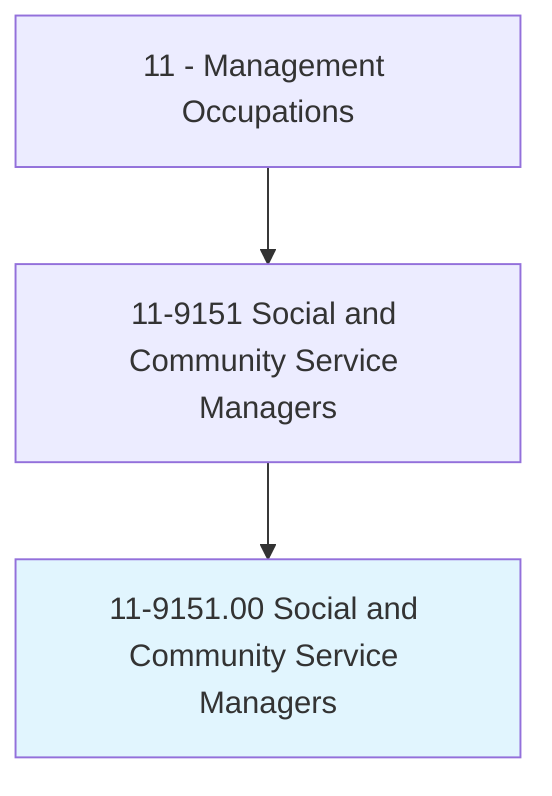
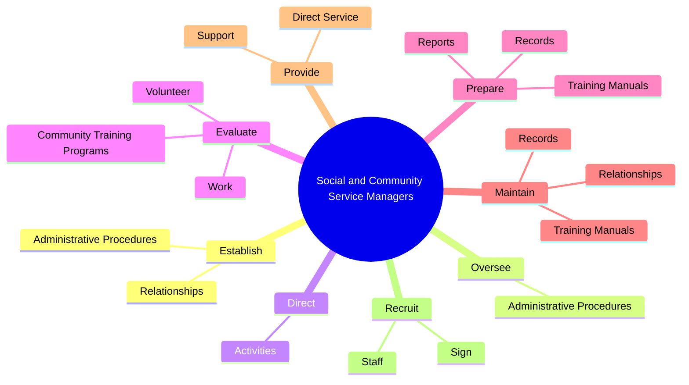
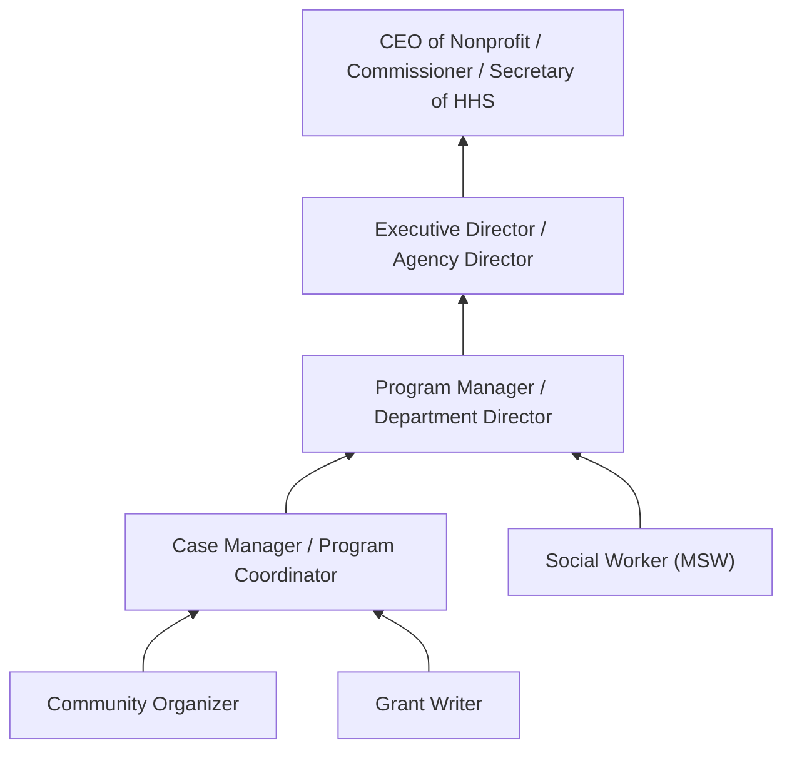
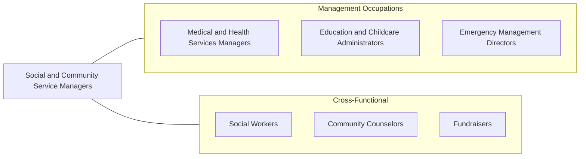

# Social and Community Service Managers

> Plan, direct, or coordinate the activities of a social service program or community outreach organization. Oversee the program or organization's budget and policies regarding participant involvement, program requirements, and benefits. Work may involve directing social workers, counselors, or probation officers.

## Overview

Social and Community Service Managers lead organizations and programs that serve vulnerable populations and address community needs. They direct the operations of nonprofit organizations, government social service agencies, community health centers, homeless shelters, substance abuse programs, youth services, and other human service organizations. Their work ensures that programs effectively serve their intended populations while operating within budgetary and regulatory constraints.

These managers develop program strategies, write grant proposals, manage budgets, supervise professional and volunteer staff, and evaluate program outcomes. They establish relationships with funding agencies, community partners, and government entities to secure resources and coordinate services. The role requires a deep understanding of the social issues their programs address, including poverty, mental health, substance abuse, domestic violence, homelessness, and aging.

The field is shaped by evolving funding landscapes (government grants, philanthropic donations, earned revenue), outcome measurement requirements, and the increasing complexity of social challenges. Social and Community Service Managers must demonstrate program impact through data-driven evaluation while maintaining the compassionate, client-centered approach that defines effective human services.

## Classification Hierarchy

## Key Statistics

| Metric | Value |
|--------|-------|
| SOC Code | 11-9151.00 |
| Job Zone | 4 (Considerable Preparation) |
| Category | [Management Occupations](/occupations/Management/index) |
| Task Count | 63 |
| Salary Range | $50,000 - $100,000+ |
| Employment Level | Large - over 180,000 |
| Growth Outlook | Faster than average |
| Source | O*NET |

## Core Tasks

### establish.AdministrativeProcedures

Social and Community Service Managers establish procedures and community partnerships to meet organizational objectives and serve community needs without duplicating existing services.

**Actions:**
- `establish.AdministrativeProcedures.to.meet.ObjectivesSetByBoardsOfDirectorsManagement`
- `establish.AdministrativeProcedures.to.SeniorManagement`
- `establish.Relationships.with.OtherAgenciesInCommunity.to.meet.CommunityNeedsToEnsureServicesAreNotDuplicated`
- `establish.Relationships.with.OrganizationsInCommunity.to.meet.CommunityNeedsToEnsureServicesAreNotDuplicated`

### direct.Activities

Social and Community Service Managers direct the activities of professional and technical staff members and volunteers delivering program services.

**Actions:**
- `direct.Activities.of.ProfessionalStaffMembersVolunteers`
- `direct.Activities.of.TechnicalStaffMembersVolunteers`

### evaluate.Work

Social and Community Service Managers evaluate program effectiveness, volunteer contributions, and community training outcomes to ensure services meet quality standards.

**Actions:**
- No specific sub-actions listed for this task group.

## Skills & Competencies

### Technical Skills
- **Program Management** - Expert
- **Grant Writing & Administration** - Expert
- **Budget Management** - Advanced
- **Outcome Measurement & Evaluation** - Advanced
- **Social Service Delivery Models** - Advanced
- **Regulatory Compliance** - Advanced
- **Volunteer Management** - Advanced

### Soft Skills
- **Empathy & Compassion** - Critical
- **Leadership** - Critical
- **Communication** - Essential
- **Advocacy** - Essential
- **Collaboration** - Essential
- **Cultural Competency** - Essential
- **Resilience** - Important

## Education & Certifications

| Requirement | Details |
|-------------|---------|
| Typical Education | Bachelor's or Master's degree in Social Work (MSW), Public Administration (MPA), Public Health, or Nonprofit Management |
| Work Experience | 3-5 years in social services, community development, or nonprofit management |
| Licensure | LCSW or LMSW (required for clinical supervisory roles - state social work boards) |
| Common Certifications | CNP (Certified Nonprofit Professional - NLA), CFRE (Certified Fund Raising Executive - CFRE International), CPM (Certified Public Manager), HSE (Human Services Executive) |

## Career Progression

## Industry Variations

- **Nonprofit Organizations** - Board governance; fundraising; volunteer management; mission-driven operations; 990 reporting
- **Government Social Services** - Policy implementation; public benefit administration; inter-agency coordination; legislative advocacy
- **Healthcare (Behavioral Health)** - Clinical program oversight; managed care contracting; evidence-based practice implementation; licensure compliance
- **Faith-Based Organizations** - Congregation-based services; religious mission alignment; volunteer-heavy operations; community outreach

## Technology & Tools

- **Case Management** - Apricot (Social Solutions), Efforts to Outcomes (ETO), Salesforce NPSP, ClientTrack
- **Grant Management** - Fluxx, Submittable, GrantHub
- **Fundraising / CRM** - Salesforce NPSP, Bloomerang, DonorPerfect, Raiser's Edge (Blackbaud)
- **Accounting** - QuickBooks Nonprofit, Sage Intacct (Nonprofit), Blackbaud Financial Edge
- **Outcome Measurement** - HMIS (Homeless Management Information System), Apricot, Logic models
- **Communication** - Constant Contact, Mailchimp, Canva, social media

## Related Occupations

## Industries

- [Healthcare and Social Assistance](/industries/Healthcare/index) - Very High Employment
- [Government](/industries/Government) - High Employment
- [Religious, Grantmaking, Civic, and Professional Organizations](/industries/Nonprofits) - High Employment
- [Educational Services](/industries/Education) - Moderate Employment

## Departments

This occupation typically works in:
- [Program Management](/departments/ProgramManagement)
- [Community Services](/departments/CommunityServices)
- [Social Services](/departments/SocialServices)
- [Development / Fundraising](/departments/Development)

---

*Source: O*NET 11-9151.00 - ONETOccupation*
