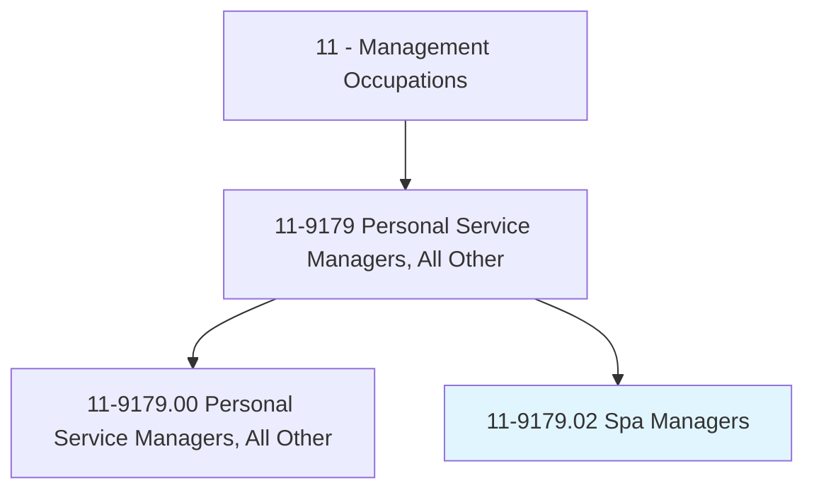
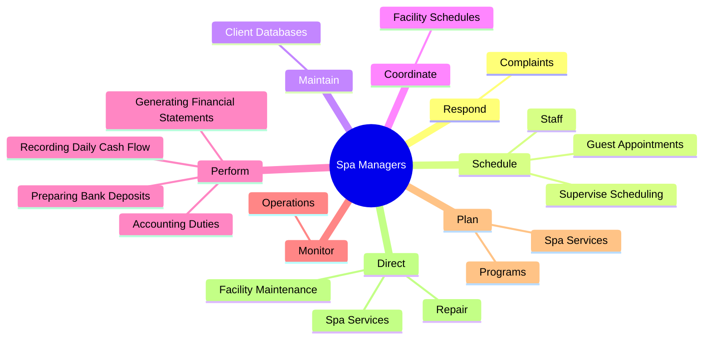
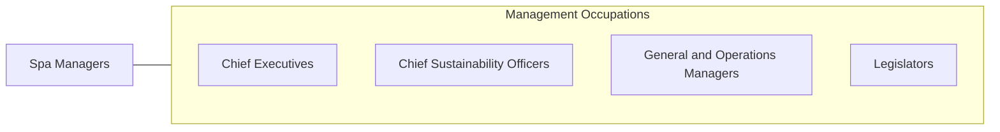

# Spa Managers

> Plan, direct, or coordinate activities of a spa facility. Coordinate programs, schedule and direct staff, and oversee financial activities.

## Overview

Spa Managers is a specialized variant within the Management Occupations category. Plan, direct, or coordinate activities of a spa facility. 

## Classification Hierarchy

## Key Statistics

| Metric | Value |
|--------|-------|
| SOC Code | 11-9179.02 |
| Category | [Management Occupations](/occupations/Management) |
| Task Count | 46 |
| Source | O*NET |

## Core Tasks

### respond.Complaints

Spa Managers respond complaints as part of their core responsibilities.

**Actions:**
- `respond.Complaints`

### schedule.GuestAppointments

Spa Managers schedule guest appointments as part of their core responsibilities.

**Actions:**
- `schedule.GuestAppointments`
- `schedule.Staff`
- `schedule.SuperviseScheduling`

### maintain.ClientDatabases

Spa Managers maintain client databases as part of their core responsibilities.

**Actions:**
- `maintain.ClientDatabases`

## Skills & Competencies

### Technical Skills
- **Strategic Planning** - Advanced
- **Financial Management** - Advanced
- **Operations Management** - Advanced

### Soft Skills
- **Communication** - Essential
- **Problem Solving** - Essential
- **Critical Thinking** - Important
- **Teamwork** - Important
- **Adaptability** - Important

## Related Occupations

## Industries

This occupation is found across multiple industries. See [Industries](/industries) for sector-specific employment data.

## Career Progression

---

*Source: O*NET 11-9179.02 - ONETOccupation*
