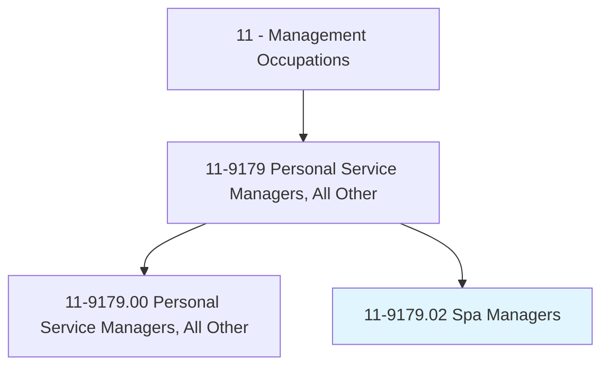
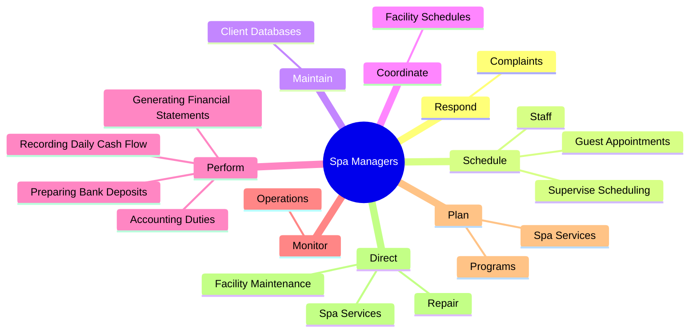
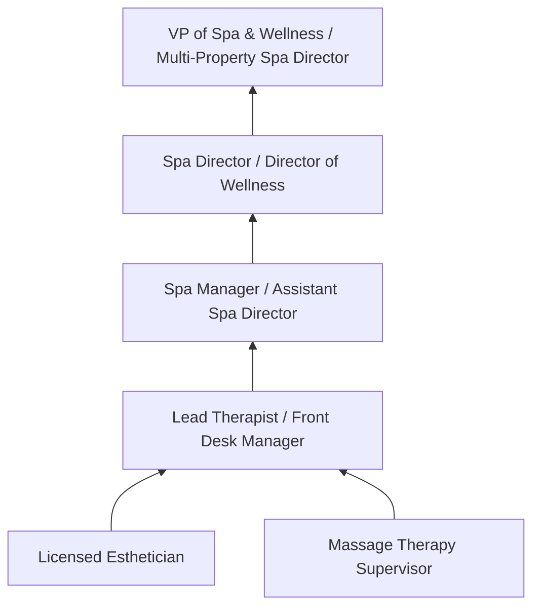
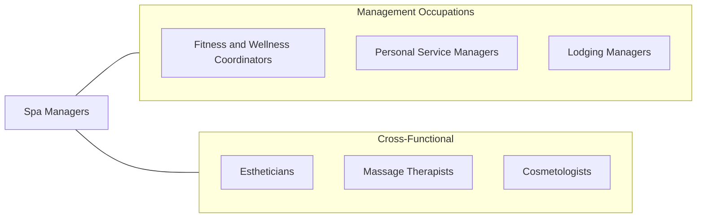

# Spa Managers

> Plan, direct, or coordinate activities of a spa facility. Coordinate programs, schedule and direct staff, and oversee financial activities.

## Overview

Spa Managers oversee the operations of day spas, resort spas, medical spas, and wellness centers. They manage service delivery, staff scheduling, financial performance, marketing, and facility maintenance to create a premium guest experience. The role combines hospitality management with knowledge of wellness treatments, skincare, and health services.

These managers hire and train estheticians, massage therapists, nail technicians, and front desk staff. They develop service menus, set pricing strategies, manage inventory of skincare products and supplies, and ensure that all treatments are delivered safely and to brand standards. Customer experience management is paramount, as repeat business and word-of-mouth referrals drive revenue in the spa industry.

The spa and wellness industry has expanded significantly as consumers increasingly prioritize self-care, stress reduction, and preventive health. Spa Managers must stay current with treatment trends (CBD therapies, cryotherapy, infrared saunas), retail product innovations, and evolving guest expectations. Medical spas add complexity with provider oversight requirements, HIPAA compliance, and specialized treatment protocols.

## Classification Hierarchy

## Key Statistics

| Metric | Value |
|--------|-------|
| SOC Code | 11-9179.02 |
| Job Zone | 3 (Medium Preparation) |
| Category | [Management Occupations](/occupations/Management/index) |
| Task Count | 46 |
| Salary Range | $40,000 - $80,000+ |
| Employment Level | Small |
| Growth Outlook | Faster than average |
| Source | O*NET |

## Core Tasks

### schedule.GuestAppointments

Spa Managers coordinate appointment scheduling, staff assignments, and treatment room allocation to maximize utilization and guest satisfaction.

**Actions:**
- `schedule.GuestAppointments`
- `schedule.Staff`
- `schedule.SuperviseScheduling`

### perform.AccountingDuties

Spa Managers handle financial operations including daily cash reconciliation, bank deposits, and financial statement preparation.

**Actions:**
- No specific sub-actions listed for this task group.

### plan.SpaServices

Spa Managers design service menus, develop wellness programs, and create seasonal promotions that attract and retain clients.

**Actions:**
- No specific sub-actions listed for this task group.

## Skills & Competencies

### Technical Skills
- **Spa Operations Management** - Expert
- **Treatment Knowledge (Skincare, Massage, Body)** - Advanced
- **Revenue & Yield Management** - Advanced
- **Retail Product Knowledge & Merchandising** - Advanced
- **Health & Safety Compliance** - Advanced
- **Financial Management** - Advanced
- **Marketing & Client Retention** - Advanced

### Soft Skills
- **Customer Service** - Critical
- **Leadership** - Critical
- **Communication** - Essential
- **Attention to Detail** - Essential
- **Organizational Skills** - Essential
- **Aesthetic Sensibility** - Important
- **Calm Demeanor** - Important

## Education & Certifications

| Requirement | Details |
|-------------|---------|
| Typical Education | Associate's or Bachelor's degree in Hospitality Management, Business, or Esthetics |
| Work Experience | 3-5 years in spa or wellness industry with supervisory experience |
| Common Certifications | CSM (Certified Spa Manager - various programs), Licensed Esthetician (state cosmetology board), CIDESCO Diploma, Medical Spa licensing requirements (state-specific) |

## Career Progression

## Industry Variations

- **Resort Spas** - Integration with hotel operations; guest package design; seasonal programming; luxury brand standards
- **Day Spas** - Walk-in and appointment balance; membership programs; retail product sales; community marketing
- **Medical Spas** - Physician oversight; injectable treatments; laser procedures; HIPAA compliance; medical-grade products
- **Destination Spas** - Comprehensive wellness programs; nutrition and fitness integration; multi-day packages; transformational experiences

## Technology & Tools

- **Spa Management Software** - Book4Time, Mindbody, Booker, SpaSoft (Agilysys)
- **POS / Retail** - Square, Lightspeed, Mindbody retail module
- **Marketing** - Mailchimp, Instagram, Facebook, Google Business Profile
- **Client Management** - CRM features within spa software, loyalty programs
- **Accounting** - QuickBooks, Xero
- **Online Booking** - Mindbody widget, Vagaro, Booksy

## Related Occupations

## Industries

- [Personal Care Services](/industries/PersonalServices) - High Employment
- [Accommodation (Resort Spas)](/industries/AccommodationFood) - Moderate Employment
- [Healthcare (Medical Spas)](/industries/Healthcare/index) - Growing Employment

## Departments

This occupation typically works in:
- [Spa Operations](/departments/SpaOps)
- [Wellness](/departments/Wellness)
- [Guest Services](/departments/GuestServices)

---

*Source: O*NET 11-9179.02 - ONETOccupation*
