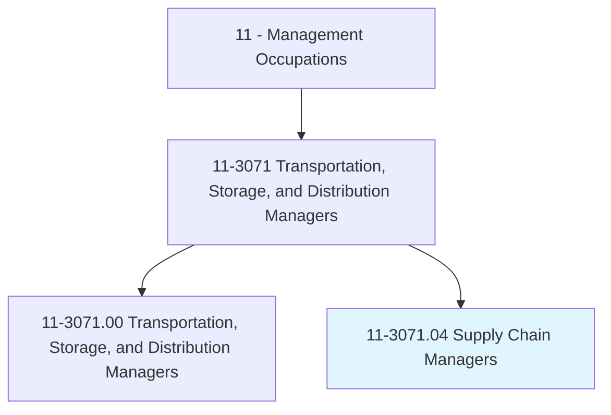
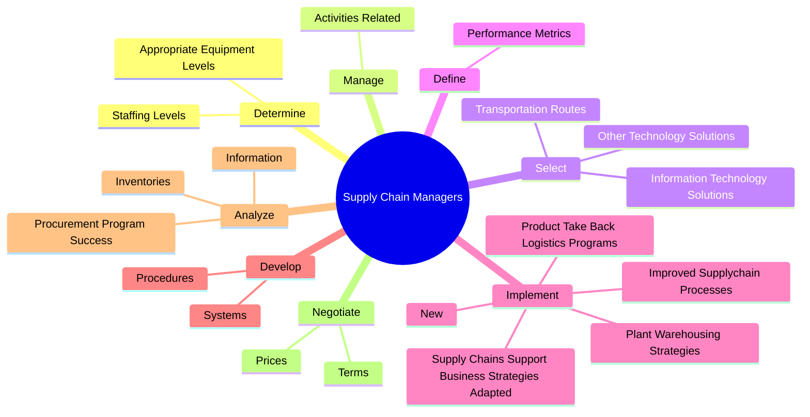
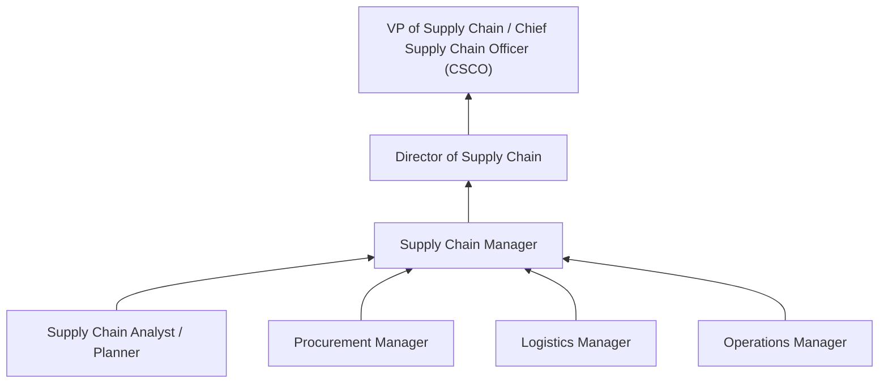
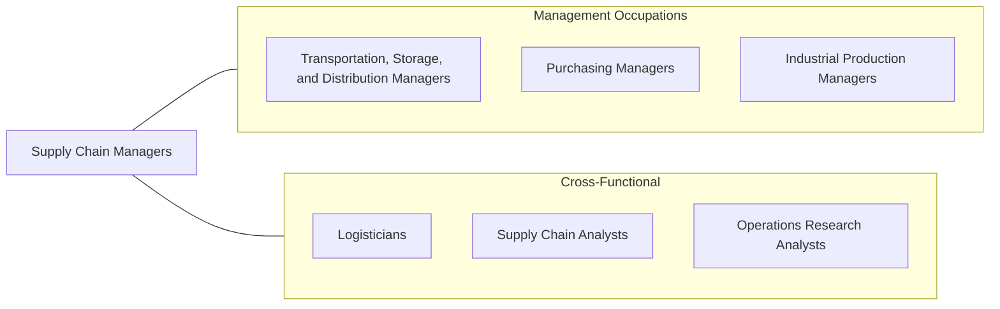

# Supply Chain Managers

> Direct or coordinate production, purchasing, warehousing, distribution, or financial forecasting services or activities to limit costs and improve accuracy, customer service, or safety. Examine existing procedures or opportunities for streamlining activities to meet product distribution needs. Direct the movement, storage, or processing of inventory.

## Overview

Supply Chain Managers orchestrate the end-to-end flow of goods, information, and finances from raw material sourcing through production, warehousing, and final delivery to customers. They take a holistic view of the supply chain, optimizing processes across procurement, manufacturing, logistics, and distribution to reduce costs, improve service levels, and build supply chain resilience. Their strategic decisions impact an organization's competitive position, profitability, and ability to respond to market changes.

These managers analyze supply chain data to identify inefficiencies, develop demand forecasts, manage inventory levels, select transportation modes, and implement process improvements. They coordinate with suppliers, manufacturing plants, distribution centers, and customers to ensure seamless product flow. The role requires balancing competing objectives: minimizing inventory investment while preventing stockouts, reducing transportation costs while meeting delivery commitments, and achieving cost targets while maintaining quality and safety standards.

Supply chain management has become increasingly strategic due to global sourcing complexities, pandemic-related disruptions, sustainability pressures, and the acceleration of e-commerce. Supply Chain Managers must build agile, resilient supply networks while leveraging advanced analytics, IoT, blockchain, and AI-driven planning tools to gain visibility and make data-driven decisions.

## Classification Hierarchy

## Key Statistics

| Metric | Value |
|--------|-------|
| SOC Code | 11-3071.04 |
| Job Zone | 4 (Considerable Preparation) |
| Category | [Management Occupations](/occupations/Management/index) |
| Task Count | 159 |
| Salary Range | $80,000 - $155,000+ |
| Employment Level | Growing |
| Growth Outlook | Faster than average |
| Source | O*NET |

## Core Tasks

### determine.AppropriateEquipmentLevels

Supply Chain Managers determine the equipment and staffing resources needed to load, unload, move, and store materials efficiently across the supply chain.

**Actions:**
- `determine.AppropriateEquipmentLevels.to.load`
- `determine.AppropriateEquipmentLevels.to.unload`
- `determine.AppropriateEquipmentLevels.to.move`
- `determine.AppropriateEquipmentLevels.to.store.Materials`

### manage.ActivitiesRelated

Supply Chain Managers oversee activities related to strategic and tactical purchasing, material requirements planning, and inventory control.

**Actions:**
- `manage.ActivitiesRelated.to.Strategic`
- `manage.ActivitiesRelated.to.TacticalPurchasing`
- `manage.ActivitiesRelated.to.MaterialRequirementsPlanning`
- `manage.ActivitiesRelated.to.ControllingInventory`

### select.TransportationRoutes

Supply Chain Managers select transportation routes and technology solutions to maximize economy through shipment consolidation, warehousing optimization, and improved tracking.

**Actions:**
- `select.TransportationRoutes.to.maximize.EconomyByCombiningShipments`
- `select.TransportationRoutes.to.ConsolidatingWarehousing`
- `select.TransportationRoutes.to.Distribution`
- `select.InformationTechnologySolutions.to.improve.Tracking`

## Skills & Competencies

### Technical Skills
- **Supply Chain Strategy & Design** - Expert
- **Demand Planning & Forecasting** - Expert
- **Inventory Optimization** - Advanced
- **Procurement & Sourcing** - Advanced
- **Logistics & Distribution** - Advanced
- **Supply Chain Analytics** - Advanced
- **ERP & SCM Systems** - Advanced

### Soft Skills
- **Strategic Thinking** - Critical
- **Analytical Problem Solving** - Critical
- **Communication** - Essential
- **Negotiation** - Essential
- **Cross-Functional Collaboration** - Essential
- **Leadership** - Essential
- **Change Management** - Important

## Education & Certifications

| Requirement | Details |
|-------------|---------|
| Typical Education | Bachelor's degree in Supply Chain Management, Operations, Business, or Engineering |
| Advanced Education | MBA or Master's in Supply Chain frequently preferred |
| Work Experience | 5-10 years across supply chain functions |
| Common Certifications | CSCP (Certified Supply Chain Professional - ASCM), CPSM (Certified Professional in Supply Management - ISM), CPIM (Certified in Planning and Inventory Management - ASCM), Six Sigma Green/Black Belt, PMP (PMI) |

## Career Progression

## Industry Variations

- **Consumer Goods (CPG)** - Demand sensing; trade promotion management; omnichannel fulfillment; sustainability in packaging
- **Automotive** - Just-in-sequence delivery; tier-1/tier-2 supplier management; quality traceability; global platform sourcing
- **Pharmaceutical** - Cold chain integrity; serialization/track-and-trace; regulatory compliance (GDP); controlled substance logistics
- **Technology / Electronics** - Component shortage management; rapid product lifecycle; global contract manufacturing; reverse logistics

## Technology & Tools

- **SCM Platforms** - SAP SCM/IBP, Oracle SCM Cloud, Blue Yonder, Kinaxis RapidResponse
- **Planning** - Anaplan, o9 Solutions, DELMIA Quintiq
- **Visibility** - FourKites, project44, Descartes
- **Procurement** - Coupa, SAP Ariba, Jaggaer
- **Analytics** - Tableau, Power BI, Alteryx
- **Emerging** - Digital twins, blockchain (supply chain provenance), AI/ML demand forecasting

## Related Occupations

## Industries

- [Manufacturing](/industries/Manufacturing/index) - Very High Employment
- [Wholesale Trade](/industries/WholesaleTrade) - High Employment
- [Retail Trade](/industries/Retail/index) - High Employment
- [Transportation and Warehousing](/industries/TransportationWarehousing) - Moderate Employment
- [Professional Services (Consulting)](/industries/ProfessionalServices) - Moderate Employment

## Departments

This occupation typically works in:
- [Supply Chain](/departments/SupplyChain)
- [Operations](/departments/Operations/index)
- [Logistics & Distribution](/departments/Logistics)
- [Procurement](/departments/Procurement)

---

*Source: O*NET 11-3071.04 - ONETOccupation*
