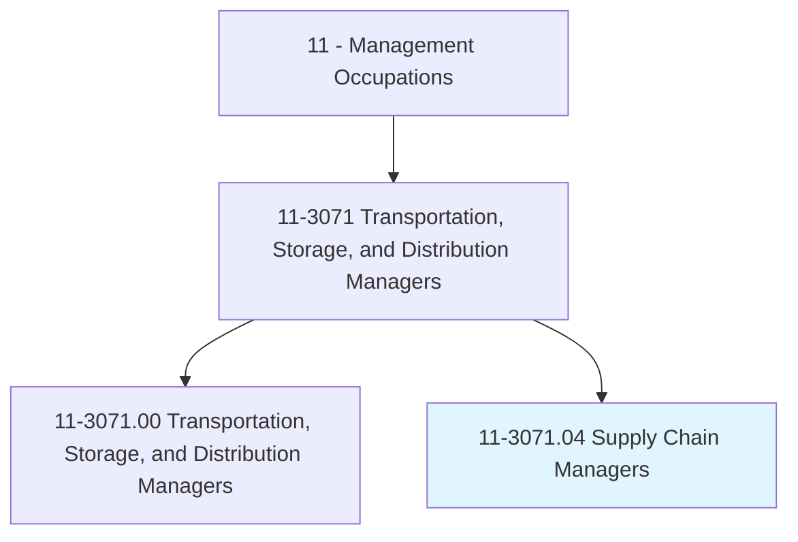
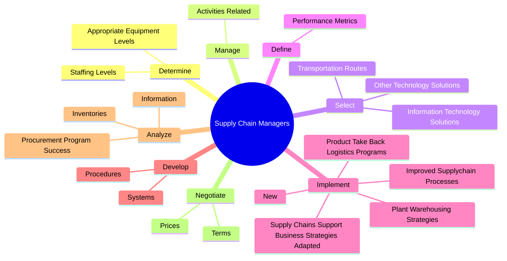
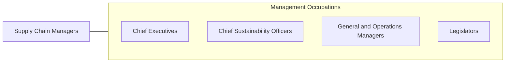

# Supply Chain Managers

> Direct or coordinate production, purchasing, warehousing, distribution, or financial forecasting services or activities to limit costs and improve accuracy, customer service, or safety. Examine existing procedures or opportunities for streamlining activities to meet product distribution needs. Direct the movement, storage, or processing of inventory.

## Overview

Supply Chain Managers is a specialized variant within the Management Occupations category. Direct or coordinate production, purchasing, warehousing, distribution, or financial forecasting services or activities to limit costs and improve accuracy, customer service, or safety. Examine existing procedures or opportunities for streamlining activities to meet product distribution needs.

## Classification Hierarchy

## Key Statistics

| Metric | Value |
|--------|-------|
| SOC Code | 11-3071.04 |
| Category | [Management Occupations](/occupations/Management) |
| Task Count | 159 |
| Source | O*NET |

## Core Tasks

### determine.AppropriateEquipmentLevels

Supply Chain Managers determine appropriate equipment levels as part of their core responsibilities.

**Actions:**
- `determine.AppropriateEquipmentLevels.to.load`
- `determine.AppropriateEquipmentLevels.to.unload`
- `determine.AppropriateEquipmentLevels.to.move`
- `determine.AppropriateEquipmentLevels.to.store.Materials`

### manage.ActivitiesRelated

Supply Chain Managers manage activities related as part of their core responsibilities.

**Actions:**
- `manage.ActivitiesRelated.to.Strategic`
- `manage.ActivitiesRelated.to.TacticalPurchasing`
- `manage.ActivitiesRelated.to.MaterialRequirementsPlanning`
- `manage.ActivitiesRelated.to.ControllingInventory`

### select.TransportationRoutes

Supply Chain Managers select transportation routes as part of their core responsibilities.

**Actions:**
- `select.TransportationRoutes.to.maximize.EconomyByCombiningShipments`
- `select.TransportationRoutes.to.ConsolidatingWarehousing`
- `select.TransportationRoutes.to.Distribution`
- `select.InformationTechnologySolutions.to.improve.Tracking`

## Skills & Competencies

### Technical Skills
- **Strategic Planning** - Advanced
- **Financial Management** - Advanced
- **Operations Management** - Advanced

### Soft Skills
- **Communication** - Essential
- **Problem Solving** - Essential
- **Critical Thinking** - Important
- **Teamwork** - Important
- **Adaptability** - Important

## Related Occupations

## Industries

This occupation is found across multiple industries. See [Industries](/industries) for sector-specific employment data.

## Career Progression

---

*Source: O*NET 11-3071.04 - ONETOccupation*
