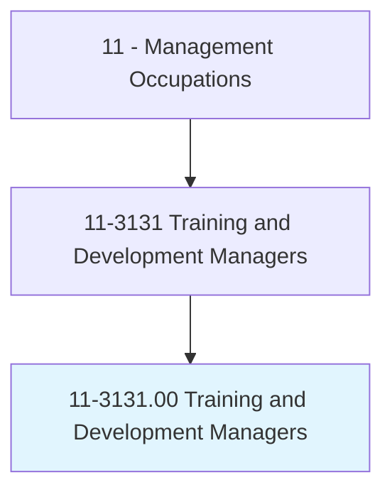
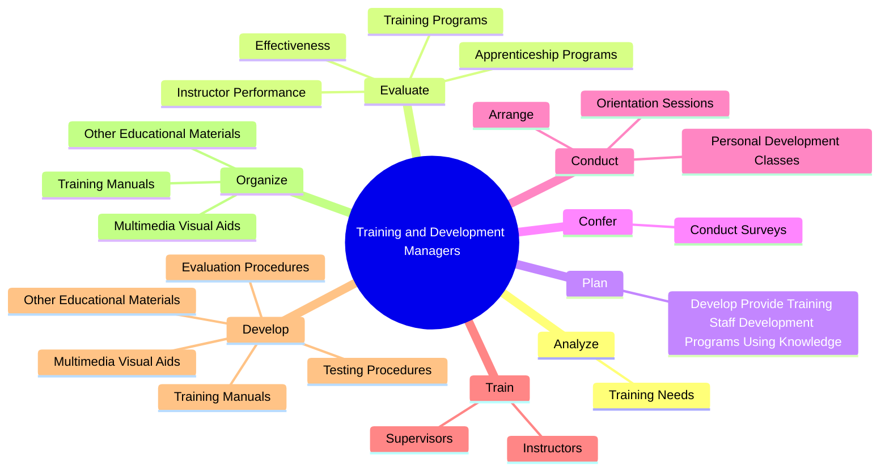
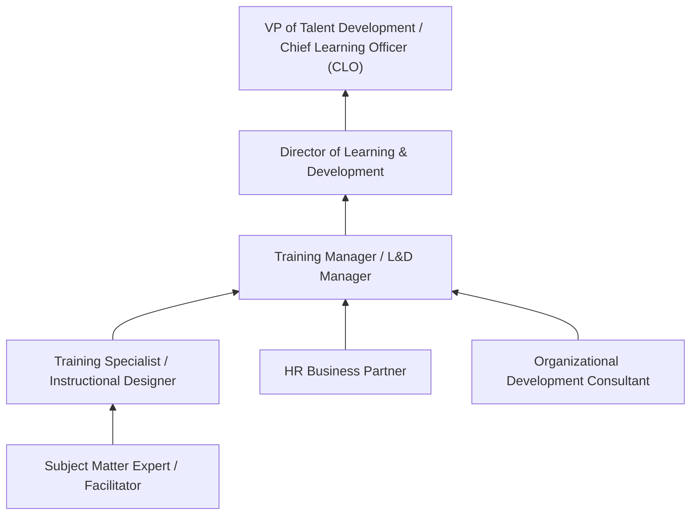
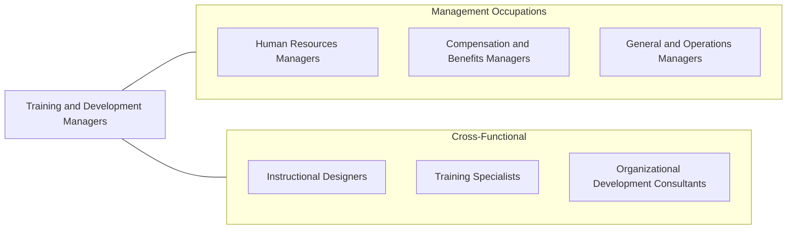

# Training and Development Managers

> Plan, direct, or coordinate the training and development activities and staff of an organization.

## Overview

Training and Development Managers design and oversee programs that enhance the knowledge, skills, and capabilities of an organization's workforce. They assess training needs, develop learning strategies, manage training budgets, and evaluate program effectiveness. Their work directly impacts employee performance, retention, career development, and organizational competitiveness.

These managers lead teams of instructional designers, trainers, facilitators, and e-learning specialists who deliver training through classroom instruction, workshops, online courses, simulations, mentoring programs, and on-the-job learning. They must align training initiatives with business strategy, ensuring that learning investments address critical skill gaps and support organizational goals such as digital transformation, leadership development, compliance, and change management.

The training landscape has been transformed by technology and changing workforce expectations. Training and Development Managers now oversee blended learning environments that combine in-person instruction with virtual classrooms, self-paced e-learning, microlearning, social learning platforms, and AI-powered adaptive learning. They must also address the needs of increasingly diverse, distributed, and multigenerational workforces.

## Classification Hierarchy

## Key Statistics

| Metric | Value |
|--------|-------|
| SOC Code | 11-3131.00 |
| Job Zone | 4 (Considerable Preparation) |
| Category | [Management Occupations](/occupations/Management/index) |
| Task Count | 38 |
| Salary Range | $75,000 - $145,000+ |
| Employment Level | Moderate - approximately 40,000 |
| Growth Outlook | Average |
| Source | O*NET |

## Core Tasks

### analyze.TrainingNeeds

Training and Development Managers conduct needs assessments to identify skills gaps, determine training priorities, and develop targeted learning programs.

**Actions:**
- `analyze.TrainingNeeds.to.develop.NewTrainingPrograms`
- `analyze.TrainingNeeds.to.modify.ExistingPrograms`
- `analyze.TrainingNeeds.to.improve.ExistingPrograms`

### evaluate.InstructorPerformance

Training and Development Managers assess instructor effectiveness and training program outcomes to continuously improve learning delivery and impact.

**Actions:**
- `evaluate.InstructorPerformance.of.TrainingPrograms`
- `evaluate.InstructorPerformance.of.ProvidingRecommendationsF`
- `evaluate.InstructorPerformance.of.Improvement`
- `evaluate.Effectiveness.of.TrainingPrograms`

### develop.TrainingManuals

Training and Development Managers create and organize comprehensive training materials including manuals, multimedia resources, testing instruments, and evaluation frameworks.

**Actions:**
- No specific sub-actions listed for this task group.

## Skills & Competencies

### Technical Skills
- **Instructional Design** - Expert
- **Learning Needs Assessment** - Expert
- **Program Evaluation & Measurement** - Advanced
- **E-Learning Development** - Advanced
- **Leadership Development** - Advanced
- **Budget Management** - Advanced
- **Learning Management Systems** - Advanced

### Soft Skills
- **Communication** - Critical
- **Leadership** - Critical
- **Presentation Skills** - Essential
- **Strategic Thinking** - Essential
- **Coaching & Mentoring** - Essential
- **Creativity** - Important
- **Influencing Skills** - Important

## Education & Certifications

| Requirement | Details |
|-------------|---------|
| Typical Education | Bachelor's degree in Human Resources, Education, Organizational Development, or Business |
| Advanced Education | Master's degree in Instructional Design, Organizational Development, or MBA preferred |
| Work Experience | 5+ years in training, instructional design, or organizational development |
| Common Certifications | CPTD (Certified Professional in Talent Development - ATD), SHRM-SCP (SHRM), PMP (PMI), CLP (Certified Learning Professional), APTD (Associate Professional in Talent Development - ATD) |

## Career Progression

## Industry Variations

- **Technology** - Rapid skill obsolescence; continuous learning culture; developer bootcamps; certification programs; AI/ML upskilling
- **Healthcare** - Clinical competency training; continuing medical education (CME); compliance training (HIPAA, OSHA); simulation-based learning
- **Financial Services** - Regulatory compliance training; anti-money laundering; product knowledge; sales effectiveness; leadership academies
- **Manufacturing** - Safety training; equipment operation; lean/Six Sigma; apprenticeship programs; skills-based career pathways

## Technology & Tools

- **Learning Management Systems** - Cornerstone OnDemand, Docebo, SAP Litmos, Absorb LMS
- **Authoring Tools** - Articulate Storyline/Rise, Adobe Captivate, Camtasia
- **Virtual Classroom** - Zoom, Microsoft Teams, Webex, Adobe Connect
- **Assessment** - Questionmark, ProProfs, Kahoot!, Qualtrics
- **Talent Management** - Workday Learning, SAP SuccessFactors, Cornerstone
- **Analytics** - xAPI/Tin Can, Learning Record Store, Power BI, Tableau

## Related Occupations

## Industries

- [Professional, Scientific, and Technical Services](/industries/Scientific) - High Employment
- [Finance and Insurance](/industries/Finance) - Moderate Employment
- [Healthcare and Social Assistance](/industries/Healthcare/index) - Moderate Employment
- [Manufacturing](/industries/Manufacturing/index) - Moderate Employment
- [Government](/industries/PublicAdministration) - Moderate Employment

## Departments

This occupation typically works in:
- Learning & Development
- [Human Resources](/departments/HumanResources/index)
- Talent Development
- Organizational Development

---

*Source: O*NET 11-3131.00 - ONETOccupation*
