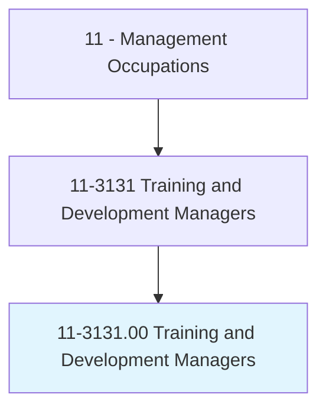
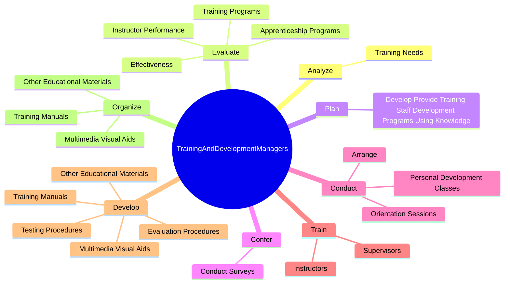
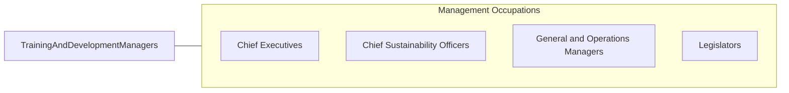

# Training and Development Managers

> Plan, direct, or coordinate the training and development activities and staff of an organization.

## Overview

Training and Development Managers is classified under Management Occupations (SOC 11). Plan, direct, or coordinate the training and development activities and staff of an organization.

## Classification Hierarchy

## Key Statistics

| Metric | Value |
|--------|-------|
| SOC Code | 11-3131.00 |
| Category | [Management Occupations](/occupations/Management/index) |
| Task Count | 38 |
| Source | O*NET |

## Core Tasks

### analyze.TrainingNeeds

Training and Development Managers analyze training needs as part of their core responsibilities.

**Actions:**
- `analyze.TrainingNeeds.to.develop.NewTrainingPrograms`
- `analyze.TrainingNeeds.to.modify.ExistingPrograms`
- `analyze.TrainingNeeds.to.improve.ExistingPrograms`

### evaluate.InstructorPerformance

Training and Development Managers evaluate instructor performance as part of their core responsibilities.

**Actions:**
- `evaluate.InstructorPerformance.of.TrainingPrograms`
- `evaluate.InstructorPerformance.of.ProvidingRecommendationsF`
- `evaluate.InstructorPerformance.of.Improvement`
- `evaluate.Effectiveness.of.TrainingPrograms`

### plan.DevelopProvideTrainingStaffDevelopmentProgramsUsingKnowledge

Training and Development Managers plan develop provide training staff development programs using knowledge as part of their core responsibilities.

**Actions:**
- `plan.DevelopProvideTrainingStaffDevelopmentProgramsUsingKnowledge.of.Effectiveness.of.MethodsSuchAsClassroomTrainingDemonstrationsOnJobTrainingMeetingsConferencesWorkshops`

## Skills & Competencies

### Technical Skills
- **Strategic Planning** - Advanced
- **Financial Management** - Advanced
- **Operations Management** - Advanced

### Soft Skills
- **Communication** - Essential
- **Problem Solving** - Essential
- **Critical Thinking** - Important
- **Teamwork** - Important
- **Adaptability** - Important

## Related Occupations

## Industries

This occupation is found across multiple industries. See [Industries](/industries) for sector-specific employment data.

## Career Progression

---

*Source: O*NET 11-3131.00 - ONETOccupation*
