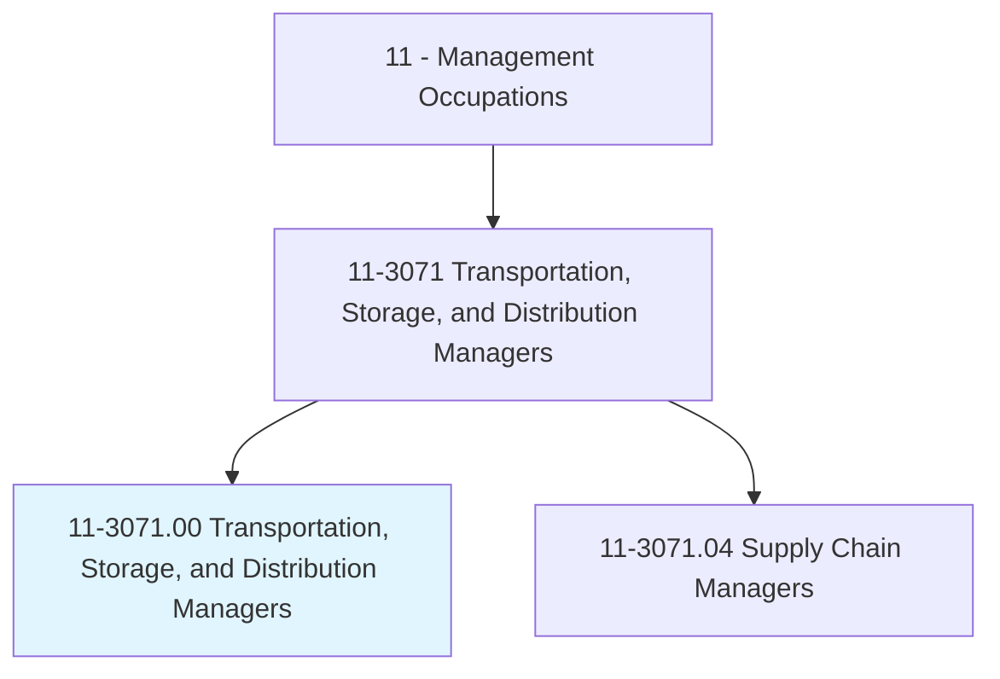
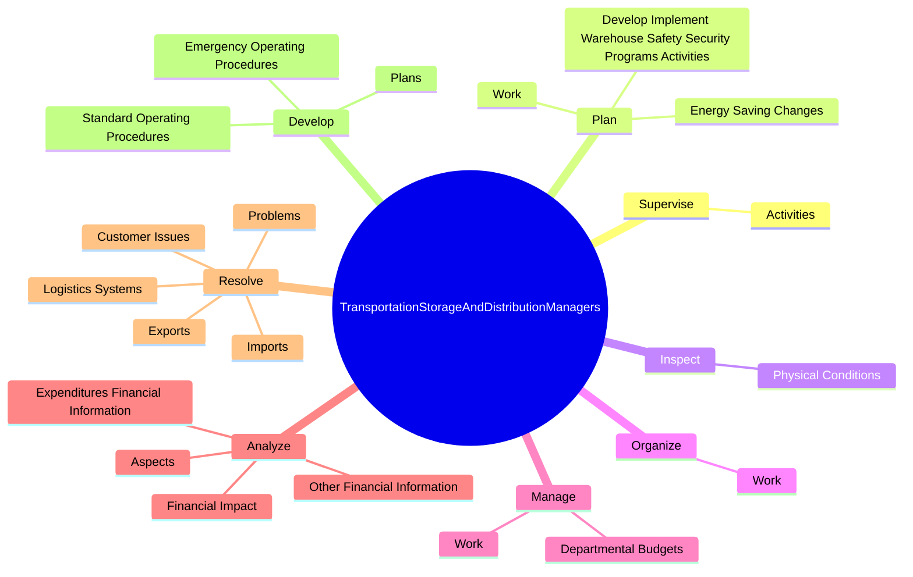
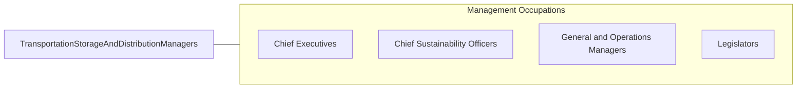

# Transportation, Storage, and Distribution Managers

> Plan, direct, or coordinate transportation, storage, or distribution activities in accordance with organizational policies and applicable government laws or regulations. Includes logistics managers.

## Overview

Transportation, Storage, and Distribution Managers is an occupation within the Management Occupations category. Plan, direct, or coordinate transportation, storage, or distribution activities in accordance with organizational policies and applicable government laws or regulations. 

## Classification Hierarchy

## Key Statistics

| Metric | Value |
|--------|-------|
| SOC Code | 11-3071.00 |
| Category | [Management Occupations](/occupations/Management) |
| Task Count | 147 |
| Source | O*NET |

## Core Tasks

### supervise.Activities

Transportation, Storage, and Distribution Managers supervise activities as part of their core responsibilities.

**Actions:**
- `supervise.Activities.of.Workers.engaged.in.Receiving`
- `supervise.Activities.of.Storing`
- `supervise.Activities.of.Testing`
- `supervise.Activities.of.ShippingProducts`

### plan.DevelopImplementWarehouseSafetySecurityProgramsActivities

Transportation, Storage, and Distribution Managers plan develop implement warehouse safety security programs activities as part of their core responsibilities.

**Actions:**
- `plan.DevelopImplementWarehouseSafetySecurityProgramsActivities`
- `plan.Work.of.SubordinateStaff.to.ensure.WorkIsAccomplishedInMannerConsistentWithOrganizationalRequirements`
- `plan.EnergySavingChanges.to.transportation.Services`
- `plan.EnergySavingChanges.to.ReducingRoutes`

### inspect.PhysicalConditions

Transportation, Storage, and Distribution Managers inspect physical conditions as part of their core responsibilities.

**Actions:**
- `inspect.PhysicalConditions.of.Warehouses`
- `inspect.PhysicalConditions.of.VehicleFleets`
- `inspect.PhysicalConditions.of.Equipment`
- `inspect.PhysicalConditions.of.OrderTesting`

## Skills & Competencies

### Technical Skills
- **Strategic Planning** - Advanced
- **Financial Management** - Advanced
- **Operations Management** - Advanced

### Soft Skills
- **Communication** - Essential
- **Problem Solving** - Essential
- **Critical Thinking** - Important
- **Teamwork** - Important
- **Adaptability** - Important

## Related Occupations

## Industries

This occupation is found across multiple industries. See [Industries](/industries) for sector-specific employment data.

## Career Progression

---

*Source: O*NET 11-3071.00 - ONETOccupation*
