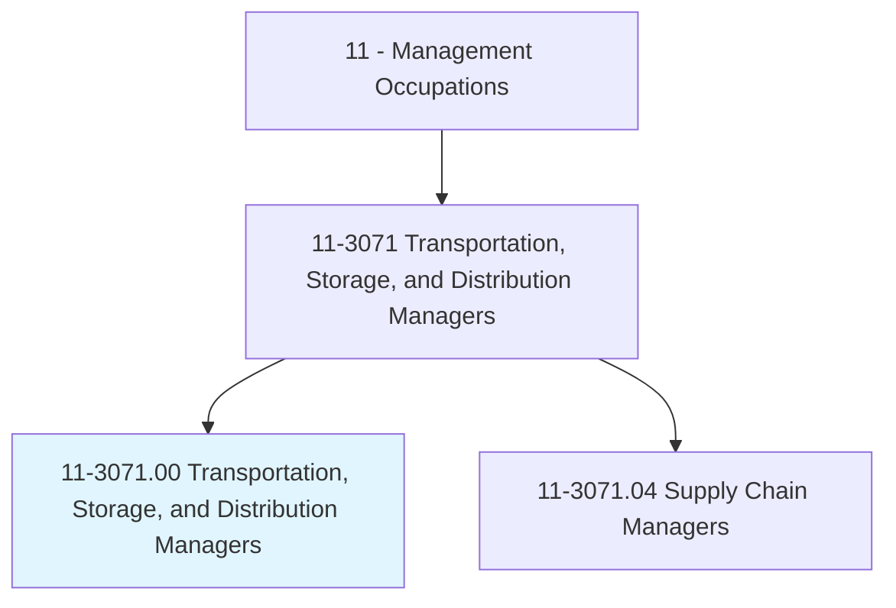
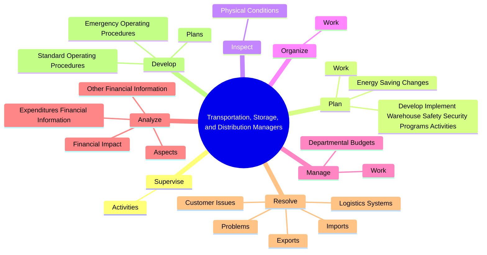
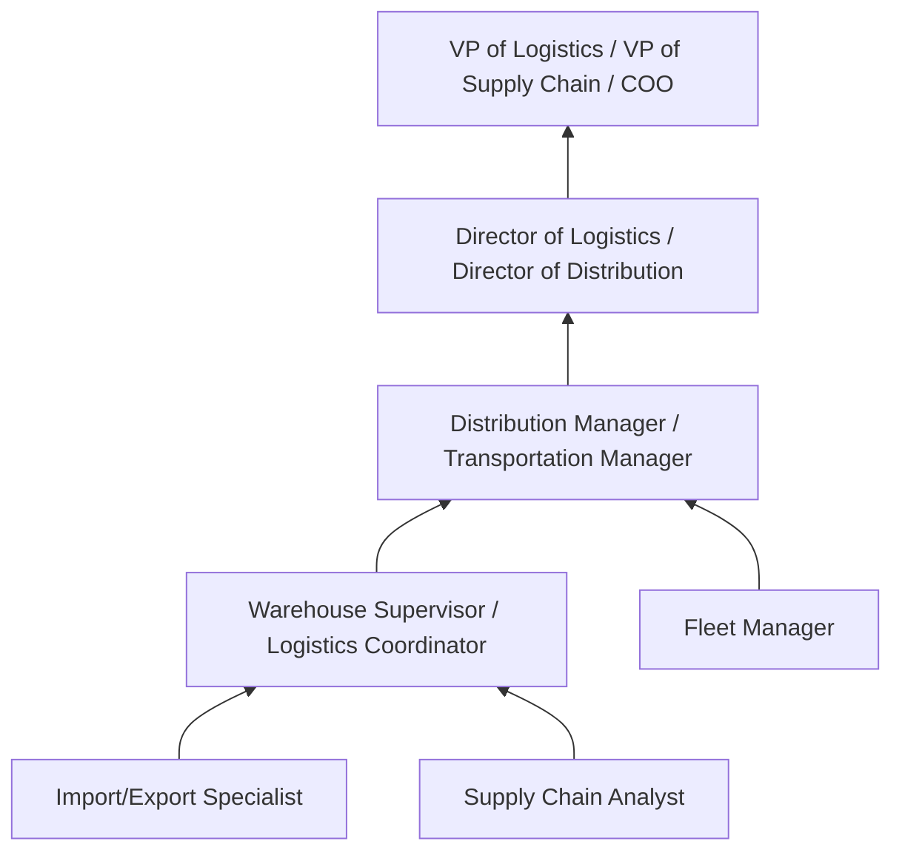
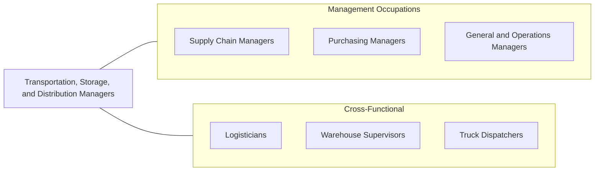

# Transportation, Storage, and Distribution Managers

> Plan, direct, or coordinate transportation, storage, or distribution activities in accordance with organizational policies and applicable government laws or regulations. Includes logistics managers.

## Overview

Transportation, Storage, and Distribution Managers oversee the movement, warehousing, and delivery of goods within and between organizations. They plan logistics operations, manage warehouse facilities, coordinate transportation routes, and ensure that products reach customers efficiently and cost-effectively while complying with safety and regulatory requirements. This role is fundamental to supply chain performance.

These managers supervise receiving, storing, testing, and shipping operations while managing the workforce, equipment, and technology needed for efficient logistics operations. They analyze transportation costs, negotiate carrier contracts, optimize warehouse layouts, implement safety programs, and develop standard operating procedures. Their decisions directly impact delivery times, transportation costs, inventory accuracy, and customer satisfaction.

The logistics landscape is rapidly evolving with e-commerce growth driving demand for faster delivery, warehouse automation transforming operations, and sustainability concerns reshaping transportation strategies. Managers must adapt to last-mile delivery challenges, multi-modal transportation networks, cold chain requirements, and the integration of technologies such as warehouse management systems, transportation management systems, and IoT-enabled tracking.

## Classification Hierarchy

## Key Statistics

| Metric | Value |
|--------|-------|
| SOC Code | 11-3071.00 |
| Job Zone | 4 (Considerable Preparation) |
| Category | [Management Occupations](/occupations/Management/index) |
| Task Count | 147 |
| Salary Range | $65,000 - $135,000+ |
| Employment Level | Moderate - approximately 145,000 |
| Growth Outlook | Average |
| Source | O*NET |

## Core Tasks

### supervise.Activities

Transportation, Storage, and Distribution Managers supervise workers engaged in receiving, storing, testing, and shipping products across the supply chain.

**Actions:**
- `supervise.Activities.of.Workers.engaged.in.Receiving`
- `supervise.Activities.of.Storing`
- `supervise.Activities.of.Testing`
- `supervise.Activities.of.ShippingProducts`

### plan.DevelopImplementWarehouseSafetySecurityProgramsActivities

These managers develop and implement warehouse safety and security programs, plan staff work assignments, and drive energy efficiency initiatives in transportation.

**Actions:**
- `plan.DevelopImplementWarehouseSafetySecurityProgramsActivities`
- `plan.Work.of.SubordinateStaff.to.ensure.WorkIsAccomplishedInMannerConsistentWithOrganizationalRequirements`
- `plan.EnergySavingChanges.to.transportation.Services`
- `plan.EnergySavingChanges.to.ReducingRoutes`

### inspect.PhysicalConditions

These managers inspect warehouses, vehicle fleets, and equipment to ensure safe and efficient physical operations.

**Actions:**
- `inspect.PhysicalConditions.of.Warehouses`
- `inspect.PhysicalConditions.of.VehicleFleets`
- `inspect.PhysicalConditions.of.Equipment`
- `inspect.PhysicalConditions.of.OrderTesting`

## Skills & Competencies

### Technical Skills
- **Logistics & Distribution Management** - Expert
- **Warehouse Operations** - Expert
- **Transportation Planning** - Advanced
- **Inventory Management** - Advanced
- **Safety & OSHA Compliance** - Advanced
- **Budget & Cost Analysis** - Advanced
- **Customs & Trade Compliance** - Advanced

### Soft Skills
- **Leadership** - Critical
- **Problem Solving** - Critical
- **Communication** - Essential
- **Decision Making** - Essential
- **Organizational Skills** - Essential
- **Attention to Detail** - Important
- **Negotiation** - Important

## Education & Certifications

| Requirement | Details |
|-------------|---------|
| Typical Education | Bachelor's degree in Supply Chain Management, Logistics, Business Administration, or related field |
| Work Experience | 5+ years in logistics, warehousing, or transportation operations |
| On-the-Job Training | Moderate - mode-specific and regulatory knowledge |
| Common Certifications | CSCP (Certified Supply Chain Professional - ASCM), CTL (Certified in Transportation and Logistics - AST&L), CPIM (Certified in Planning and Inventory Management - ASCM), OSHA Forklift Certification, CDL (Commercial Driver's License) for some roles |

## Career Progression

## Industry Variations

- **E-Commerce / Retail** - Fulfillment center management; last-mile delivery optimization; returns processing; seasonal volume scaling
- **Manufacturing** - Inbound materials logistics; finished goods warehousing; just-in-time delivery; lean material handling
- **Third-Party Logistics (3PL)** - Multi-client operations; contract logistics; value-added services; client relationship management
- **Food & Beverage** - Cold chain management; FSMA compliance; perishable inventory rotation; temperature-controlled transportation

## Technology & Tools

- **Warehouse Management Systems** - Manhattan Associates, Blue Yonder, Oracle WMS, SAP EWM
- **Transportation Management** - Oracle TMS, MercuryGate, Transplace, Kuebix
- **Fleet Management** - Samsara, Geotab, Omnitracs, KeepTruckin
- **Inventory** - Fishbowl, Zoho Inventory, NetSuite
- **Automation** - AutoStore, Locus Robotics, Fetch Robotics, conveyor systems
- **Analytics** - Tableau, Power BI, FourKites (visibility), project44

## Related Occupations

## Industries

- Transportation and Warehousing - Very High Employment
- [Manufacturing](/industries/Manufacturing/index) - High Employment
- Wholesale Trade - High Employment
- [Retail Trade](/industries/Retail/index) - Moderate Employment

## Departments

This occupation typically works in:
- [Logistics / Distribution](/departments/SupplyChain)
- Warehouse Operations
- Transportation
- [Supply Chain](/departments/SupplyChain)

---

*Source: O*NET 11-3071.00 - ONETOccupation*
