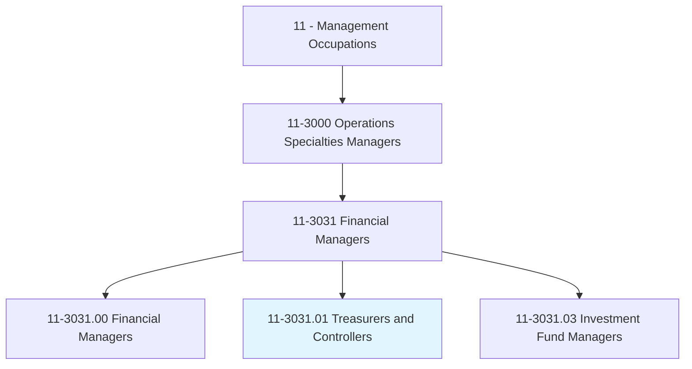
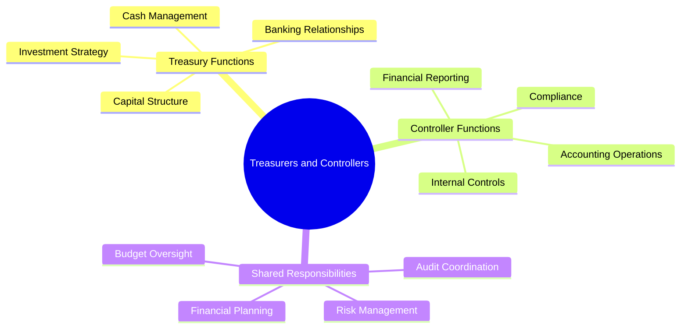
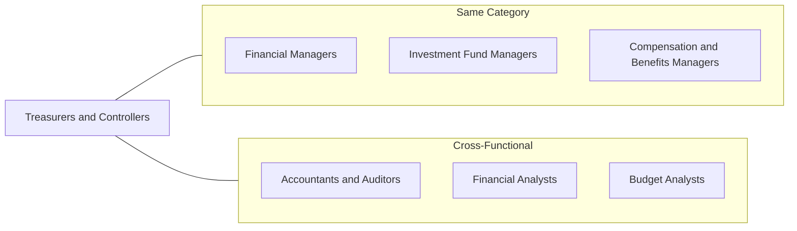
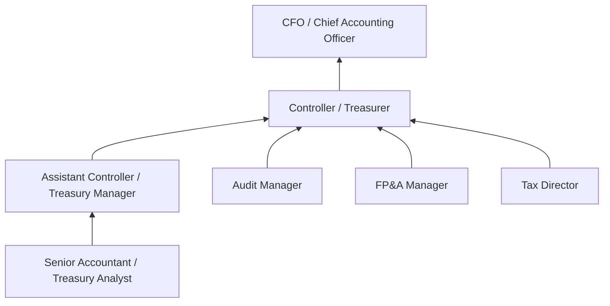

# Treasurers and Controllers

> Direct financial activities, such as planning, procurement, and investments for all or part of an organization.

## Overview

Treasurers and Controllers are senior financial executives with distinct but complementary responsibilities. Treasurers focus on cash management, investment strategies, capital structure, and banking relationships, while Controllers oversee accounting operations, financial reporting, and internal controls. Together, these roles ensure financial integrity, liquidity, and strategic capital allocation. Both positions require deep technical expertise and the ability to translate financial data into strategic insights for leadership.

## Classification Hierarchy

## Key Statistics

| Metric | Value |
|--------|-------|
| SOC Code | 11-3031.01 |
| Job Zone | 5 (Extensive Preparation) |
| Category | [Management](/occupations/Management/index) |
| Core Tasks | 20+ |
| Source | O*NET |

## Core Tasks

### direct.FinancialPlanning

Treasurers and Controllers lead strategic financial planning initiatives.

**Actions:**
- `direct.FinancialPlanning.for.Organization` - Guide overall financial strategy
- `direct.Procurement.of.Capital` - Secure funding sources
- `direct.Investments.for.Returns` - Optimize capital allocation
- `direct.BudgetDevelopment.for.Operations` - Create financial frameworks

### manage.CashOperations

Treasurers ensure optimal cash management and liquidity.

**Actions:**
- `manage.CashPosition.for.Liquidity` - Maintain adequate funds
- `manage.BankingRelationships.for.Services` - Optimize banking partnerships
- `manage.ShortTermInvestments.for.Returns` - Deploy excess cash
- `forecast.CashNeeds.for.Planning` - Project cash requirements

### oversee.FinancialReporting

Controllers ensure accurate and timely financial statements.

**Actions:**
- `oversee.FinancialReporting.for.Compliance` - Produce accurate statements
- `oversee.AccountingOperations.for.Accuracy` - Maintain proper records
- `implement.InternalControls.for.Integrity` - Establish safeguards
- `coordinate.Audits.for.Verification` - Facilitate examinations

### manage.CapitalStructure

Treasurers optimize the mix of debt and equity financing.

**Actions:**
- `manage.DebtFinancing.for.CostOptimization` - Structure borrowings
- `manage.EquityTransactions.for.Capital` - Handle stock matters
- `negotiate.CreditFacilities.with.Banks` - Secure credit lines
- `evaluate.CapitalProjects.for.Viability` - Assess investments

### ensure.RegulatoryCompliance

Both roles work to maintain compliance with financial regulations.

**Actions:**
- `ensure.SOXCompliance.for.PublicCompanies` - Meet Sarbanes-Oxley requirements
- `ensure.GAAPCompliance.in.Reporting` - Follow accounting standards
- `ensure.TaxCompliance.with.Regulations` - Meet tax obligations
- `ensure.SECFilings.for.Disclosure` - File required reports

## Skills & Competencies

### Technical Skills
- **Treasury Management** - Expert
- **Financial Reporting** - Expert
- **Internal Controls** - Expert
- **Cash Management** - Expert
- **Tax Planning** - Advanced
- **Risk Management** - Advanced

### Soft Skills
- **Strategic Thinking** - Critical
- **Leadership** - Critical
- **Communication** - Critical
- **Integrity** - Essential
- **Attention to Detail** - Essential
- **Decision Making** - Essential

## Related Occupations

## Industries

- [Finance and Insurance](/industries/FinanceInsurance) - High Employment
- [Manufacturing](/industries/Manufacturing/index) - High Employment
- [Professional Services](/industries/ProfessionalServices) - Moderate Employment
- [Healthcare](/industries/Healthcare/index) - Moderate Employment
- [Wholesale Trade](/industries/Wholesale/index) - Moderate Employment
- [Technology](/industries/Technology) - Moderate Employment

## Career Progression

## Education & Training

| Requirement | Details |
|-------------|---------|
| Typical Education | Bachelor's degree in Accounting, Finance, or related field; MBA common |
| Work Experience | 10+ years in accounting or treasury with progressive responsibility |
| On-the-Job Training | Extensive; continuous professional development |
| Common Certifications | CPA (required for many Controller roles), CTP, CMA, MBA |

## Departments

This occupation typically works in:
- [Treasury](/departments/Treasury)
- [Accounting](/departments/Accounting)
- [Finance](/departments/Finance/index)
- [Corporate Finance](/departments/CorporateFinance)

---

*Source: O*NET 11-3031.01 - ONETOccupation*
