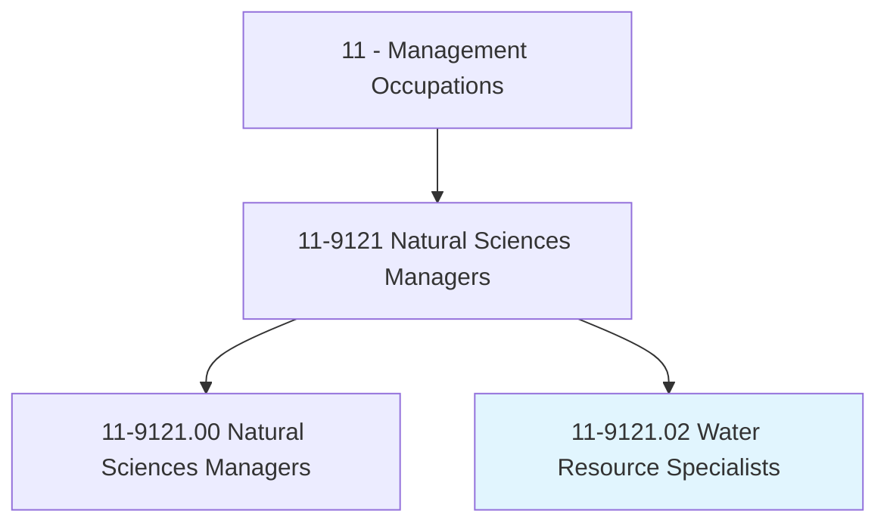
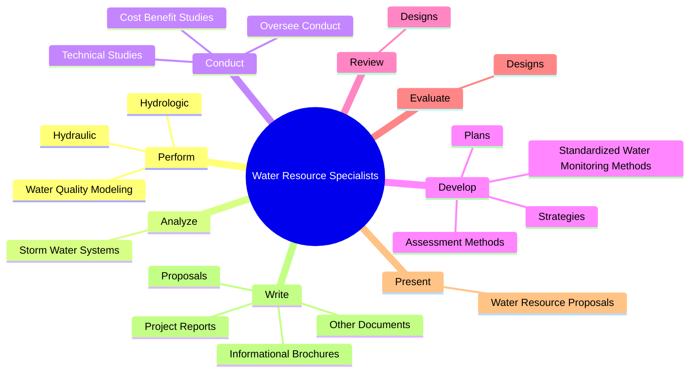
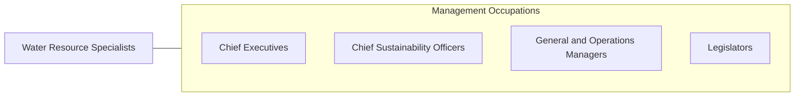

# Water Resource Specialists

> Design or implement programs and strategies related to water resource issues such as supply, quality, and regulatory compliance issues.

## Overview

Water Resource Specialists is classified under Management Occupations (SOC 11). Design or implement programs and strategies related to water resource issues such as supply, quality, and regulatory compliance issues.

## Classification Hierarchy

## Key Statistics

| Metric | Value |
|--------|-------|
| SOC Code | 11-9121.02 |
| Category | [Management Occupations](/occupations/Management) |
| Task Count | 73 |
| Source | O*NET |

## Core Tasks

### perform.Hydrologic

Water Resource Specialists perform hydrologic as part of their core responsibilities.

**Actions:**
- `perform.Hydrologic`
- `perform.Hydraulic`
- `perform.WaterQualityModeling`

### analyze.StormWaterSystems

Water Resource Specialists analyze storm water systems as part of their core responsibilities.

**Actions:**
- `analyze.StormWaterSystems.to.identify.OpportunitiesForWaterResourceImprovements`

### conduct.OverseeConduct

Water Resource Specialists conduct oversee conduct as part of their core responsibilities.

**Actions:**
- `conduct.OverseeConduct.of.Investigations.on.MattersSuchAsWaterStorageWastewaterDischargePollutantsPermitsOtherComplianceRegulatoryIssues`
- `conduct.TechnicalStudies.for.WaterResources.on.Topics`
- `conduct.TechnicalStudies.for.Pollutants`
- `conduct.TechnicalStudies.for.WaterTreatmentOptions`

## Skills & Competencies

### Technical Skills
- **Strategic Planning** - Advanced
- **Financial Management** - Advanced
- **Operations Management** - Advanced

### Soft Skills
- **Communication** - Essential
- **Problem Solving** - Essential
- **Critical Thinking** - Important
- **Teamwork** - Important
- **Adaptability** - Important

## Related Occupations

## Industries

This occupation is found across multiple industries. See [Industries](/industries) for sector-specific employment data.

## Career Progression

---

*Source: O*NET 11-9121.02 - ONETOccupation*
