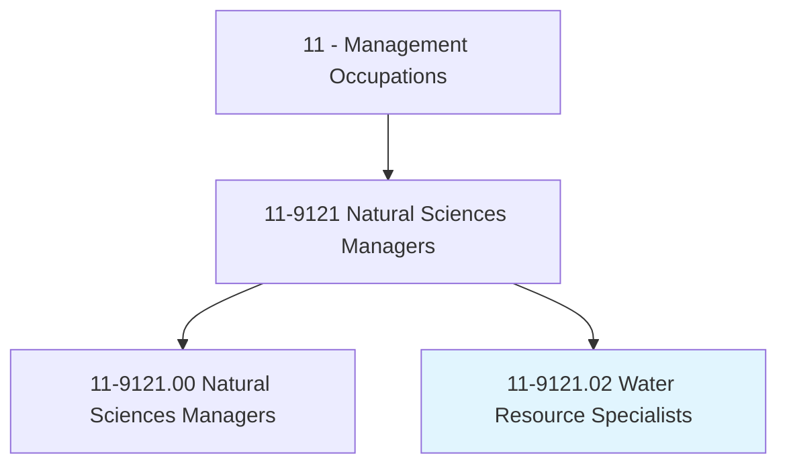
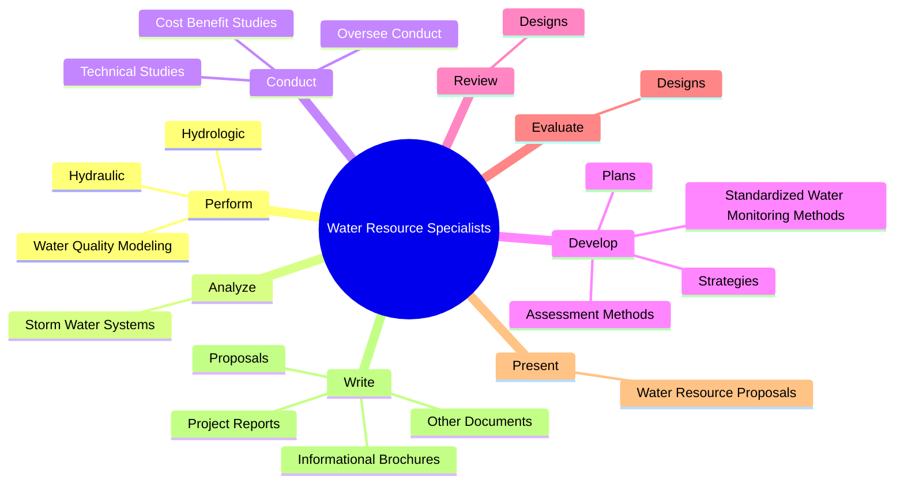
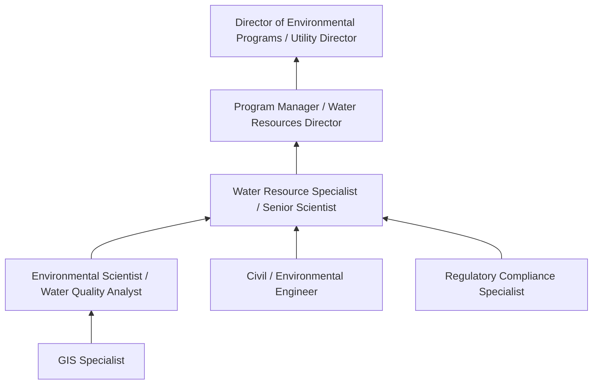
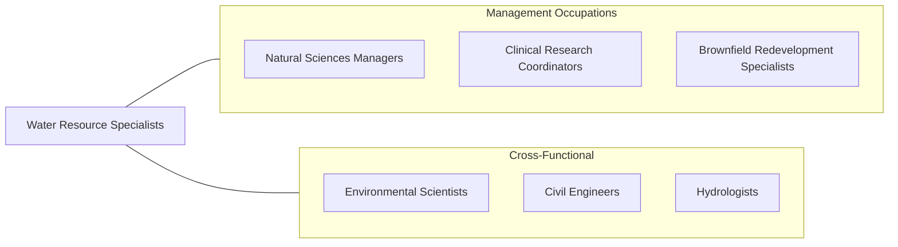

# Water Resource Specialists

> Design or implement programs and strategies related to water resource issues such as supply, quality, and regulatory compliance issues.

## Overview

Water Resource Specialists manage programs and develop strategies addressing critical water issues including supply, quality, conservation, stormwater management, and regulatory compliance. They combine scientific expertise with management skills to protect water resources, ensure safe drinking water, manage wastewater systems, and comply with environmental regulations. Their work is essential for public health, environmental protection, and sustainable community development.

These specialists conduct hydrologic and hydraulic modeling, analyze water quality data, design water management plans, and oversee monitoring programs. They work with government agencies, utilities, engineering firms, and environmental organizations to address challenges ranging from drought management and flood control to contamination remediation and watershed protection. They also write technical reports, present findings to stakeholders, and secure funding through grant applications and project proposals.

Water resource management is becoming increasingly critical due to climate change impacts (drought, flooding, sea-level rise), aging infrastructure, population growth, and emerging contaminants. Water Resource Specialists must integrate traditional engineering and environmental science with advanced modeling tools, real-time monitoring systems, and adaptive management approaches to address these evolving challenges.

## Classification Hierarchy

## Key Statistics

| Metric | Value |
|--------|-------|
| SOC Code | 11-9121.02 |
| Job Zone | 5 (Extensive Preparation) |
| Category | [Management Occupations](/occupations/Management/index) |
| Task Count | 73 |
| Salary Range | $65,000 - $130,000+ |
| Employment Level | Small - Moderate |
| Growth Outlook | Average |
| Source | O*NET |

## Core Tasks

### perform.Hydrologic

Water Resource Specialists perform hydrologic, hydraulic, and water quality modeling to understand water systems and inform management decisions.

**Actions:**
- `perform.Hydrologic`
- `perform.Hydraulic`
- `perform.WaterQualityModeling`

### analyze.StormWaterSystems

Water Resource Specialists analyze stormwater systems to identify opportunities for improvement and compliance with municipal separate storm sewer system (MS4) permits.

**Actions:**
- `analyze.StormWaterSystems.to.identify.OpportunitiesForWaterResourceImprovements`

### conduct.TechnicalStudies

Water Resource Specialists conduct and oversee technical investigations on water resources topics including water storage, wastewater discharge, pollutants, and regulatory compliance.

**Actions:**
- `conduct.OverseeConduct.of.Investigations.on.MattersSuchAsWaterStorageWastewaterDischargePollutantsPermitsOtherComplianceRegulatoryIssues`
- `conduct.TechnicalStudies.for.WaterResources.on.Topics`
- `conduct.TechnicalStudies.for.Pollutants`
- `conduct.TechnicalStudies.for.WaterTreatmentOptions`

## Skills & Competencies

### Technical Skills
- **Hydrology & Hydraulics** - Expert
- **Water Quality Analysis** - Expert
- **Environmental Regulation (CWA, SDWA)** - Advanced
- **Hydrologic Modeling** - Advanced
- **Watershed Management** - Advanced
- **Environmental Impact Assessment** - Advanced
- **Grant Writing & Project Management** - Advanced

### Soft Skills
- **Analytical Thinking** - Critical
- **Communication (Technical Writing & Presentation)** - Critical
- **Problem Solving** - Essential
- **Collaboration** - Essential
- **Stakeholder Engagement** - Essential
- **Project Management** - Important
- **Public Speaking** - Important

## Education & Certifications

| Requirement | Details |
|-------------|---------|
| Typical Education | Master's degree in Hydrology, Water Resources Engineering, Environmental Science, or Civil Engineering |
| Work Experience | 5+ years in water resource management, environmental consulting, or related field |
| Common Certifications | PE (Professional Engineer - NCEES), PH (Professional Hydrologist - AIH), CPSWQ (Certified Professional in Stormwater Quality - EnviroCert), LEED AP (USGBC), CFM (Certified Floodplain Manager - ASFPM) |

## Career Progression

## Industry Variations

- **Municipal Water Utilities** - Water supply management; treatment plant oversight; distribution system management; rate setting
- **Environmental Consulting** - Client project delivery; environmental assessment; remediation design; regulatory permitting
- **Government Agencies (EPA, USGS, Army Corps)** - Policy implementation; watershed management; national-scale monitoring; flood risk management
- **Nonprofit / Conservation** - Watershed restoration; community engagement; grant-funded research; advocacy

## Technology & Tools

- **Hydrologic Modeling** - HEC-HMS, HEC-RAS, SWMM (EPA), MODFLOW, MIKE
- **Water Quality** - QUAL2K, WASP, laboratory information systems
- **GIS** - ArcGIS, QGIS, Google Earth Engine
- **Data Management** - R, Python (pandas, geopandas), MATLAB
- **Monitoring** - SCADA systems, real-time sensor networks, continuous monitoring equipment
- **Compliance** - EPA ECHO, state water quality databases, NPDES permit tracking

## Related Occupations

## Industries

- [Government (Federal, State, Local)](/industries/Government) - High Employment
- [Professional, Scientific, and Technical Services](/industries/ProfessionalServices) - High Employment
- [Utilities](/industries/Utilities/index) - Moderate Employment

## Departments

This occupation typically works in:
- [Water Resources / Utilities](/departments/WaterResources)
- [Environmental Services](/departments/EnvironmentalServices)
- [Public Works](/departments/PublicWorks)
- [Conservation](/departments/Conservation)

---

*Source: O*NET 11-9121.02 - ONETOccupation*
