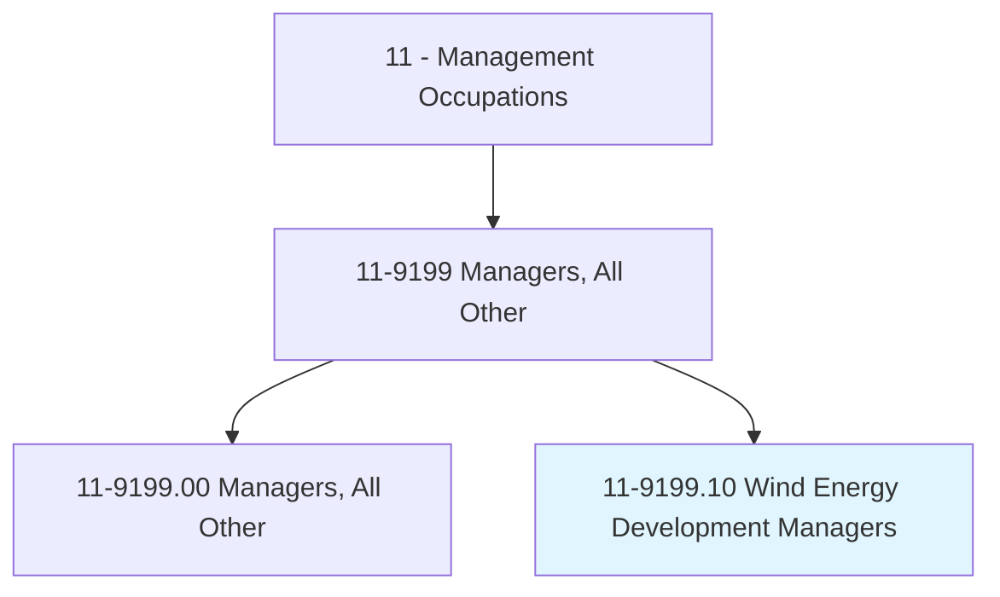
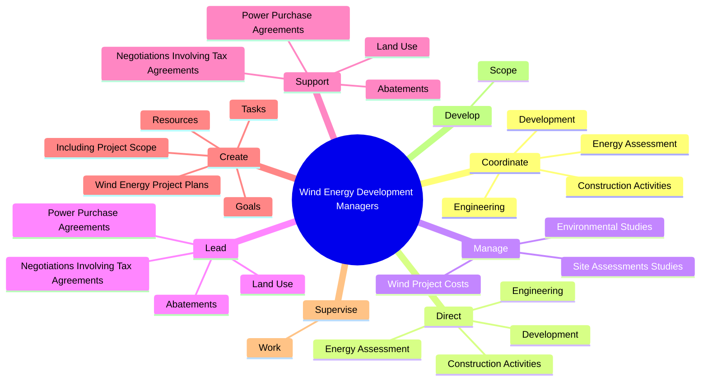
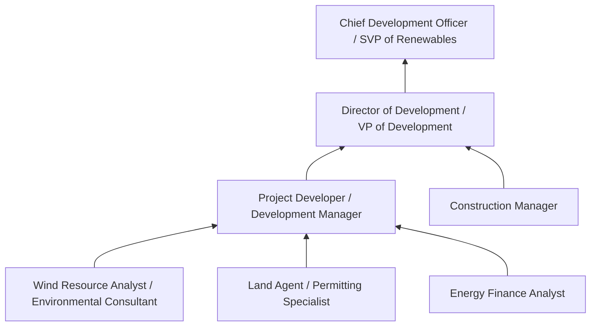
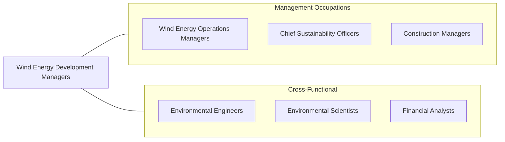

# Wind Energy Development Managers

> Lead or manage the development and evaluation of potential wind energy business opportunities, including environmental studies, permitting, and proposals. May also manage construction of projects.

## Overview

Wind Energy Development Managers lead the process of bringing wind energy projects from concept to construction-ready status. They identify and evaluate potential project sites, manage wind resource assessments, secure land rights, navigate environmental and regulatory permitting, negotiate power purchase agreements (PPAs), and oversee project financing. Their work spans years of development activity before a single turbine is erected, requiring persistence, strategic thinking, and the ability to manage complex multi-stakeholder processes.

These managers coordinate teams of wind resource analysts, environmental consultants, land agents, attorneys, engineers, and financial analysts. They evaluate wind resource data from meteorological towers and remote sensing, commission environmental impact studies (avian, bat, noise, visual, cultural resources), engage with local communities and governing bodies, and structure deals that make projects financially viable. Development pipelines typically involve dozens of potential projects in various stages, requiring managers to allocate resources strategically and make go/no-go decisions based on evolving information.

The wind energy industry has matured rapidly, with onshore wind now among the lowest-cost sources of new electricity generation. Development managers must navigate an increasingly competitive landscape for prime wind sites, growing community opposition in some regions, evolving tax incentives (Production Tax Credit, Investment Tax Credit), interconnection queue backlogs, and supply chain constraints. Offshore wind development adds maritime permitting, subsea cable routing, port logistics, and Jones Act compliance. The role demands integration of technical, financial, legal, environmental, and political expertise.

## Classification Hierarchy

## Key Statistics

| Metric | Value |
|--------|-------|
| SOC Code | 11-9199.10 |
| Job Zone | 4 (Considerable Preparation) |
| Category | [Management Occupations](/occupations/Management/index) |
| Task Count | 88 |
| Salary Range | $90,000 - $160,000+ |
| Employment Level | Small |
| Growth Outlook | Much faster than average |
| Source | O*NET |

## Core Tasks

### coordinate.Development

Wind Energy Development Managers coordinate all development activities to ensure project milestones and objectives are met on schedule and within budget.

**Actions:**
- `coordinate.Development.to.ensure.WindProjectNeedsAreMet`
- `coordinate.Development.to.ObjectivesAreMet`
- `coordinate.EnergyAssessment.to.ensure.WindProjectNeedsAreMet`
- `coordinate.EnergyAssessment.to.ObjectivesAreMet`

### direct.Development

Wind Energy Development Managers direct wind resource assessment, engineering, and construction activities across multiple simultaneous projects.

**Actions:**
- `direct.Development.to.ensure.WindProjectNeedsAreMet`
- `direct.Development.to.ObjectivesAreMet`
- `direct.EnergyAssessment.to.ensure.WindProjectNeedsAreMet`
- `direct.EnergyAssessment.to.ObjectivesAreMet`

### manage.WindProjectCosts

Wind Energy Development Managers manage project budgets, site assessment costs, and environmental study expenditures to maintain financial viability.

**Actions:**
- `manage.WindProjectCosts.to.stay.WithinBudgetLimits`
- `manage.SiteAssessmentsStudies.for.WindFields`
- `manage.EnvironmentalStudies.for.WindFields`

## Skills & Competencies

### Technical Skills
- **Wind Resource Assessment** - Expert
- **Project Development & Permitting** - Expert
- **Power Purchase Agreement Negotiation** - Advanced
- **Environmental Impact Assessment** - Advanced
- **Financial Modeling & Project Finance** - Advanced
- **Land Acquisition & Leasing** - Advanced
- **Grid Interconnection Process** - Advanced

### Soft Skills
- **Negotiation** - Critical
- **Leadership** - Critical
- **Strategic Thinking** - Essential
- **Communication** - Essential
- **Stakeholder Management** - Essential
- **Problem Solving** - Important
- **Persistence & Patience** - Important

## Education & Certifications

| Requirement | Details |
|-------------|---------|
| Typical Education | Bachelor's or Master's degree in Engineering, Environmental Science, Business, Energy Policy, or related field |
| Work Experience | 5-10 years in renewable energy development, energy consulting, or project management |
| Common Certifications | PMP (PMI), NABCEP (renewable energy), LEED AP (USGBC), AEE Certified Energy Manager (CEM) |

## Career Progression

## Industry Variations

- **Independent Power Producers (IPPs)** - Full development lifecycle; portfolio management; merchant/contracted generation mix; platform development for sale
- **Utility Developers** - Regulated development; integrated resource planning; rate-based project recovery; self-build vs. acquisition analysis
- **Offshore Wind** - Maritime permitting (BOEM, USCG); subsea cable engineering; port and vessel logistics; Jones Act compliance; community benefit agreements
- **Corporate / C&I Development** - Behind-the-meter projects; virtual PPAs; corporate renewable energy targets; distributed wind

## Technology & Tools

- **Wind Resource** - WindPRO, WAsP, Openwind, AWS Truepower tools, LIDAR/SODAR analysis
- **GIS / Siting** - ArcGIS, Google Earth Pro, constraint mapping tools, land parcel databases
- **Financial Modeling** - Excel (advanced), proprietary financial models, LCOE calculators, tax equity modeling
- **Project Management** - Microsoft Project, Primavera, Smartsheet, Procore (construction)
- **Environmental** - EIS/EA preparation tools, avian radar, bat acoustic monitoring, noise modeling (CadnaA)
- **Interconnection** - OASIS (grid access), power flow studies, transmission planning tools

## Related Occupations

## Industries

- [Utilities (Electric Power Generation)](/industries/Utilities/index) - High Employment
- [Professional, Scientific, and Technical Services](/industries/Scientific) - Moderate Employment
- [Construction (Power and Communication Line)](/industries/Construction/index) - Moderate Employment

## Departments

This occupation typically works in:
- Development
- Business Development
- Project Management

---

*Source: O*NET 11-9199.10 - ONETOccupation*
