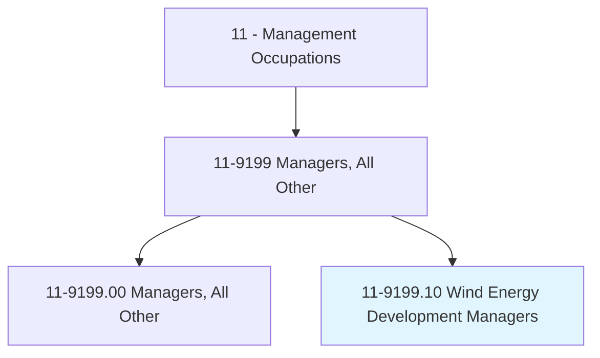
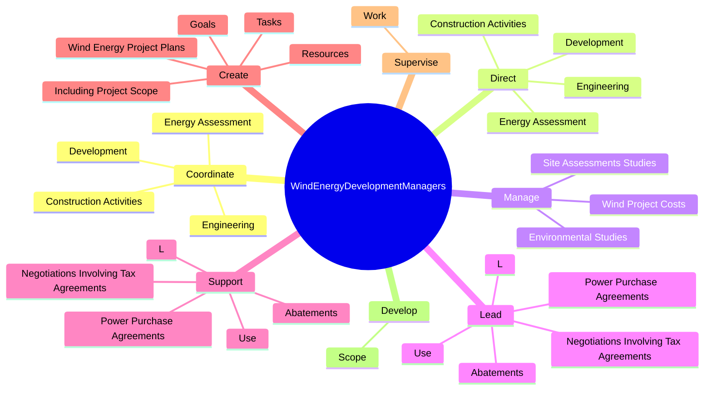
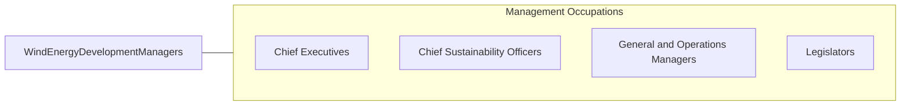

# Wind Energy Development Managers

> Lead or manage the development and evaluation of potential wind energy business opportunities, including environmental studies, permitting, and proposals. May also manage construction of projects.

## Overview

Wind Energy Development Managers is a specialized variant within the Management Occupations category. Lead or manage the development and evaluation of potential wind energy business opportunities, including environmental studies, permitting, and proposals. 

## Classification Hierarchy

## Key Statistics

| Metric | Value |
|--------|-------|
| SOC Code | 11-9199.10 |
| Category | [Management Occupations](/occupations/Management) |
| Task Count | 88 |
| Source | O*NET |

## Core Tasks

### coordinate.Development

Wind Energy Development Managers coordinate development as part of their core responsibilities.

**Actions:**
- `coordinate.Development.to.ensure.WindProjectNeedsAreMet`
- `coordinate.Development.to.ObjectivesAreMet`
- `coordinate.EnergyAssessment.to.ensure.WindProjectNeedsAreMet`
- `coordinate.EnergyAssessment.to.ObjectivesAreMet`

### direct.Development

Wind Energy Development Managers direct development as part of their core responsibilities.

**Actions:**
- `direct.Development.to.ensure.WindProjectNeedsAreMet`
- `direct.Development.to.ObjectivesAreMet`
- `direct.EnergyAssessment.to.ensure.WindProjectNeedsAreMet`
- `direct.EnergyAssessment.to.ObjectivesAreMet`

### manage.WindProjectCosts

Wind Energy Development Managers manage wind project costs as part of their core responsibilities.

**Actions:**
- `manage.WindProjectCosts.to.stay.WithinBudgetLimits`
- `manage.SiteAssessmentsStudies.for.WindFields`
- `manage.EnvironmentalStudies.for.WindFields`

## Skills & Competencies

### Technical Skills
- **Strategic Planning** - Advanced
- **Financial Management** - Advanced
- **Operations Management** - Advanced

### Soft Skills
- **Communication** - Essential
- **Problem Solving** - Essential
- **Critical Thinking** - Important
- **Teamwork** - Important
- **Adaptability** - Important

## Related Occupations

## Industries

This occupation is found across multiple industries. See [Industries](/industries) for sector-specific employment data.

## Career Progression

---

*Source: O*NET 11-9199.10 - ONETOccupation*
