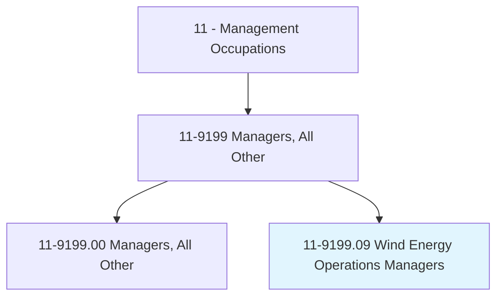
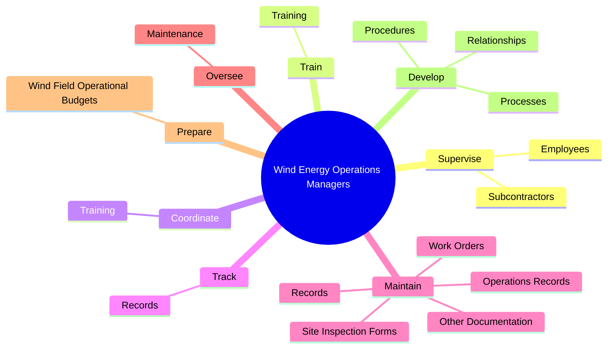
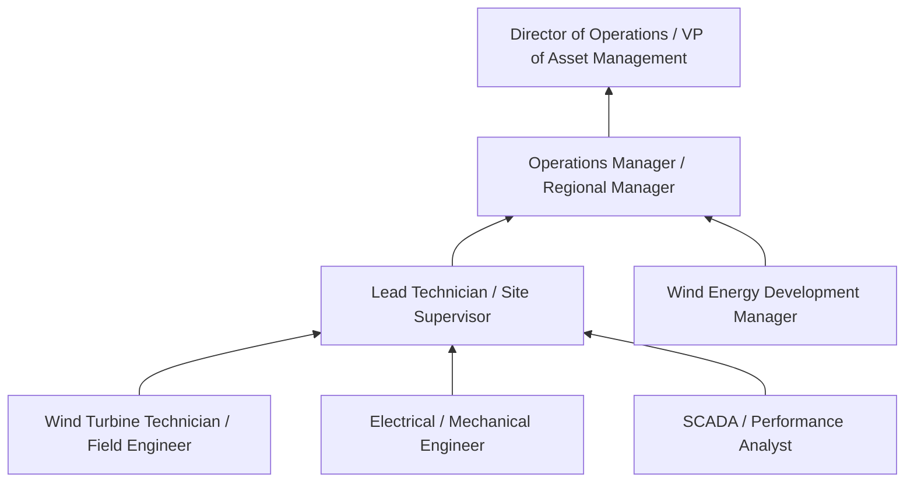
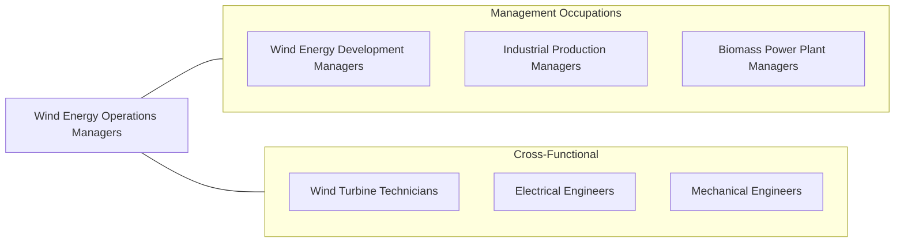

# Wind Energy Operations Managers

> Manage wind field operations, including personnel, maintenance activities, financial activities, and planning.

## Overview

Wind Energy Operations Managers oversee the day-to-day operation and maintenance of wind farms after construction is complete. They manage field technician teams, coordinate scheduled and unscheduled maintenance, monitor turbine performance, administer site budgets, and ensure compliance with safety, environmental, and grid interconnection requirements. Their goal is to maximize energy production and asset availability while minimizing operating costs over the 25-30 year life of a wind project.

These managers direct wind technicians who perform tower climbs, nacelle inspections, blade repairs, electrical troubleshooting, and component replacements on turbines that may stand 300+ feet tall in remote locations. They use SCADA systems and performance analytics to monitor hundreds of turbines across one or more wind farms, identifying underperforming units and diagnosing root causes -- whether mechanical (gearbox, bearing), electrical (generator, converter, transformer), structural (blade erosion, tower fatigue), or environmental (icing, lightning damage). Warranty management, spare parts logistics, and contractor oversight are ongoing responsibilities.

The wind operations sector is evolving rapidly with the growth of remote monitoring, predictive analytics, drone inspections, and condition-based maintenance strategies. Operations managers must balance in-house maintenance capabilities against third-party service agreements (OEM full-service, independent service providers). As wind farms age, repowering decisions, end-of-life planning, and decommissioning add new dimensions. Offshore wind operations introduce maritime logistics, specialized vessels, and weather-window planning that significantly increase operational complexity.

## Classification Hierarchy

## Key Statistics

| Metric | Value |
|--------|-------|
| SOC Code | 11-9199.09 |
| Job Zone | 4 (Considerable Preparation) |
| Category | [Management Occupations](/occupations/Management/index) |
| Task Count | 82 |
| Salary Range | $85,000 - $150,000+ |
| Employment Level | Small |
| Growth Outlook | Much faster than average |
| Source | O*NET |

## Core Tasks

### supervise.Employees

Wind Energy Operations Managers supervise wind technicians and subcontractors, ensuring quality workmanship and adherence to safety regulations and company policies.

**Actions:**
- `supervise.Employees.to.ensure.QualityOfWorkToSafetyRegulationsPolicies`
- `supervise.Employees.to.AdherenceToSafetyRegulationsPolicies`
- `supervise.Subcontractors.to.ensure.QualityOfWorkToSafetyRegulationsPolicies`
- `supervise.Subcontractors.to.AdherenceToSafetyRegulationsPolicies`

### train.Training

Wind Energy Operations Managers develop and coordinate training programs covering operations, safety, environmental, and technical topics for wind farm personnel.

**Actions:**
- `train.Training.of.Employees.in.Operations`
- `train.Training.of.Safety`
- `train.Training.of.EnvironmentalIssues`
- `train.Training.of.TechnicalIssues`

### coordinate.Training

Wind Energy Operations Managers coordinate training delivery across multiple sites and shifts, ensuring all personnel maintain required certifications and competencies.

**Actions:**
- `coordinate.Training.of.Employees.in.Operations`
- `coordinate.Training.of.Safety`
- `coordinate.Training.of.EnvironmentalIssues`
- `coordinate.Training.of.TechnicalIssues`

## Skills & Competencies

### Technical Skills
- **Wind Turbine Technology** - Expert
- **Operations & Maintenance Management** - Expert
- **Safety Management (OSHA, Fall Protection, Electrical)** - Advanced
- **SCADA & Performance Analytics** - Advanced
- **Budget & Financial Management** - Advanced
- **Environmental Compliance** - Advanced
- **Contractor & Vendor Management** - Advanced

### Soft Skills
- **Leadership** - Critical
- **Decision Making** - Critical
- **Communication** - Essential
- **Problem Solving** - Essential
- **Team Development** - Essential
- **Planning & Organization** - Important
- **Negotiation** - Important

## Education & Certifications

| Requirement | Details |
|-------------|---------|
| Typical Education | Bachelor's degree in Engineering, Renewable Energy Technology, Business Management, or related field |
| Work Experience | 5-8 years in wind energy operations, power generation, or industrial maintenance with supervisory experience |
| Common Certifications | GWO (Global Wind Organisation) Basic Safety Training, OSHA 30-Hour, NFPA 70E (electrical safety), CPR/First Aid, PMP (PMI), tower rescue certification |

## Career Progression

## Industry Variations

- **Independent Power Producers (IPPs)** - Multi-site portfolio management; asset optimization across fleet; third-party O&M contracts; investor reporting
- **Utility-Owned Wind** - Integrated utility operations; generation dispatch coordination; regulatory reporting; rate case support
- **OEM Service Providers** - Warranty service; full-service agreements; fleet-wide performance guarantees; technology upgrades; parts supply chain
- **Offshore Wind** - Crew transfer vessels (CTVs); service operation vessels (SOVs); weather window management; marine safety; helicopter access

## Technology & Tools

- **SCADA / Monitoring** - Turbine SCADA (Vestas Online, GE Wind SCADA, Siemens Gamesa), fleet monitoring platforms, alarm management
- **Performance Analytics** - Bazefield, Greenbyte, Windographer, power curve analysis tools
- **Maintenance** - CMMS (SAP PM, Maximo, eMaint), work order management, spare parts tracking
- **Safety** - Permit-to-work systems, lockout/tagout, fall protection equipment, rescue kits
- **Inspection** - Drone inspection (blade damage), borescope (gearbox), thermography, ultrasonic testing
- **Field Operations** - GPS fleet management, mobile workforce apps, weather forecasting tools

## Related Occupations

## Industries

- [Utilities (Electric Power Generation)](/industries/Utilities/index) - High Employment
- [Professional, Scientific, and Technical Services](/industries/ProfessionalServices) - Moderate Employment
- [Manufacturing (Turbine and Power Equipment)](/industries/Manufacturing/index) - Low Employment

## Departments

This occupation typically works in:
- [Operations](/departments/Operations/index)
- [Asset Management](/departments/AssetManagement)
- [Field Services](/departments/FieldServices)

---

*Source: O*NET 11-9199.09 - ONETOccupation*
