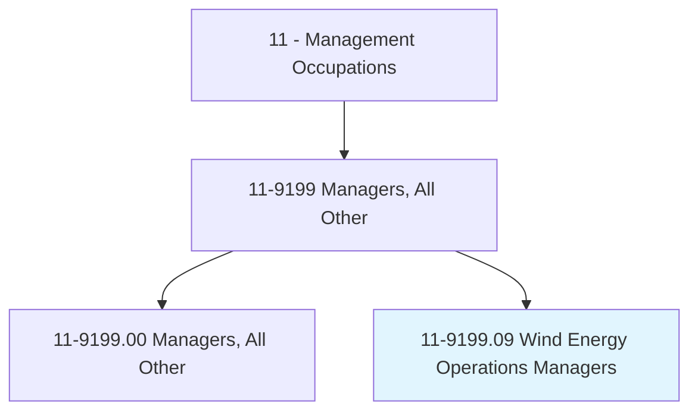
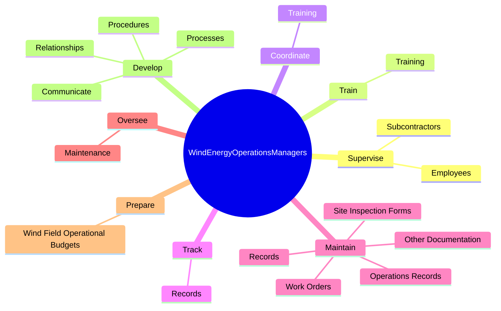
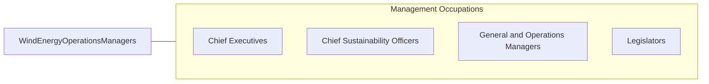

# Wind Energy Operations Managers

> Manage wind field operations, including personnel, maintenance activities, financial activities, and planning.

## Overview

Wind Energy Operations Managers is classified under Management Occupations (SOC 11). Manage wind field operations, including personnel, maintenance activities, financial activities, and planning.

## Classification Hierarchy

## Key Statistics

| Metric | Value |
|--------|-------|
| SOC Code | 11-9199.09 |
| Category | [Management Occupations](/occupations/Management) |
| Task Count | 82 |
| Source | O*NET |

## Core Tasks

### supervise.Employees

Wind Energy Operations Managers supervise employees as part of their core responsibilities.

**Actions:**
- `supervise.Employees.to.ensure.QualityOfWorkToSafetyRegulationsPolicies`
- `supervise.Employees.to.AdherenceToSafetyRegulationsPolicies`
- `supervise.Subcontractors.to.ensure.QualityOfWorkToSafetyRegulationsPolicies`
- `supervise.Subcontractors.to.AdherenceToSafetyRegulationsPolicies`

### train.Training

Wind Energy Operations Managers train training as part of their core responsibilities.

**Actions:**
- `train.Training.of.Employees.in.Operations`
- `train.Training.of.Safety`
- `train.Training.of.EnvironmentalIssues`
- `train.Training.of.TechnicalIssues`

### coordinate.Training

Wind Energy Operations Managers coordinate training as part of their core responsibilities.

**Actions:**
- `coordinate.Training.of.Employees.in.Operations`
- `coordinate.Training.of.Safety`
- `coordinate.Training.of.EnvironmentalIssues`
- `coordinate.Training.of.TechnicalIssues`

## Skills & Competencies

### Technical Skills
- **Strategic Planning** - Advanced
- **Financial Management** - Advanced
- **Operations Management** - Advanced

### Soft Skills
- **Communication** - Essential
- **Problem Solving** - Essential
- **Critical Thinking** - Important
- **Teamwork** - Important
- **Adaptability** - Important

## Related Occupations

## Industries

This occupation is found across multiple industries. See [Industries](/industries) for sector-specific employment data.

## Career Progression

---

*Source: O*NET 11-9199.09 - ONETOccupation*
