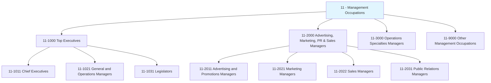
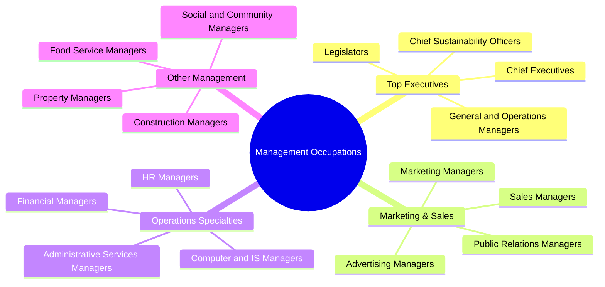
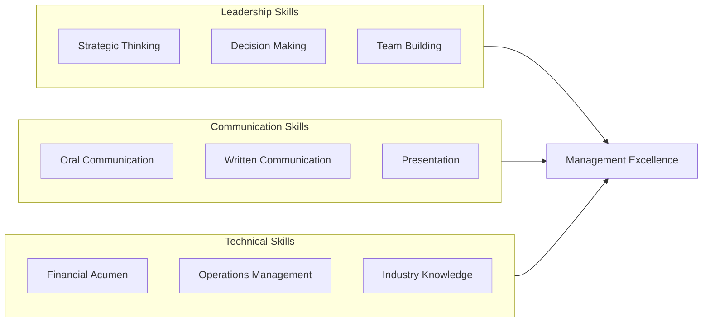
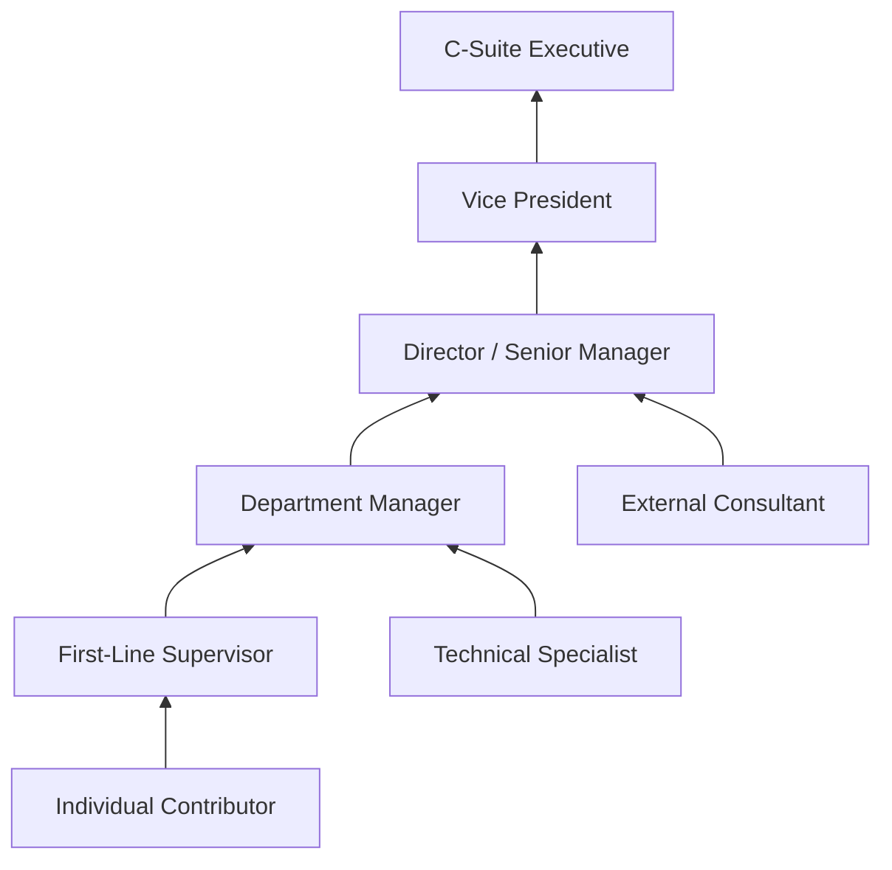

# Management Occupations

> Category 11 - Management occupations include a wide range of responsibilities for planning, directing, and coordinating activities in organizations across all sectors of the economy.

## Overview

Management Occupations encompass leadership roles responsible for planning, directing, and coordinating the activities of organizations. This category includes top executives who set organizational strategy, specialized managers who oversee functional areas like marketing, finance, and operations, as well as first-line supervisors. Managers at all levels translate organizational goals into actionable plans, allocate resources, lead teams, and make decisions that shape business outcomes.

## Classification Hierarchy

## Key Statistics

| Metric | Value |
|--------|-------|
| SOC Category Code | 11 |
| Major Groups | 4 |
| Detailed Occupations | 40+ |
| Source | O*NET / BLS |

## Occupations in this Category

### Top Executives (11-1000)

| Occupation | Code | Description |
|------------|------|-------------|
| [Chief Executives](./ChiefExecutives.mdx) | 11-1011.00 | Determine and formulate policies, provide overall organizational direction |
| [Chief Sustainability Officers](./ChiefSustainabilityOfficers.mdx) | 11-1011.03 | Coordinate sustainability strategy and environmental initiatives |
| [General and Operations Managers](./OperationsManagers.mdx) | 11-1021.00 | Plan, direct, and coordinate organizational operations |
| [Legislators](./Legislators.mdx) | 11-1031.00 | Develop and enact laws at local, state, or federal level |

### Advertising, Marketing, Promotions, Public Relations, and Sales Managers (11-2000)

| Occupation | Code | Description |
|------------|------|-------------|
| [Advertising and Promotions Managers](./AdvertisingManagers.mdx) | 11-2011.00 | Plan and direct advertising policies and promotional programs |

## Category Overview Diagram

## Skills Common to Management Occupations

### Core Competencies

## Career Pathways

## Industries Employing Management Occupations

- [Professional, Scientific, and Technical Services](/industries/ProfessionalServices) - Highest concentration
- [Finance and Insurance](/industries/FinanceInsurance) - High employment
- [Manufacturing](/industries/Manufacturing/index) - High employment
- [Healthcare and Social Assistance](/industries/Healthcare/index) - Growing sector
- [Retail Trade](/industries/Retail/index) - High volume employment
- [Government](/industries/Government) - Significant public sector presence

## Education & Training Trends

| Level | Percentage of Managers |
|-------|----------------------|
| Bachelor's Degree | 40-50% |
| Master's Degree (MBA) | 25-30% |
| Associate's/Some College | 15-20% |
| High School + Experience | 5-10% |

## Related Categories

- [Business and Financial Operations](/occupations/BusinessAndFinancial) - Category 13
- [Computer and Mathematical](/occupations/ComputerAndMathematical) - Category 15
- [Sales and Related](/occupations/Sales/index) - Category 41
- [Office and Administrative Support](/occupations/OfficeAndAdministrative) - Category 43

---

*Source: O*NET / Bureau of Labor Statistics - SOC Category 11*
